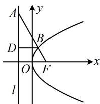

> [!faq]- 《第4节 高考中抛物线常用的二级结论》参考答案
>
> > [!success]- **【答案】** $y^{2} = 2x$
>
> > [!note]- **【分析】**
> > 本题未单列分析。
>
> > [!note]- **【解析】**
> > 解析：如图，过 $B$ 作 $BD \perp l$ 于 $D$ ，直线 $AF$ 的倾斜角为 $120^{\circ}$ ，所以 $\angle AFO = \angle ABD = 60^{\circ}$
> >
> > 已知 $\left|AB\right|=\frac{4}{3}$ ，可在 $\triangle ABD$ 中求 $\left|BD\right|$ ，结合抛物线定义得出 $\left|BF\right|$ ，再由角版焦半径公式建立方程求p，
> >
> > $\left|BD\right| = \left|AB\right|\cdot \cos \angle ABD = \frac{2}{3}$ ，由抛物线定义， $\left|BF\right| =$
> >
> > $\left|BD\right| = \frac{2}{3}$ ，又 $\left|BF\right| = \frac{p}{1 + \cos\angle BFO} = \frac{p}{1 + \cos60^{\circ}} = \frac{2p}{3}$
> >
> > 所以 $\frac{2p}{3} = \frac{2}{3}$ ，解得： $p = 1$ ，故 $C$ 的方程为 $y^{2} = 2x$ 。
> >
> > 
