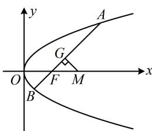

> [!faq]- 《第4节 高考中抛物线常用的二级结论》参考答案
>
> > [!success]- **【答案】** 详见解析
>
> > [!note]- **【分析】**
> > 本题未单列分析。
>
> > [!note]- **【解析】**
> > 2
> >
> > 解法1：涉及中垂线，可先把直线 $l$ 与抛物线联立，结合韦达定理求出 $AB$ 中点，写出中垂线的方程，
> >
> > 由题意， $F\left(\frac{p}{2},0\right)$ ，直线AB的方程为 $y=x-\frac{p}{2}$ ，
> >
> > 即 $x = y + \frac{p}{2}$ ，设 $A(x_{1},y_{1})$ ， $B(x_{2},y_{2})$ ，将 $x = y + \frac{p}{2}$ 代入
> >
> > $y^{2}=2px$ 消去 x 整理得： $y^{2}-2py-p^{2}=0$ ，
> >
> > 判别式 $\Delta = (-2p)^2 - 4 \times 1 \times (-p^2) = 8p^2 > 0$
> >
> > 由韦达定理， $y_{1} + y_{2} = 2p$ ，所以 $x_{1} + x_{2} = y_{1} + \frac{p}{2} +y_{2} + \frac{p}{2}$
> >
> > $= y_{1} + y_{2} + p = 3p$ ，故 $AB$ 中点 $G$ 为 $\left(\frac{3p}{2},p\right)$
> >
> > 所以 $AB$ 中垂线的方程为 $y - p = -\left(x - \frac{3p}{2}\right)$ ①，
> >
> > 由此中垂线可求 $M$ 的坐标, 进而求得 $\vert F M \vert$ ,
> >
> > 在①中令 $y = 0$ 得： $x = \frac{5p}{2}$ ，故 $M\left(\frac{5p}{2},0\right)$
> >
> > 所以 $\left|FM\right|=\frac{5p}{2}-\frac{p}{2}=2p$ ，故 $\frac{4p}{\left|FM\right|}=2$ 。
> >
> > 解法2：如图，要求 $|FM|$ ，注意到 $\angle GFM$ 是已知的，故可先求 $|FG|$ ，因为 $G$ 为 $AB$ 中点，
> >
> > 所以 $|FG| = |AF| - |AG| = |AF| - \frac{1}{2} |AB|$ ①，已知 $l$ 的倾斜角，可用角版焦半径和焦点弦公式来算 $|AF|$ 和 $|AB|$ ，
> >
> > 直线 $l$ 的倾斜角为 $45^{\circ} \Rightarrow \angle GFM = 45^{\circ} \Rightarrow \angle AFO = 135^{\circ}$
> >
> > 所以 $\left|AF\right|=\frac{p}{1+\cos135^{\circ}}$ ， $\left|AB\right|=\frac{2p}{\sin^{2}135^{\circ}}$
> >
> > 代入①得： $\left|FG\right|=\frac{p}{1+\cos135^{\circ}}-\frac{1}{2}\cdot\frac{2p}{\sin^{2}135^{\circ}}=\sqrt{2}p$
> >
> > 又 $\angle GFM = 45^{\circ}$ ，所以 $\triangle GFM$ 是等腰直角三角形，
> >
> > 从而 $\left|FM\right|=\sqrt{2}\left|FG\right|=2p$ ，故 $\frac{4p}{\left|FM\right|}=2$ 。
> >
> > 
