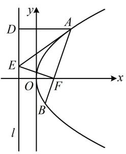

> [!faq]- 《第4节 高考中抛物线常用的二级结论》参考答案
>
> > [!success]- **【答案】** ACD
>
> > [!note]- **【分析】**
> > 本题未单列分析。
>
> > [!note]- **【解析】**
> > $$
> > F \left(\frac {3}{2}, 0\right)
> > $$
> >
> > $$
> > l: x = - \frac {3}{2}
> > $$
> >
> > A 项，如图，由抛物线定义， $\left|AD\right|=\left|AF\right|$ ，故 A 项正确；
> > B 项， $\left|AB\right|$ 是焦点弦，可代角版焦点弦公式计算，那 $\left|AE\right|$ 呢？注意到 $AF\perp EF$ ，故可考虑到 $\triangle AEF$ 中来分析，
> > 设 $\angle AFO = \theta (0 < \theta < \pi)$ ，则由角版焦点弦、焦半径公式， $\left|AB\right|=\frac{2p}{\sin^{2}\theta}=\frac{6}{\sin^{2}\theta},\quad\left|AF\right|=\frac{p}{1+\cos\theta}=\frac{3}{1+\cos\theta}$ 由图可知 AD//x 轴，所以 $\angle DAF = \angle AFx = \pi - \angle AFO$ $=\pi-\theta,$ 又 $\angle ADE = \angle AFE = \frac{\pi}{2}, \quad |AD| = |AF|, \quad |AE| = |AE|,$ 所以 $\triangle ADE \cong \triangle AFE$ ，从而 $\angle DAE = \angle FAE$ 故 $\angle FAE = \frac{1}{2} \angle DAF = \frac{\pi - \theta}{2} = \frac{\pi}{2} - \frac{\theta}{2}$ 在 $\triangle AEF$ 中， $\left|AE\right|=\frac{\left|AF\right|}{\cos\angle FAE}=\frac{\frac{3}{1+\cos\theta}}{\cos\left(\frac{\pi}{2}-\frac{\theta}{2}\right)}$ $=\frac{3}{(1+\cos\theta)\sin\frac{\theta}{2}}=\frac{3}{2\cos^{2}\frac{\theta}{2}\sin\frac{\theta}{2}}=\frac{3}{\sin\theta\cos\frac{\theta}{2}}\neq\frac{6}{\sin^{2}\theta}$ 所以 $\left|AE\right|$ 与 $\left|AB\right|$ 不相等，故 B 项错误；
> > C 项，由图可知 $0 < \theta < \pi$ ，所以 $0 < \sin\theta \leq 1$ ，
> > 从而 $\left|AB\right|=\frac{6}{\sin^{2}\theta}\geq6$ ，故 C 项正确；
> >
> > D 项, 判断结论需要 $|BE|$ , 怎样求 $|BE|$ ? 要仿照求 $|AE|$ 的方法再来一遍吗? 不用, 两者的差别不外乎就是把 $A$ 换成了 $B$ , 也就是把 $\angle AFO$ 换成 $\angle BFO$ (即 $\pi - \theta$ ), 故直接在 $|AE|$ 的结果中用 $\pi - \theta$ 替换 $\theta$ , 即可得到 $|BE|$ ,
> >
> > 在 $\left|AE\right|=\frac{3}{(1+\cos\theta)\sin\frac{\theta}{2}}$ 中将 $\theta$ 换成 $\pi-\theta$ 得 $\left|BE\right|=$ $\frac{3}{[1+\cos(\pi-\theta)]\sin\frac{\pi-\theta}{2}}=\frac{3}{(1-\cos\theta)\cos\frac{\theta}{2}}$ 所以 $\left|AE\right|\cdot\left|BE\right|=\frac{3}{(1+\cos\theta)\sin\frac{\theta}{2}}\cdot\frac{3}{(1-\cos\theta)\cos\frac{\theta}{2}}$ $=\frac{9}{(1-\cos^{2}\theta)\sin\frac{\theta}{2}\cos\frac{\theta}{2}}=\frac{9}{\sin^{2}\theta\frac{1}{2}\sin\theta}=\frac{18}{\sin^{3}\theta}\geq18,$
> >
> > 故D项正确.
> >
> > 
> >
> > 一数·必刷100讲
