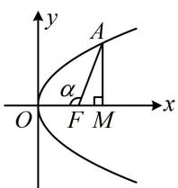
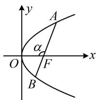
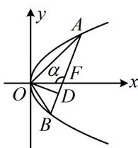

<!-- source-part:1 pages:1-8 -->

## 第 4 节 高考中抛物线常用的二级结论（★★★）

## 内容提要

1. 坐标版焦半径、焦点弦公式（设 $P(x_0, y_0)$ 在抛物线上， $A(x_1, y_1)$ ， $B(x_2, y_2)$ ， $AB$ 是抛物线的焦点弦）

<table><tr><td>标准方程</td><td> $y^2=2px(p>0)$ </td><td> $y^2=-2px(p>0)$ </td><td> $x^2=2py(p>0)$ </td><td> $x^2=-2py(p>0)$ </td></tr><tr><td>焦半径公式</td><td> $|PF|=x_0+\frac{p}{2}$ </td><td> $|PF|=\frac{p}{2}-x_0$ </td><td> $|PF|=y_0+\frac{p}{2}$ </td><td> $|PF|=\frac{p}{2}-y_0$ </td></tr><tr><td>焦点弦公式</td><td> $|AB|=x_1+x_2+p$ </td><td> $|AB|=p-(x_1+x_2)$ </td><td> $|AB|=y_1+y_2+p$ </td><td> $|AB|=p-(y_1+y_2)$ </td></tr></table>

2. 角版焦半径、焦点弦、焦原三角形面积公式：设抛物线 $y^{2} = 2px (p > 0)$ 的焦点为 $F$ ， $O$ 为原点.

①焦半径公式：设 $A$ 为抛物线上任意一点，记 $\angle AFO = \alpha$ ，则焦半径 $\left|AF\right| = \frac{p}{1 + \cos\alpha}$

证明: 作 $AM \perp x$ 轴于 $M$ , 先考虑 $M$ 在 $F$ 右侧的情形, 如图 1,

设 $A(x_0, y_0)$ ，则 $\left|FM\right| = x_0 - \frac{p}{2}$ ，又 $\left|FM\right| = \left|AF\right|\cos \angle AFM = \left|AF\right|\cos (\pi - \alpha) = -\left|AF\right|\cos \alpha$

与上式比较可得： $-|AF|\cos \alpha = x_0 - \frac{p}{2}$ ，另一方面，由坐标版焦半径公式知 $|AF| = x_0 + \frac{p}{2}$

与上式作差消去 $x_0$ 整理得： $\left|AF\right| = \frac{p}{1 + \cos\alpha}$

同理可证当 $M$ 在 $F$ 左侧或恰好与 $F$ 重合时, 都有 $\left|AF\right| = \frac{p}{1 + \cos \alpha}$ .

  
图1

  
图2

  
图3

②焦点弦公式： $AB$ 是抛物线的焦点弦，记 $\angle AFO = \alpha$ ，则 $\left|AB\right| = \frac{2p}{\sin^2\alpha}$

证明：如上图2， $\angle BFO = \pi - \alpha$ ，由①中的焦半径公式可得

$$
\left| A F \right| = \frac {p}{1 + \cos \alpha}, \quad \left| B F \right| = \frac {p}{1 + \cos (\pi - \alpha)} = \frac {p}{1 - \cos \alpha},
$$

所以 $\left|AB\right|=\frac{p}{1+\cos\alpha}+\frac{p}{1-\cos\alpha}=\frac{p(1-\cos\alpha)+p(1+\cos\alpha)}{(1+\cos\alpha)(1-\cos\alpha)}=\frac{2p}{1-\cos^{2}\alpha}=\frac{2p}{\sin^{2}\alpha}$

③焦原三角形面积：设 $AB$ 是抛物线的焦点弦，记 $\angle AFO = \alpha$ ，则 $S_{\triangle AOB} = \frac{p^2}{2\sin\alpha}$

证明：如上图3，作 $OD \perp AB$ 于 $D$ ，则 $\vert OD\vert = \vert OF\vert \sin \angle OFD = \vert OF\vert \sin (\pi -\alpha)$

$= |OF|\sin \alpha = \frac{p}{2}\cdot \sin \alpha$ ，由②中的焦点弦公式可得： $|AB| = \frac{2p}{\sin^2\alpha}$

所以 $S_{\triangle AOB} = \frac{1}{2}\big|AB\big|\cdot \big|OD\big| = \frac{1}{2}\cdot \frac{2p}{\sin^2\alpha}\cdot \frac{p}{2}\cdot \sin \alpha = \frac{p^2}{2\sin\alpha}.$

注：②和③中的 $\alpha$ 可由 $\angle AFO$ 换成 $\angle BFO$ 或 $AB$ 的倾斜角，结果不变；但若 $\alpha$ 统一取 $\angle AFO$ 则①②③中的结论对各种开口的抛物线都成立，这也是我们要把 $\angle AFO$ 设为 $\alpha$ 的原因.

3. 焦半径倒数和定值结论：设抛物线的焦点为 $F$ ， $AB$ 是抛物线的一条焦点弦，则 $\frac{1}{|AF|} + \frac{1}{|BF|} = \frac{2}{p}$ .

证明：如上图2，由①中的焦半径公式， $\left|AF\right|=\frac{p}{1+\cos\alpha}$ ， $\left|BF\right|=\frac{p}{1+\cos(\pi-\alpha)}=\frac{p}{1-\cos\alpha}$

所以 $\frac{1}{|AF|} +\frac{1}{|BF|} = \frac{1 + \cos\alpha}{p} +\frac{1 - \cos\alpha}{p} = \frac{2}{p}.$

![[高中/总复习/教辅/一数常规版2026/第10章 解析几何/模块5 抛物线与方程/第4节 高考中抛物线常用的二级结论/类型01_焦半径问题/类型01_焦半径问题.md]]
![[高中/总复习/教辅/一数常规版2026/第10章 解析几何/模块5 抛物线与方程/第4节 高考中抛物线常用的二级结论/类型02_焦点弦问题/类型02_焦点弦问题.md]]
![[高中/总复习/教辅/一数常规版2026/第10章 解析几何/模块5 抛物线与方程/第4节 高考中抛物线常用的二级结论/类型03_焦原三角形面积/类型03_焦原三角形面积.md]]
![[高中/总复习/教辅/一数常规版2026/第10章 解析几何/模块5 抛物线与方程/第4节 高考中抛物线常用的二级结论/强化训练/强化训练.md]]
