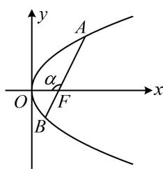

> [!faq]- 《第4节 高考中抛物线常用的二级结论》例题解析
>
> > [!success]- **【答案】** $\frac{3}{2}$
>
> > [!note]- **【分析】**
> > 本题未单列分析。
>
> > [!note]- **【解析】**
> > 解法 1：已知 $\left|AF\right|$ ，可由坐标版焦半径公式求得 A 的坐标，
> >
> > 由题意， $|AF| = x_{A} + 1 = 3$ ，所以 $x_{A} = 2$ ，代入 $y^{2} = 4x$ 可得 $y_{A} = \pm 2\sqrt{2}$ ，由对称性，不妨设 $A(2,2\sqrt{2})$ 此时可结合点 $F$ 写出直线 $AF$ 的方程，并与抛物线联立求出点 $B$ 的坐标，再算 $|BF|$
> >
> > 又 $F(1,0)$ ，所以 $k_{AF} = \frac{2\sqrt{2} - 0}{2 - 1} = 2\sqrt{2}$ ，故直线 $AF$ 的方程为 $y = 2\sqrt{2}(x - 1)$
> >
> > 联立 $\left\{ \begin{array}{l} y = 2\sqrt{2}(x - 1) \\ y^2 = 4x \end{array} \right.$ 消去 $y$ 整理得： $2x^{2} - 5x + 2 = 0$ ，解得： $x = 2$ 或 $\frac{1}{2}$ ，
> >
> > 因为 $x_{A} = 2$ ，所以 $x_{B} = \frac{1}{2}$ ，故 $\left|BF\right| = x_{B} + 1 = \frac{3}{2}$
> >
> > 解法2：如图，已知 $|AF|$ ，可由角版焦半径公式求得 $\cos \alpha$ ，并用于求 $|BF|$ ，
> >
> > 设 $\angle AFO = \alpha$ ，则 $\left|AF\right| = \frac{2}{1 + \cos\alpha} = 3$ ，所以 $\cos \alpha = -\frac{1}{3}$
> >
> > 故 $\left|BF\right|=\frac{2}{1+\cos(\pi-\alpha)}=\frac{2}{1-\cos\alpha}=\frac{3}{2}$ .
> >
> > 解法3：已知 $|AF|$ 求 $|BF|$ ，也可用结论 $\frac{1}{|AF|} + \frac{1}{|BF|} = \frac{2}{p}$ ，
> >
> > 
> >
> > 由题意， $p = 2$ ，所以 $\frac{1}{|AF|} +\frac{1}{|BF|} = \frac{2}{p} = 1$ ，将 $\left|AF\right| = 3$ 代入可求得 $\left|BF\right| = \frac{3}{2}$
