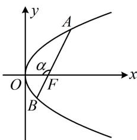

> [!faq]- 《第4节 高考中抛物线常用的二级结论》例题解析
>
> > [!success]- **【答案】** 4
>
> > [!note]- **【分析】**
> > 本题未单列分析。
>
> > [!note]- **【解析】**
> > 解法 1: $|AB|$ 和 $|AF| \cdot |BF|$ 都可以用 $A, B$ 的坐标来算, 故先设坐标,
> >
> > 设 $A(x_{1},y_{1})$ ， $B(x_{2},y_{2})$ ，则 $\left|AB\right| = x_1 + x_2 + 1$ ， $\left|AF\right| = x_1 + \frac{1}{2}$ ， $\left|BF\right| = x_2 + \frac{1}{2}$
> >
> > 所以 $\left|AF\right|\cdot\left|BF\right|=\left(x_{1}+\frac{1}{2}\right)\left(x_{2}+\frac{1}{2}\right)=x_{1}x_{2}+\frac{x_{1}+x_{2}}{2}+\frac{1}{4}$ ①,
> >
> > 涉及 $x_{1} + x_{2}$ 和 $x_{1}x_{2}$ ，可将直线与抛物线联立，结合韦达定理来算，
> >
> > 由题意， $F\left(\frac{1}{2},0\right)$ ，直线 l 不与 y 轴垂直，可设其方程为 $x=my+\frac{1}{2}$ ，
> >
> > 代入 $y^{2} = 2x$ 整理得： $y^{2} - 2my - 1 = 0$ ，由韦达定理， $y_{1} + y_{2} = 2m$ ， $y_{1}y_{2} = -1$ ，
> >
> > 所以 $x_{1} + x_{2} = my_{1} + \frac{1}{2} +my_{2} + \frac{1}{2} = m(y_{1} + y_{2}) + 1 = 2m^{2} + 1$ ②， $x_{1}x_{2} = \frac{y_{1}^{2}}{2}\cdot \frac{y_{2}^{2}}{2} = \left(\frac{y_{1}y_{2}}{2}\right)^{2} = \frac{1}{4}$ ③，
> >
> > 故 $\left|AB\right|=x_{1}+x_{2}+1=2m^{2}+2$ ，由题意， $\left|AB\right|=8$ ，所以 $2m^{2}+2=8$ ，故 $m^{2}=3$ ，
> >
> > 将②③代入①可得 $\left|AF\right|\cdot\left|BF\right|=x_{1}x_{2}+\frac{x_{1}+x_{2}}{2}+\frac{1}{4}=\frac{1}{4}+\frac{2m^{2}+1}{2}+\frac{1}{4}=m^{2}+1=4$ .
> >
> > 解法2：涉及焦点弦 $|AB|$ 和焦半径 $|AF|$ 与 $|BF|$ ，也可设角，用角版的焦点弦、焦半径公式来处理，
> >
> > 如图，设 $\angle AFO = \alpha$ ，由题意， $|AB| = \frac{2}{\sin^2\alpha} = 8$ ，所以 $\sin^2\alpha = \frac{1}{4}$
> >
> > 又 $\left|AF\right|=\frac{1}{1+\cos\alpha}$ ， $\left|BF\right|=\frac{1}{1+\cos(\pi-\alpha)}=\frac{1}{1-\cos\alpha}$ ，所以 $\left|AF\right|\cdot\left|BF\right|=\frac{1}{1+\cos\alpha}\cdot\frac{1}{1-\cos\alpha}=\frac{1}{1-\cos^{2}\alpha}=\frac{1}{\sin^{2}\alpha}=4$
> >
> > 解法3：注意到 $|AB| = |AF| + |BF|$ ，故将 $\frac{1}{|AF|} + \frac{1}{|BF|} = \frac{2}{p}$ 通分，恰好可求得 $|AF| \cdot |BF|$ ，
> >
> > 由题意， $p = 1$ ，所以 $\frac{1}{|AF|} +\frac{1}{|BF|} = \frac{2}{p} = 2$
> >
> > $$
> > \frac {1}{| A F |} + \frac {1}{| B F |} = \frac {| B F | + | A F |}{| A F | \cdot | B F |} = \frac {| A B |}{| A F | \cdot | B F |} = \frac {8}{| A F | \cdot | B F |},
> > $$
> >
> > 所以 $\frac{8}{|AF|\cdot|BF|} = 2$ ，故 $\left|AF\right|\cdot \left|BF\right| = 4$
> >
> > 
>
> > [!tip]- **【反思】**
> > 从上面两道题可以看出，涉及焦半径、焦点弦的计算，用角版的公式或 $\frac{1}{|AF|} +\frac{1}{|BF|} = \frac{2}{p}$ 计算量往往更小，可作为首选方案，坐标版公式为次选方案.
