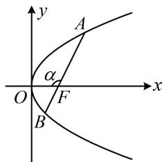

> [!faq]- 《第4节 高考中抛物线常用的二级结论》例题解析
>
> > [!success]- **【答案】** $\frac{9}{2}$
>
> > [!note]- **【分析】**
> > 本题未单列分析。
>
> > [!note]- **【解析】**
> > 解法1：由 $\vert AF \vert = 2\vert BF\vert$ 可用角版焦半径公式建立方程求得 $\cos \alpha$ ，从而求得 $\vert AB \vert$ ，
> >
> > 如图，设 $\angle AFO = \alpha$ ，则 $|AF| = \frac{2}{1 + \cos\alpha}$ ， $|BF| = \frac{2}{1 + \cos(\pi - \alpha)} = \frac{2}{1 - \cos\alpha}$
> >
> > 因为 $\left|AF\right|=2\left|BF\right|$ ，所以 $\frac{2}{1+\cos\alpha}=2\cdot\frac{2}{1-\cos\alpha}$ ，从而 $\cos\alpha=-\frac{1}{3}$ ，故 $\left|AB\right]=\frac{4}{\sin^{2}\alpha}=\frac{4}{1-\cos^{2}\alpha}=\frac{9}{2}$ .
> >
> > 解法2: 已知 $|AF| = 2|BF|$ , 想到结合 $\frac{1}{|AF|} + \frac{1}{|BF|} = \frac{2}{p}$ 也可求出 $|AF|$ 和 $|BF|$ , 从而求得 $|AB|$ ,
> >
> > 由题意， $\frac{1}{|AF|} +\frac{1}{|BF|} = \frac{2}{p} = 1$ ，结合 $\left|AF\right| = 2\left|BF\right|$ 可得 $\left|AF\right| = 3$ ， $\left|BF\right| = \frac{3}{2}$
> >
> > 所以 $\left|AB\right|=\left|AF\right|+\left|BF\right|=\frac{9}{2}$ .
> >
> >
> > 
