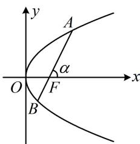

> [!faq]- 《第4节 高考中抛物线常用的二级结论》例题解析
>
> > [!success]- **【答案】** C
>
> > [!note]- **【分析】**
> > 本题未单列分析。
>
> > [!note]- **【解析】**
> > 解析：如图，由斜率可求得 $\cos \alpha$ ，于是选择角版焦半径公式来计算 $|AF|$ 和 $|BF|$
> >
> > 设直线 $l$ 的倾斜角为 $\alpha \left(0 < \alpha < \frac{\pi}{2}\right)$ ，则 $\tan \alpha = \frac{\sin \alpha}{\cos \alpha} = 2\sqrt{2}$ ，结合 $\sin^2\alpha + \cos^2\alpha = 1$ 可得 $\cos \alpha = \frac{1}{3}$ ，
> >
> > 由图可知 $\angle AFO = \pi -\alpha$ ， $\angle BFO = \alpha$ ，所以 $\left|AF\right| = \frac{p}{1 + \cos(\pi - \alpha)} = \frac{p}{1 - \cos\alpha} = \frac{3p}{2},$ $|BF| = \frac{p}{1 + \cos\alpha} = \frac{3p}{4}$ 又 $|AF| = \lambda |BF|$ ，所以 $\lambda = \frac{|AF|}{|BF|} = \frac{\frac{3p}{2}}{\frac{3p}{4}} = 2.$
> >
> >
> > 答案: C
> >
> > 
