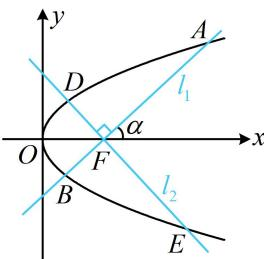

> [!faq]- 《第4节 高考中抛物线常用的二级结论》例题解析
>
> > [!success]- **【答案】** 24
>
> > [!note]- **【分析】**
> > 本题未单列分析。
>
> > [!note]- **【解析】**
> > 解法1： $|AB|$ 和 $|DE|$ 都是焦点弦，可由坐标版公式来算，需用到韦达定理，故联立直线和抛物线方程由题意， $F\left(\frac{3}{2},0\right)$ ， $l_1$ 和 $l_2$ 都不与坐标轴垂直，可设 $l_1:y = k\left(x - \frac{3}{2}\right)(k \neq 0)$ ，则 $l_2:y = -\frac{1}{k}\left(x - \frac{3}{2}\right)$ ，将 $y = k\left(x - \frac{3}{2}\right)$ 代入 $y^2 = 6x$ 消去 $y$ 整理得： $k^2 x^2 - (3k^2 + 6)x + \frac{9}{4} k^2 = 0$ ，由韦达定理， $x_1 + x_2 = \frac{3k^2 + 6}{k^2} = 3 + \frac{6}{k^2}$ ，所以 $|AB| = x_1 + x_2 + 3 = 6 + \frac{6}{k^2}$ ①，注意到两直线仅斜率不同，其它都一样，故只需在①中替换斜率即可得到 $|DE|$ ，无需重复计算，在①用 $-\frac{1}{k}$ 替换 $k$ 可得 $|DE| = 6 + 6k^2$ ，所以 $|AB| + |DE| = 12 + 6\left(\frac{1}{k^2} + k^2\right) \geq 12 + 6 \times 2\sqrt{\frac{1}{k^2} \cdot k^2} = 24$ ，当且仅当 $\frac{1}{k^2} = k^2$ ，即 $k = \pm 1$ 时取等号，故 $|AB| + |DE|$ 的最小值为24. 解法2： $|AB|$ 和 $|DE|$ 都是焦点弦，也可设两直线的倾斜角，用角版焦点弦公式来计算，如图，设直线 $l_1$ 的倾斜角为 $\alpha$ ，两直线都不与坐标轴垂直，不妨设 $0 < \alpha < \frac{\pi}{2}$ ，则 $|AB| = \frac{6}{\sin^2 \alpha}$ ，
> >
> > 因为 $l_{1} \perp l_{2}$ ，所以 $l_{2}$ 的倾斜角为 $\frac{\pi}{2} + \alpha$ ，从而 $|DE| = \frac{6}{\sin^2\left(\frac{\pi}{2} + \alpha\right)} = \frac{6}{\cos^2\alpha}$ ，故 $|AB| + |DE| = \frac{6}{\sin^2\alpha} + \frac{6}{\cos^2\alpha} = \frac{6\cos^2\alpha + 6\sin^2\alpha}{\sin^2\alpha\cos^2\alpha} = \frac{6}{\left(\frac{1}{2}\sin 2\alpha\right)^2} = \frac{24}{\sin^2 2\alpha}$ ，所以当 $\alpha = \frac{\pi}{4}$ 时， $\sin^2 2\alpha = 1$ ， $|AB| + |DE|$ 取得最小值24.
> >
> >
> > 
