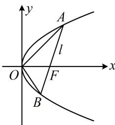

> [!faq]- 《第4节 高考中抛物线常用的二级结论》例题解析
>
> > [!success]- **【答案】** B
>
> > [!note]- **【分析】**
> > 本题未单列分析。
>
> > [!note]- **【解析】**
> > 解析：给了直线 l 的斜率，可求得其倾斜角，故考虑直接代公式 $S=\frac{p^{2}}{2\sin\alpha}$ 计算 $\triangle AOB$ 的面积，
> > 如图，直线 l 的斜率为 $1 \Rightarrow$ 倾斜角 $\alpha = 45^{\circ}$ ，所以 $S_{\triangle AOB} = \frac{p^{2}}{2\sin\alpha} = \frac{p^{2}}{2\sin45^{\circ}} = \frac{p^{2}}{\sqrt{2}}$ 由题意， $\triangle AOB$ 的面积为 $3\sqrt{2}$ ，所以 $\frac{p^{2}}{\sqrt{2}} = 3\sqrt{2}$ ，解得： $p = \sqrt{6}$ .
> >
> > 
>
> > [!tip]- **【反思】**
> > 抛物线中涉及焦点弦与原点组成的三角形的面积问题，都可考虑用面积公式 $S = \frac{p^2}{2\sin\alpha}$ 来算.
