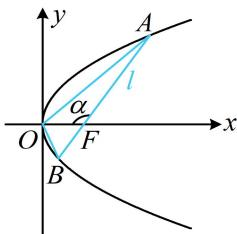

> [!faq]- 《第4节 高考中抛物线常用的二级结论》例题解析
>
> > [!success]- **【答案】** A
>
> > [!note]- **【分析】**
> > 本题未单列分析。
>
> > [!note]- **【解析】**
> > 解析：由 $\overrightarrow{AB} = 3\overrightarrow{FB}$ 可结合角版焦点弦、焦半径公式求角，再用 $S = \frac{p^2}{2\sin\alpha}$ 算 $\triangle AOB$ 的面积，如图，设 $\angle AFO = \alpha (0 < \alpha < \pi)$ ，则 $|AB| = \frac{2p}{\sin^2\alpha}$ ， $\angle BFO = \pi - \alpha$ ，所以 $|FB| = \frac{p}{1 + \cos(\pi - \alpha)} = \frac{p}{1 - \cos\alpha}$ ，因为 $\overrightarrow{AB} = 3\overrightarrow{FB}$ ，所以 $|AB| = 3|FB|$ ，从而 $\frac{2p}{\sin^2\alpha} = 3 \cdot \frac{p}{1 - \cos\alpha}$ ，故 $\frac{2}{\sin^2\alpha} = \frac{3}{1 - \cos\alpha}$ ①，
> >
> > 又 $\frac{2}{\sin^2\alpha} = \frac{2}{1 - \cos^2\alpha} = \frac{2}{(1 + \cos\alpha)(1 - \cos\alpha)}$ ，所以代入①化简得： $\frac{2}{1 + \cos\alpha} = 3$ ，解得：
> >
> > $$
> > \cos \alpha = - \frac {1}{3}
> > $$
> >
> > 因为 $0 < \alpha < \pi$ ，所以 $\sin \alpha = \sqrt{1 - \cos^2\alpha} = \frac{2\sqrt{2}}{3}$ ，故 $S_{\triangle AOB} = \frac{p^2}{2\sin\alpha} = \frac{p^2}{\frac{4\sqrt{2}}{3}} = \frac{3p^2}{4\sqrt{2}}$
> >
> > 又 $S_{\triangle AOB} = \frac{3\sqrt{2}}{2}$ ，所以 $\frac{3p^2}{4\sqrt{2}} = \frac{3\sqrt{2}}{2}$ ，解得： $p = 2$ ：
> >
> >
> > 
