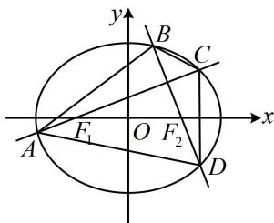

<!-- question-source:start -->
## 6. (2024·江苏泰州模拟·★★★★)

已知椭圆 $W: \frac{x^2}{a^2} + \frac{y^2}{b^2} = 1 (a > b > 0)$ 的左、右焦点分别为 $F_1$ ， $F_2$ ，且 $\left|F_1F_2\right| = 2$ ，椭圆上一动点 $P$ 满足 $\left|PF_1\right| + \left|PF_2\right| = 2\sqrt{3}$ .

（1）求椭圆 $W$ 的标准方程及离心率；

（2）如图，过点 $F_{1}$ 作直线 $l_{1}$ 与椭圆 $W$ 交于点 $A, C$ ，过点 $F_{2}$ 作直线 $l_{2} \perp l_{1}$ ，且 $l_{2}$ 与椭圆 $W$ 交于点 $B, D$ ，试求四边形ABCD面积的最大值.

<!-- question-source:end -->

![[Q00049518A1]]
