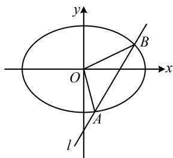

> [!faq]- 《第1节 解析几何大题条件翻译：长度与面积》参考答案
>
> > [!success]- **【答案】** 详见解析
>
> > [!note]- **【分析】**
> > 本题未单列分析。
>
> > [!note]- **【解析】**
> > 解: (1) 由题意, 椭圆的长轴长 $2a = 4$ , 所以 $a = 2$ ,
> >
> > 又椭圆的离心率 $e = \frac{\sqrt{a^2 - b^2}}{a} = \frac{\sqrt{2}}{2}$
> >
> > 化简得： $b=\frac{\sqrt{2}}{2}a=\sqrt{2}$ ，所以 C 的方程为 $\frac{x^{2}}{4}+\frac{y^{2}}{2}=1$ .
> >
> > （2）（所求为 $|AB|$ ，可联立直线 $l$ 与椭圆的方程，用弦长公式来算，直线 $AB$ 过点 $(0, -2)$ ，还差斜率就能写出其方程，故设斜率，下面考虑看斜率不存在的情况）
> >
> > 当直线 l 斜率不存在时，A，O，B 三点共线，不构成三角形，不合题意；
> >
> > 当直线 $l$ 斜率存在时，设 $l$ 的斜率为 $k$ ，结合 $l$ 过点 $(0, - 2)$ 可得 $l$ 的方程为 $y = kx - 2$ ，设 $A(x_{1},y_{1})$ ， $B(x_{2},y_{2})$
> >
> > 联立 $\left\{ \begin{array}{l} y = kx - 2 \\ \frac{x^2}{4} + \frac{y^2}{2} = 1 \end{array} \right.$ 消去 $y$ 整理得： $(1 + 2k^2)x^2 - 8kx + 4 = 0$
> >
> > 判别式 $\Delta = (-8k)^2 - 4(1 + 2k^2) \cdot 4 = 16(2k^2 - 1) > 0$
> >
> > 所以 $k < -\frac{\sqrt{2}}{2}$ 或 $k > \frac{\sqrt{2}}{2}$ ，
> >
> > 由弦长公式， $\left|AB\right|=\sqrt{1+k^{2}}\cdot\left|x_{1}-x_{2}\right|$
> >
> > $$
> > = \sqrt {1 + k ^ {2}} \cdot \frac {\sqrt {1 6 (2 k ^ {2} - 1)}}{\left| 1 + 2 k ^ {2} \right|} = \sqrt {1 + k ^ {2}} \cdot \frac {4 \sqrt {2 k ^ {2} - 1}}{1 + 2 k ^ {2}} \quad ①,
> > $$
> >
> > （求 $|AB|$ 还差 $k$ ，题干给出了 $\triangle OAB$ 的面积，可以 $AB$ 为底，点 $O$ 到直线 $l$ 的距离为高，计算该面积，建立方程求 $k$ ）直线 $l$ 的方程可化为 $kx - y - 2 = 0$ ，所以点 $O$ 到直线 $l$ 的距离 $d = \frac{|-2|}{\sqrt{k^2 + (-1)^2}} = \frac{2}{\sqrt{k^2 + 1}}$
> >
> > 所以 $S_{\triangle OAB} = \frac{1}{2}\big|AB\big|\cdot d = \frac{1}{2}\times \sqrt{1 + k^2}\cdot \frac{4\sqrt{2k^2 - 1}}{1 + 2k^2}\times \frac{2}{\sqrt{k^2 + 1}}$
> >
> > $= \frac{4\sqrt{2k^2 - 1}}{1 + 2k^2}$ ，由题意， $S_{\triangle OAB} = \sqrt{2}$
> >
> > 所以 $\frac{4\sqrt{2k^2 - 1}}{1 + 2k^2} = \sqrt{2}$ ，解得： $k^2 = \frac{3}{2}$ ，满足 $k < -\frac{\sqrt{2}}{2}$ 或
> >
> > $k > \frac{\sqrt{2}}{2}$ ，代入①得 $\left|AB\right| = \sqrt{1 + \frac{3}{2}} \times \frac{4\sqrt{2 \times \frac{3}{2} - 1}}{1 + 2 \times \frac{3}{2}} = \sqrt{5}$ .
> >
> > 
