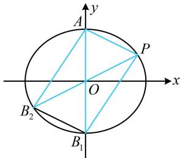

> [!faq]- 《第1节 解析几何大题条件翻译：长度与面积》参考答案
>
> > [!success]- **【答案】** 详见解析
>
> > [!note]- **【分析】**
> > 本题未单列分析。
>
> > [!note]- **【解析】**
> > 解：（1）由题意， $A(0,3)$ 在椭圆 $C$ 上，所以 $b = 3$
> >
> > 又 $P\left(3, \frac{3}{2}\right)$ 在椭圆 $C$ 上，所以 $\frac{9}{a^2} + \frac{9}{4b^2} = 1$
> >
> > 结合 $b = 3$ 得 $a = 2\sqrt{3}$ ，所以 $C$ 的离心率 $e = \frac{\sqrt{a^2 - b^2}}{a} = \frac{1}{2}$
> >
> > （2）解法1：（计算 $S_{\triangle ABP}$ 可用 $BP$ 为底，点 $A$ 到直线 $BP$ 的距离为高，故设直线 $BP$ 的斜率，用弦长公式计算 $\vert BP\vert$ ，下面先考虑斜率不存在的情况）
> >
> > 当直线 $l$ 斜率不存在时，其方程为 $x = 3$ ，所以点 $A$ 到直线 $BP$ 的距离为3，
> >
> > 又由对称性可知 $B\left(3, - \frac{3}{2}\right)$ ，所以 $\vert BP\vert = \frac{3}{2} -\left(-\frac{3}{2}\right) = 3$
> >
> > 故 $S_{\triangle ABP} = \frac{1}{2}\times 3\times 3 = \frac{9}{2}\neq 9$ ，不合题意；
> >
> > 当直线 $l$ 斜率存在时，设 $l$ 的方程为 $y - \frac{3}{2} = k(x - 3)$
> >
> > 即 $y = kx + \frac{3}{2} - 3k$ ①，代入 $\frac{x^2}{12} + \frac{y^2}{9} = 1$ 整理得：
> >
> > $$
> > (3 + 4 k ^ {2}) x ^ {2} + 4 k (3 - 6 k) x + 3 6 k ^ {2} - 3 6 k - 2 7 = 0 \quad ②,
> > $$
> >
> > （注意到 $P$ 的坐标是已知的，故结合韦达定理，可以求 $B$ 的坐标）由韦达定理， $x_{P}x_{B} = 3x_{B} = \frac{36k^{2} - 36k - 27}{3 + 4k^{2}}$ ，
> >
> > 所以 $x_{B} = \frac{12k^{2} - 12k - 9}{3 + 4k^{2}}$
> >
> > 故由弦长公式， $|BP| = \sqrt{1 + k^2}\cdot |x_P - x_B|$
> >
> > $$
> > = \sqrt {1 + k ^ {2}} \cdot \left| \frac {1 2 k ^ {2} - 1 2 k - 9}{3 + 4 k ^ {2}} - 3 \right| = \sqrt {1 + k ^ {2}} \cdot \frac {6 | 2 k + 3 |}{3 + 4 k ^ {2}},
> > $$
> >
> > 式①可化为 $2kx - 2y + 3 - 6k = 0$ ，
> >
> > 所以点 $A$ 到直线 $BP$ 的距离 $d = \frac{|-2\times 3 + 3 - 6k|}{\sqrt{4k^2 + 4}} = \frac{3|1 + 2k|}{2\sqrt{k^2 + 1}}$
> >
> > $$
> > S _ {\triangle A B P} = \frac {1}{2} | B P | \cdot d = \frac {1}{2} \sqrt {1 + k ^ {2}} \cdot \frac {6 | 2 k + 3 |}{3 + 4 k ^ {2}} \cdot \frac {3 | 1 + 2 k |}{2 \sqrt {k ^ {2} + 1}}
> > $$
> >
> > $= \frac{9\left|4k^2 + 8k + 3\right|}{2(3 + 4k^2)}$ ，由题意， $\frac{9\left|4k^2 + 8k + 3\right|}{2(3 + 4k^2)} = 9$
> >
> > 所以 $4k^{2} + 8k + 3 = 2(3 + 4k^{2})$ 或 $4k^{2} + 8k + 3 = -2(3 + 4k^{2})$
> >
> > 解得： $k=\frac{1}{2}$ 或 $\frac{3}{2}$ ，经检验，满足方程②的判别式 $\Delta>0$ ，
> >
> > 代入①化简得直线 l 的方程为 x-2y=0 或 3x-2y-6=0.
> >
> > 解法 2: (如图, 仔细观察会发现, 当 $B$ 与图中 $B_{1}$ 重合时, $\triangle ABP$ 的面积恰好为 9 , 所以这是满足题意的一种情况, 我们先求解此时的直线 $BP$ 的方程)
> >
> > 由题意，当点 $B$ 与椭圆的下顶点 $B_{1}(0, - 3)$ 重合时，
> >
> > $S_{\triangle ABP} = \frac{1}{2}\left|AB_1\right|\cdot d_{P - AB_1} = \frac{1}{2}\times 6\times 3 = 9$ （其中 $d_{P - AB_1}$ 表示点 $P$ 到直线 $AB_{1}$ 的距离），满足题意，
> >
> > 此时直线 $l$ 的斜率 $k = \frac{\frac{3}{2} - (-3)}{3 - 0} = \frac{3}{2}$
> >
> > 其方程为 $y - \frac{3}{2} = \frac{3}{2}(x - 3)$ ，化简得： $3x - 2y - 6 = 0$ ；
> >
> > （那其它情况怎么找呢？由于 $AP$ 的长是固定的，所以换个角度，我们以 $AP$ 为底，则高也是固定的，这意味着点 $B$ 只能在过 $B_{1}$ 且与 $AP$ 平行的直线上，该直线与椭圆还有一个交点 $B_{2}$ ，所以 $B$ 与 $B_{2}$ 重合也可以）如图，过 $B_{1}$ 作 $AP$ 的平行线交椭圆 $C$ 于另一点 $B_{2}$ ，则当 $B$ 与 $B_{2}$ 重合时，也有 $S_{\triangle ABP} = 9$
> >
> > 由对称性， $B_{2}\left(-3, - \frac{3}{2}\right)$ ，此时直线 $l$ 过原点，其斜率 $k = \frac{1}{2}$ ，所以 $l$ 的方程为 $y = \frac{1}{2} x$ ，化简得： $x - 2y = 0$
> >
> > 结合图形可知满足 $S_{\triangle ABP} = 9$ 的点 $B$ 只有 $B_{1}$ ， $B_{2}$ 两种情况，
> >
> > 所以 l 的方程为 3x - 2y - 6 = 0 或 x - 2y = 0.
> >
> > 
