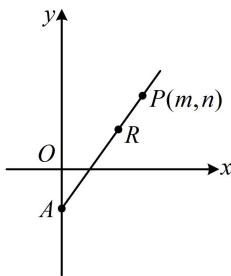
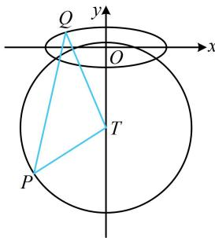
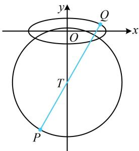

> [!faq]- 《第1节 解析几何大题条件翻译：长度与面积》参考答案
>
> > [!success]- **【答案】** 详见解析
>
> > [!note]- **【分析】**
> > 本题未单列分析。
>
> > [!note]- **【解析】**
> > 解: (1) 椭圆的下顶点为 $A(0, -b)$ , 右顶点为 $B(a, 0)$ ,
> >
> > 所以 $\left|AB\right|=\sqrt{(0-a)^{2}+(-b-0)^{2}}=\sqrt{a^{2}+b^{2}}$
> >
> > 又 $|AB|=\sqrt{10}$ ，所以 $\sqrt{a^{2}+b^{2}}=\sqrt{10}$ ，故 $a^{2}+b^{2}=10$ ①，
> >
> > 因为椭圆 $C$ 的离心率为 $\frac{2\sqrt{2}}{3}$ ，所以 $\frac{\sqrt{a^2 - b^2}}{a} = \frac{2\sqrt{2}}{3}$ ，
> >
> > 化简得： $a = 3b$ ，结合①可解得： $a = 3$ ， $b = 1$
> >
> > 所以椭圆 C 的方程为 $\frac{x^{2}}{9} + y^{2} = 1$ .
> >
> > (2) (i) 解法 1: (如图 1, A, P 的坐标已知, A, R, P 三点又共线, 于是可设 $\overrightarrow{AR} = \lambda \overrightarrow{AP}$ , 只要求出 $\lambda$ , 就能得到 $\overrightarrow{AR}$ 的坐标, 那么 $R$ 的坐标也就有了, 怎样求 $\lambda$ ? 可翻译 $|AR| \cdot |AP| = 3$ 建立关于 $\lambda$ 的方程并求解)
> >
> > 由（1）可得 $A(0, - 1)$ ，所以 $\overrightarrow{AP} = (m,n + 1)$
> >
> > 设 $R(x_{R},y_{R})$ ，则 $\overrightarrow{AR} = (x_R,y_R + 1)$
> >
> > 由图1可知 $\overrightarrow{AR}$ 与 $\overrightarrow{AP}$ 同向，所以可设 $\overrightarrow{AR} = \lambda \overrightarrow{AP} (\lambda >0)$ ，则 $\overrightarrow{AR}\cdot \overrightarrow{AP} = \lambda \overrightarrow{AP}\cdot \overrightarrow{AP} = \lambda \overrightarrow{AP} ^2 = \lambda [m^2 +(n + 1)^2 ]$ ②，
> >
> > 又 $\overrightarrow{AR} \cdot \overrightarrow{AP} = |\overrightarrow{AR}| \cdot |\overrightarrow{AP}| \cdot \cos 0^{\circ} = |\overrightarrow{AR}| \cdot |\overrightarrow{AP}| = |AR| \cdot |AP|$ ，
> >
> > 且由题意， $|AR|\cdot|AP|=3$ ，所以 $\overrightarrow{AR}\cdot\overrightarrow{AP}=3$ ，
> >
> > 结合②得 $\lambda [m^2 +(n + 1)^2 ] = 3$ ，所以 $\lambda = \frac{3}{m^2 + (n + 1)^2}$
> >
> > 因为 $\overrightarrow{AR} = \lambda \overrightarrow{AP}$ ，所以 $(x_{R},y_{R} + 1) = \lambda (m,n + 1)$
> >
> > 故 $\left\{\begin{aligned}x_{R}&=\lambda m\\ y_{R}&+1=\lambda(n+1)\end{aligned}\right.$
> >
> > 结合 $\lambda = \frac{3}{m^2 + (n + 1)^2}$ 可得 $\left\{ \begin{array}{l}x_{R} = \frac{3m}{m^{2} + (n + 1)^{2}}\\ y_{R} = \frac{3(n + 1)}{m^{2} + (n + 1)^{2}} -1 \end{array} \right.$
> >
> > 所以 $R$ 的坐标为 $\left(\frac{3m}{m^2 + (n + 1)^2}, \frac{3(n + 1)}{m^2 + (n + 1)^2} - 1\right)$ .
> >
> > 解法2: (核心是求 $\overrightarrow{AR}$ 的坐标, 注意到 $| \overrightarrow{AR}|$ 容易由 $|AR|$ .
> >
> > $\left|AP\right| = 3$ 求得，而 $\overrightarrow{AR} = \left|\overrightarrow{AR}\right|\cdot \frac{\overrightarrow{AP}}{\left|\overrightarrow{AP}\right|}$ ，由此可求 $\overrightarrow{AR}$ 的坐标）
> >
> > 由题意， $\overrightarrow{AP} = (m,n + 1)$ ，所以与 $\overrightarrow{AP}$ 同向的单位向量为 $\frac{\overrightarrow{AP}}{\left|\overrightarrow{AP}\right|} = \left(\frac{m}{\sqrt{m^2 + (n + 1)^2}},\frac{n + 1}{\sqrt{m^2 + (n + 1)^2}}\right),$
> >
> > 因为 $\left|AR\right|\cdot\left|AP\right|=3$ ，所以 $\left|\overrightarrow{AR}\right|=\left|AR\right|=\frac{3}{\left|AP\right|}$
> >
> > $= \frac{3}{\sqrt{m^2 + (n + 1)^2}}$ ，由图1可知 $\overrightarrow{AR}$ 与 $\overrightarrow{AP}$ 同向，
> >
> > 所以 $\overrightarrow{AR} = |\overrightarrow{AR} |\cdot \frac{\overrightarrow{AP}}{|\overrightarrow{AP}|}$
> >
> > $$
> > = \frac {3}{\sqrt {m ^ {2} + (n + 1) ^ {2}}} \left(\frac {m}{\sqrt {m ^ {2} + (n + 1) ^ {2}}}, \frac {n + 1}{\sqrt {m ^ {2} + (n + 1) ^ {2}}}\right)
> > $$
> >
> > $$
> > = \left(\frac {3 m}{m ^ {2} + (n + 1) ^ {2}}, \frac {3 (n + 1)}{m ^ {2} + (n + 1) ^ {2}}\right)
> > $$
> >
> > 又 $\overrightarrow{AR} = (x_R, y_R + 1)$ ，所以 $\left\{ \begin{array}{l} x_R = \frac{3m}{m^2 + (n + 1)^2} \\ y_R + 1 = \frac{3(n + 1)}{m^2 + (n + 1)^2} \end{array} \right.$ ，
> >
> > 从而 $\left\{ \begin{array}{l} x_{R} = \frac{3m}{m^{2} + (n + 1)^{2}} \\ y_{R} = \frac{3(n + 1)}{m^{2} + (n + 1)^{2}} - 1 \end{array} \right.$
> >
> > 故 $R$ 的坐标为 $\left(\frac{3m}{m^2 + (n + 1)^2}, \frac{3(n + 1)}{m^2 + (n + 1)^2} - 1\right)$ .
> >
> > (ii) (条件给出 $OR$ 的斜率是 $OP$ 斜率的3倍, 已有 $R$ , $P$ 的坐标, 可先用坐标翻译此条件, 看能得到什么)
> >
> > 由题意， $k_{OR} = 3k_{OP}$ ，所以 $\frac{\frac{3(n + 1)}{m^2 + (n + 1)^2} - 1}{\frac{3m}{m^2 + (n + 1)^2}} = 3\cdot \frac{n}{m}$
> >
> > 化简得： $m^2 +(n + 4)^2 = 18$ ，所以点 $P$ 在以 $T(0, - 4)$ 为圆心， $3\sqrt{2}$ 为半径的圆上，且 $P$ 不在 $y$ 轴上，
> >
> > （如图2， $P$ ， $Q$ 都是动点，直接分析 $|PQ|$ 的最大值不易，考虑先取定一个，由于圆上动点到定点的距离最值更容易分析，故不妨先取定 $Q$ ，考虑 $P$ 在圆上运动的情形）
> >
> >   
> > 图1
> >
> >   
> > 图2
> >
> > 对 $C$ 上任意的点 $Q$ ，当 $P$ 在圆 $T$ 上运动时，由三角形两边之和大于第三边， $\left|PQ\right|\leq \left|TQ\right| + \left|TP\right| = \left|TQ\right| + 3\sqrt{2}$ ③，取等条件是点 $T$ 在线段 $PQ$ 上，
> >
> > （再考虑 $Q$ 在椭圆上运动时， $|TQ|$ 的最大值，此时只有 $Q$ 是动点，可设 $Q$ 的坐标，表示 $\left|TQ\right|$ ，再分析最大值）设 $Q(x_0, y_0)$ ，则 $\left|TQ\right| = \sqrt{x_0^2 + (y_0 + 4)^2}$ ④，
> >
> > （有 $x_0$ ， $y_{0}$ 两个变量，考虑消元，可利用椭圆的方程来消元，且注意到 $x_0$ 只有平方项，所以消 $x_0$ 比较方便）由点 $Q$ 在椭圆 $C$ 上得 $\frac{x_0^2}{9} + y_0^2 = 1$ ，所以 $x_0^2 = 9 - 9y_0^2$
> >
> > 代入④得 $|TQ| = \sqrt{9 - 9y_0^2 + (y_0 + 4)^2} = \sqrt{-8y_0^2 + 8y_0 + 25}$
> >
> > $$
> > = \sqrt {- 8 \left(y _ {0} - \frac {1}{2}\right) ^ {2} + 2 7}
> > $$
> >
> > 因为 $-1 \leq y_0 \leq 1$ ，所以当 $y_0 = \frac{1}{2}$ 时， $|TQ|$ 取得最大值 $3\sqrt{3}$ ，
> >
> > 结合③得 $|PQ| \leq 3\sqrt{3} + 3\sqrt{2}$ ，
> >
> > 取等条件是 $y_0 = \frac{1}{2}$ ，且点 $T$ 在线段 $PQ$ 上，如图3，
> >
> > 此时 $P$ 不在 $y$ 轴上，满足题意，
> >
> > 所以 $|PQ|$ 的最大值是 $3\sqrt{3} + 3\sqrt{2}$ .
> >
> >   
> > 图3
>
> > [!tip]- **【反思】**
> > 不一定看到长度就要用弦长公式翻译,例如本题翻译 $|AR|\cdot|AP|=3$ 这个条件时,就没有用弦长公式,而是根据 $\overrightarrow{AR}$ 与 $\overrightarrow{AP}$ 同向,将 $|AR|\cdot|AP|$ 转化成 $\overrightarrow{AR}\cdot\overrightarrow{AP}$ 来处理(解法1),或用两点距离公式计算 $|AP|$ ,再得到 $|AR|$ (解法2),所以具体问题要具体分析.
