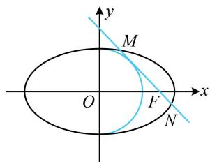

> [!faq]- 《第1节 解析几何大题条件翻译：长度与面积》参考答案
>
> > [!success]- **【答案】** 详见解析
>
> > [!note]- **【分析】**
> > 本题未单列分析。
>
> > [!note]- **【解析】**
> > 解：（1）因为椭圆 $C$ 的右焦点为 $F(\sqrt{2}, 0)$ ，所以其半焦距
> >
> > $c = \sqrt{2}$ ，又离心率 $e = \frac{c}{a} = \frac{\sqrt{6}}{3}$ ，所以 $a = \sqrt{3}$
> >
> > 从而 $b^{2} = a^{2} - c^{2} = 1$ ，故椭圆 $C$ 的方程为 $\frac{x^2}{3} +y^2 = 1$
> >
> > (2) (条件给出直线 $MN$ 与曲线 $x^{2} + y^{2} = b^{2}(x > 0)$ 相切, 该曲线是半圆, 可用圆心到直线 $MN$ 的距离等于半径来翻译, 故先设直线 $MN$ 的方程. 由于要证的结论中的 $F$ 在 $x$ 轴上, 故考虑设横截式)
> >
> > 由（1）知所给曲线即为 $x^{2} + y^{2} = 1(x > 0)$ ，过 $F$ 且 $\perp y$ 轴的直线不与该曲线相切，故可设 $MN$ 的方程为 $x = my + t$ 如图，直线 $MN$ 与右半圆 $x^{2} + y^{2} = 1(x > 0)$ 相切，应有 $t > 0$
> >
> > 且 $\frac{|t|}{\sqrt{m^2 + 1}} = 1$ ，整理得： $t^2 = m^2 +1$ ①，
> >
> > （下面先证充分性，应以 $|MN| = \sqrt{3}$ 为条件，证 $M, N, F$ 三点共线，故将直线 $MN$ 代入椭圆 $C$ 的方程，用弦长公式求 $|MN|$ ）将 $x = my + t$ 代入 $\frac{x^2}{3} + y^2 = 1$ 消去 $x$ 整理得：
> >
> > $$
> > (m ^ {2} + 3) y ^ {2} + 2 m t y + t ^ {2} - 3 = 0
> > $$
> >
> > 判别式 $\Delta = 4m^2 t^2 - 4(m^2 + 3)(t^2 - 3) = 12(m^2 + 3 - t^2)$ ，
> >
> > 将式①代入可得 $\Delta = 12(m^2 + 3 - m^2 - 1) = 24 > 0$
> >
> > 设 $M(x_{1},y_{1})$ ， $N(x_{2},y_{2})$ ，则由弦长公式，
> >
> > $$
> > \left| M N \right| = \sqrt {1 + m ^ {2}} \cdot \left| y _ {1} - y _ {2} \right| = \sqrt {1 + m ^ {2}} \cdot \frac {\sqrt {2 4}}{m ^ {2} + 3},
> > $$
> >
> > 因为 $\left|MN\right|=\sqrt{3}$ ，所以 $\sqrt{1+m^{2}}\cdot\frac{\sqrt{24}}{m^{2}+3}=\sqrt{3}$ ，故 $m^{2}=1$ ，
> >
> > 代入①结合 t > 0 可得 $t = \sqrt{2}$ ，
> >
> > 所以直线 MN 的方程为 $x = my + \sqrt{2}$ ，
> >
> > 从而直线 MN 过点 $F(\sqrt{2},0)$ ,
> >
> > 故 $M, N, F$ 三点共线，充分性成立；（再证必要性，应以 $M, N, F$ 三点共线为条件，证明 $\left|MN\right| = \sqrt{3}$ ）
> >
> > 因为 M, N, F 三点共线，所以直线 MN 过点 $F(\sqrt{2},0)$ ,
> >
> > 代入 $x = my + t$ 可得 $t = \sqrt{2}$ ，结合式①可得 $m = \pm 1$
> >
> > 所以直线 MN 的方程为 $x = \pm y + \sqrt{2}$ ，
> >
> > 代入 $\frac{x^2}{3} + y^2 = 1$ 消去 $x$ 整理得： $4y^{2} \pm 2\sqrt{2} y - 1 = 0$
> >
> > 判别式 $\Delta' = (\pm 2\sqrt{2})^2 - 4 \times 4 \times (-1) = 24 > 0$
> >
> > 由弦长公式， $\left|MN\right|=\sqrt{1+(\pm1)^{2}}\cdot\left|y_{1}-y_{2}\right|=\sqrt{2}\times\frac{\sqrt{24}}{4}=\sqrt{3}$
> >
> > 必要性成立；
> >
> > 综上所述， $M$ ， $N$ ， $F$ 三点共线的充要条件是 $\left|MN\right| = \sqrt{3}$
> >
> > 
