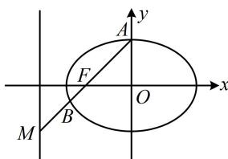
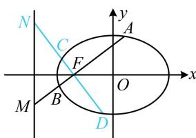

> [!faq]- 《第1节 解析几何大题条件翻译：长度与面积》参考答案
>
> > [!success]- **【答案】** 详见解析
>
> > [!note]- **【分析】**
> > 本题未单列分析。
>
> > [!note]- **【解析】**
> > 解：（1）因为椭圆 E 的焦距 2c = 2，所以 c = 1， $F(-1,0)$ ，解：（1）因为椭圆 $E$ 的点距 $2c = 2$ ，所以 $c = 1$ ， $F(-1,0)$ 又离心率 $e = \frac{c}{a} = \frac{\sqrt{2}}{2}$ ，所以 $a = \sqrt{2}$ ，故 $b = \sqrt{a^2 - c^2} = 1$ （如图1，已知 $F$ 和 $M$ ，可写出直线 $l$ 的方程，代入椭圆方程，求得交点坐标，再证结论）因为 $M(-2, -1)$ ，所以直线 $l$ 的斜率为 $\frac{-1 - 0}{-2 - (-1)} = 1$ 故 $l$ 的方程为 $y = x + 1$ ，代入 $\frac{x^2}{2} + y^2 = 1$ 消去 $y$ 整理得： $3x^{2} + 4x = 0$ ，解得： $x = 0$ 或 $-\frac{4}{3}$ （有直线 $l$ 的斜率，可按弦长公式 $\sqrt{1 + k^2} \cdot |x_1 - x_2|$ 计算有关长度，故无需再求 $A, B$ 的纵坐标）不妨设 $A$ 的横坐标为0，则 $B$ 的横坐标为 $-\frac{4}{3}$ 由弦长公式， $|MA| = \sqrt{1 + 1^2} \cdot |-2 - 0| = 2\sqrt{2}$ ， $|BF| = \sqrt{1 + 1^2} \cdot \left| -\frac{4}{3} - (-1) \right| = \frac{\sqrt{2}}{3}$ ， $|MB| = \sqrt{1 + 1^2} \cdot \left| -2 - \left( -\frac{4}{3} \right) \right|$ $= \frac{2\sqrt{2}}{3}$ ， $|AF| = \sqrt{1 + 1^2} \cdot |0 - (-1)| = \sqrt{2}$ 所以 $|MA| \cdot |BF| = \frac{4}{3}$ ， $|MB| \cdot |AF| = \frac{4}{3}$ 故 $|MA| \cdot |BF| = |MB| \cdot |AF|$ .
> >
> >   
> > 图1
> >
> >   
> > 图2
> >
> > （2）（如图2，求 $|MA|$ ， $|MB|$ ， $|NC|$ ， $|ND|$ 可用弦长公式 $\sqrt{1+k^{2}}\cdot|x_{1}-x_{2}|$ ，需要直线的斜率和有关点的坐标，故先把这些设出来）
> >
> > 设 $A(x_{1},y_{1})$ ， $B(x_{2},y_{2})$ ，因为 $AB$ 及其垂线都与直线 $x = -2$ 相交，所以直线 $AB$ 斜率存在且不为0，故可设直线 $AB$ 的斜率为 $k(k\neq 0)$ ，
> >
> > 因为 $CD \perp AB$ ，所以直线 $CD$ 的斜率为 $-\frac{1}{k}$
> >
> > 由弦长公式， $\left|MA\right|=\sqrt{1+k^{2}}\cdot\left|-2-x_{1}\right|=\sqrt{1+k^{2}}(x_{1}+2)$ ，
> >
> > 同理， $\left|MB\right|=\sqrt{1+k^{2}}(x_{2}+2)$
> >
> > 所以 $\frac{1}{|MA|} +\frac{1}{|MB|} = \frac{1}{\sqrt{1 + k^2}(x_1 + 2)} +\frac{1}{\sqrt{1 + k^2}(x_2 + 2)}$
> >
> > $$
> > = \frac {x _ {1} + x _ {2} + 4}{\sqrt {1 + k ^ {2}} (x _ {1} + 2) (x _ {2} + 2)} = \frac {x _ {1} + x _ {2} + 4}{\sqrt {1 + k ^ {2}} [ x _ {1} x _ {2} + 2 (x _ {1} + x _ {2}) + 4 ]} \quad ①,
> > $$
> >
> > (看到 $x_{1} + x_{2}$ 和 $x_{1}x_{2}$ ，想到将直线 AB 的方程代入椭圆 E 的方程，结合韦达定理来算它们)
> >
> > 直线 $AB$ 的方程为 $y = k(x + 1)$ ，代入 $\frac{x^2}{2} + y^2 = 1$ 消去 $y$ 整理得： $(2k^2 + 1)x^2 + 4k^2x + 2k^2 - 2 = 0$
> >
> > 判别式 $\Delta = 16k^4 - 4(2k^2 + 1)(2k^2 - 2) = 8(k^2 + 1) > 0$
> >
> > 由韦达定理， $x_{1} + x_{2} = -\frac{4k^{2}}{2k^{2} + 1},\quad x_{1}x_{2} = \frac{2k^{2} - 2}{2k^{2} + 1},$
> >
> > 代入①得： $\frac{1}{|MA|} +\frac{1}{|MB|} = \frac{-\frac{4k^2}{2k^2 + 1} + 4}{\sqrt{1 + k^2}\left[\frac{2k^2 - 2}{2k^2 + 1} + 2\left(-\frac{4k^2}{2k^2 + 1}\right) + 4\right]}$
> >
> > $$
> > = \frac {4 k ^ {2} + 4}{\sqrt {1 + k ^ {2}} (2 k ^ {2} + 2)} = \frac {2}{\sqrt {1 + k ^ {2}}} \quad ②,
> > $$
> >
> > (要再求一遍 $\frac{1}{|NC|} + \frac{1}{|ND|}$ 吗? 不用, 因为 $AB$ 与 $CD$ 仅斜率不同, 故直接将②的 $k$ 换成 $-\frac{1}{k}$ 即得 $\frac{1}{|NC|} + \frac{1}{|ND|}$ )
> >
> > 同理， $\frac{1}{|NC|} +\frac{1}{|ND|} = \frac{2}{\sqrt{1 + \left(-\frac{1}{k}\right)^2}} = \frac{2|k|}{\sqrt{k^2 + 1}}$ ③，
> >
> > 结合②③得 $\frac{1}{|MA|} +\frac{1}{|MB|} +\frac{1}{|NC|} +\frac{1}{|ND|} = \frac{2}{\sqrt{1 + k^2}} +\frac{2|k|}{\sqrt{1 + k^2}}$
> >
> > $$
> > = \frac {2 (1 + | k |)}{\sqrt {1 + k ^ {2}}} = 2 \sqrt {\frac {(1 + | k |) ^ {2}}{1 + k ^ {2}}} = 2 \sqrt {\frac {1 + 2 | k | + k ^ {2}}{1 + k ^ {2}}} = 2 \sqrt {1 + \frac {2 | k |}{1 + k ^ {2}}}
> > $$
> >
> > $$
> > = 2 \sqrt {1 + \frac {2}{\frac {1}{| k |} + | k |}} \leq 2 \sqrt {1 + \frac {2}{2 \sqrt {\frac {1}{| k |} \cdot | k |}}} = 2 \sqrt {2},
> > $$
> >
> > 当且仅当 $\frac{1}{|k|} = |k|$ ，即 $k = \pm 1$ 时取等号，
> >
> > 所以 $\frac{1}{|MA|} +\frac{1}{|MB|} +\frac{1}{|NC|} +\frac{1}{|ND|}$ 的最大值为 $2\sqrt{2}$
