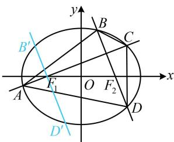

> [!faq]- 《第1节 解析几何大题条件翻译：长度与面积》参考答案
>
> > [!success]- **【答案】** 详见解析
>
> > [!note]- **【分析】**
> > 本题未单列分析。
>
> > [!note]- **【解析】**
> > 解：（1）由题意， $\left|F_{1}F_{2}\right|=2c=2$ ，所以 c=1，
> >
> > 又 $\left|PF_{1}\right|+\left|PF_{2}\right|=2a=2\sqrt{3}$ ，所以 $a=\sqrt{3}$ ，
> >
> > 从而 $b = \sqrt{a^2 - c^2} = \sqrt{2}$ ，故椭圆 $W$ 的方程为 $\frac{x^2}{3} + \frac{y^2}{2} = 1$ ，
> >
> > 离心率 $e = \frac{c}{a} = \frac{1}{\sqrt{3}} = \frac{\sqrt{3}}{3}$
> >
> > （2）（四边形ABCD对角线垂直，可按 $S = \frac{1}{2}|AC|\cdot |BD|$ 求其面积，故设直线AC和BD的方程，用弦长公式计算 $|AC|$ ， $|BD|$ ，直线AC，BD过 $x$ 轴上定点，一般设横截式，故先考虑斜率为0的情况）
> >
> > 由题意可知， $F_{1}(-1,0)$ ， $F_{2}(1,0)$ ，
> >
> > 当直线 $l_{1} \perp y$ 轴时， $l_{2} \perp x$ 轴，此时 $\left|AC\right| = 2a = 2\sqrt{3}$ ，
> >
> > 直线 $l_{2}$ 的方程为 $x = 1$ ，代入 $\frac{x^2}{3} +\frac{y^2}{2} = 1$ 可求得 $y = \pm \frac{2\sqrt{3}}{3}$
> >
> > 所以 $\left|BD\right|=\frac{4\sqrt{3}}{3}$ ， $S_{ABCD}=\frac{1}{2}\left|AC\right|\cdot\left|BD\right|=\frac{1}{2}\times2\sqrt{3}\times\frac{4\sqrt{3}}{3}=4$ ，
> >
> > 由对称性可知当 $l_{1} \perp x$ 轴， $l_{2} \perp y$ 轴时，也有 $S_{ABCD} = 4$
> >
> > $$
> > l _ {1}, \quad l _ {2}
> > $$
> >
> > 设 $l_{1}$ 的方程为 $x=my-1(m\neq0)$ ,
> >
> > 代入 $\frac{x^2}{3} +\frac{y^2}{2} = 1$ 消去 $x$ 整理得： $(2m^{2} + 3)y^{2} - 4my - 4 = 0$
> >
> > 判别式 $\Delta = (-4m)^2 - 4(2m^2 + 3) \cdot (-4) = 48(m^2 + 1) > 0$
> >
> > 设 $A(x_{1},y_{1})$ ， $C(x_{2},y_{2})$ ，则 $\left|AC\right| = \sqrt{1 + m^2}\cdot \left|y_1 - y_2\right|$
> >
> > $$
> > = \sqrt {1 + m ^ {2}} \cdot \frac {\sqrt {4 8 (m ^ {2} + 1)}}{2 m ^ {2} + 3} = \frac {4 \sqrt {3} (m ^ {2} + 1)}{2 m ^ {2} + 3}
> > $$
> >
> > （再求 $|BD|$ ，要重新计算一遍吗？不用，直线BD的方程为 $x=-\frac{1}{m}y+1$ ，如图，由对称性， $|BD|=|B'D'|$ ，其中 $B'D':x=-\frac{1}{m}y-1$ ，它与AC的差异只是把m换成了 $-\frac{1}{m}$ ，其它都一样，所以在 $|AC|$ 的结果中将m换成 $-\frac{1}{m}$ 就能得到 $|B'D|$ ，于是 $|BD|=\frac{4\sqrt{3}\left[\left(-\frac{1}{m}\right)^{2}+1\right]}{2\left(-\frac{1}{m}\right)^{2}+3}=\frac{4\sqrt{3}(1+m^{2})}{2+3m^{2}}$ ．这是我们分析得出的结果，作答时，直接写同理就行了）
> >
> > 同理， $\left|BD\right|=\frac{4\sqrt{3}(1+m^{2})}{2+3m^{2}}$ ，所以 $S_{ABCD}=\frac{1}{2}\left|AC\right|\cdot\left|BD\right|$
> >
> > $$
> > = \frac {1}{2} \times \frac {4 \sqrt {3} (m ^ {2} + 1)}{2 m ^ {2} + 3} \times \frac {4 \sqrt {3} (1 + m ^ {2})}{2 + 3 m ^ {2}} = \frac {2 4 (m ^ {2} + 1) ^ {2}}{(2 m ^ {2} + 3) (2 + 3 m ^ {2})},
> > $$
> >
> > (怎样求上式的最值？不妨把分母展开，观察它与分子的联系)
> >
> > $$
> > S _ {A B C D} = \frac {2 4 (m ^ {2} + 1) ^ {2}}{6 m ^ {4} + 1 3 m ^ {2} + 6} = \frac {2 4 (m ^ {2} + 1) ^ {2}}{6 (m ^ {2} + 1) ^ {2} + m ^ {2}} = \frac {2 4}{6 + \frac {m ^ {2}}{(m ^ {2} + 1) ^ {2}}} ,
> > $$
> >
> > 因为 $\frac{m^2}{(m^2 + 1)^2} > 0$ ，所以 $6 + \frac{m^2}{(m^2 + 1)^2} > 6$ ，
> >
> > 故 $0 < S_{ABCD} = \frac{24}{6 + \frac{m^2}{(m^2 + 1)^2}} < 4$
> >
> > 综上所述，四边形ABCD面积的最大值为4.
> >
> > 
