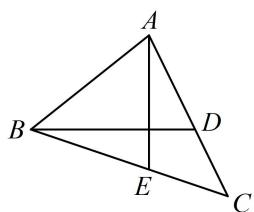
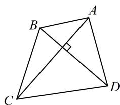

<!-- source-part:1 pages:1-10 -->

# 模块六 解析几何大题

## 第 1 节 解析几何大题条件翻译：长度与面积（★★★★）

## 内容提要

解析几何大题虽然以计算为主，但我们要学会合理地翻译各种题设条件，才能让计算变得更加有效、高效。我们将通过4节来学习各种常见条件的翻译方法，本节主要介绍长度、面积这两类条件的翻译。

## 1. 弦长的计算方法

①设 $A(x_{1},y_{1})$ ， $B(x_{2},y_{2})$ 是直线 $l:y = kx + t$ 上任意两点，则 $\left|AB\right| = \sqrt{(x_1 - x_2)^2 + (y_1 - y_2)^2}$

上述平面上两点间的距离公式是一切弦长公式的起点，其它计算方法都是由它演变而来的.

例如，将 $\left\{ \begin{array}{l} y_{1} = kx_{1} + t \\ y_{2} = kx_{2} + t \end{array} \right.$ 代入上式，则可化为 $|AB| = \sqrt{1 + k^2} \cdot |x_1 - x_2|$ ，所以当 $x_{1}$ ， $x_{2}$ 容易求出时，可按 $|AB| = \sqrt{1 + k^2} \cdot |x_1 - x_2|$ 计算 $|AB|$ ；

当 $A, B$ 是直线 $l$ 与二次曲线 $f(x, y) = 0$ （一般指圆、椭圆、双曲线、抛物线）的两个交点时，常可联立 $\left\{ \begin{array}{l} y = kx + t \\ f(x, y) = 0 \end{array} \right.$ 消去 $y$ ，得到关于 $x$ 的一元二次方程 $ax^2 + bx + c = 0 (a \neq 0)$ ，则由韦达定理推论， $|x_1 - x_2| = \frac{\sqrt{\Delta}}{|a|}$ ，代入 $|AB| = \sqrt{1 + k^2} \cdot |x_1 - x_2|$ 可得 $|AB| = \sqrt{1 + k^2} \cdot \frac{\sqrt{\Delta}}{|a|}$ .

②设 $A(x_{1},y_{1})$ ， $B(x_{2},y_{2})$ 是直线 $l:x = my + n$ 上任意两点，则 $\left|AB\right| = \sqrt{(x_1 - x_2)^2 + (y_1 - y_2)^2}$

若 $y_{1}$ ， $y_{2}$ 容易求出，则可按 $\left|AB\right| = \sqrt{1 + m^2}\cdot \left|y_1 - y_2\right|$ （推导方法与①相同）计算 $\left|AB\right|$

当 $A, B$ 是直线 $l$ 与二次曲线 $f(x, y) = 0$ 的两个交点时，常可联立 $\left\{ \begin{array}{l} x = my + n \\ f(x, y) = 0 \end{array} \right.$ 消去 $x$ ，得到关于 $y$ 的一元二次方程 $ay^2 + by + c = 0 (a \neq 0)$ ，按 $\left|AB\right| = \sqrt{1 + m^2} \cdot \frac{\sqrt{\Delta}}{\left|a\right|}$ 来计算 $\left|AB\right|$ .

2. 面积的计算：算面积常伴随着算弦长，我们分三角形和四边形来归纳面积的计算方法.

①对于三角形面积的计算，常见的方法有五种：

(i) $S = \frac{1}{2}$ 底 $\times$ 高，在题干没有特殊条件的情况下，常用此法算三角形的面积.

(ii)用 “水平宽” 或 “铅垂高” 算面积: 如图 1,

$$
S _ {\triangle A B C} = \frac {1}{2} | A E | \cdot | x _ {B} - x _ {C} | = \frac {1}{2} | B D | \cdot | y _ {A} - y _ {C} |.
$$

  
图1

  
图2

(iii)用两边及夹角： $S_{\triangle ABC} = \frac{1}{2}\big|AB|\cdot |AC|\cdot \sin \angle BAC$ ，此法常用于内角已知的情况.

(iv)转化：当直接计算某三角形的面积不方便时，还可以考虑利用其它条件（如相似等）转化为其它容易求面积的三角形来算面积.

(v)原点三角形面积公式：对于 $\triangle AOB$ （其中 $O$ 为原点），若其它方法计算 $S_{\triangle AOB}$ 不易，但 $A$ ， $B$ 的坐标已知或容易求得，则还可以考虑按 $S_{\triangle AOB} = \frac{1}{2}\left|x_A y_B - x_B y_A\right|$ 来算面积。需注意，此二级结论不宜直接使用，应先推导，推导方法请参考本节例3。

另外，当三角形没有顶点在原点时，也有类似的公式，我们可以通过平移三角形把其中一个顶点移到原点，再套上述公式。以 $\triangle ABC$ 为例，把三个顶点的坐标同时减去 $A$ 的坐标，就将 $A$ 移到了原点，平移后 $B$ ， $C$ 的坐标分别等于 $\overrightarrow{AB}$ ， $\overrightarrow{AC}$ 的坐标，假设 $\overrightarrow{AB} = (x_1, y_1)$ ， $\overrightarrow{AC} = (x_2, y_2)$ ，则 $S_{\triangle ABC} = \frac{1}{2} |x_1y_2 - x_2y_1|$ 。

②对于四边形面积的计算，常见的方法有两种：

(i)特殊四边形，如上面图2，四边形ABCD的对角线互相垂直，则 $S_{ABCD}=\frac{1}{2}\left|AC\right|\cdot\left|BD\right|$ ;

(ii)一般的四边形，可用一条对角线分割成两个三角形分别算面积.

![[高中/总复习/教辅/一数常规版2026/第10章 解析几何/模块6 解析几何大题/第1节 解析几何大题条件翻译：长度与面积/类型01_弦长的计算/类型01_弦长的计算.md]]
![[高中/总复习/教辅/一数常规版2026/第10章 解析几何/模块6 解析几何大题/第1节 解析几何大题条件翻译：长度与面积/类型02_面积的计算/类型02_面积的计算.md]]
![[高中/总复习/教辅/一数常规版2026/第10章 解析几何/模块6 解析几何大题/第1节 解析几何大题条件翻译：长度与面积/强化训练/强化训练.md]]
