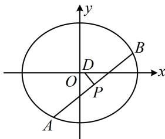

> [!faq]- 《第1节 解析几何大题条件翻译：长度与面积》例题解析
>
> > [!success]- **【答案】** 详见解析
>
> > [!note]- **【分析】**
> > 本题未单列分析。
>
> > [!note]- **【解析】**
> > 解：
> > 因为 $AB$ 的中垂线与 $x$ 轴交于唯一的点 $D$ ，所以 $AB$ 不与 $x$ 轴垂直，故 $m \neq 0$ 所以 $\left|DP\right| = \sqrt{1 + \left(-\frac{1}{m}\right)^2} \cdot \left|y_D - y_P\right| = \sqrt{\frac{m^2 + 1}{m^2}} \cdot \left|0 - \left(-\frac{3m}{3m^2 + 4}\right)\right| = \frac{3\sqrt{m^2 + 1}}{3m^2 + 4}$
> >
> > 
> >
> > 由题意， $\left|AB\right|=4\sqrt{2}\left|DP\right|$ ，所以 $\frac{12(m^{2}+1)}{3m^{2}+4}=4\sqrt{2}\cdot\frac{3\sqrt{m^{2}+1}}{3m^{2}+4}$ ，解得： $m=\pm1$ ，
> >
> > $$
> > x - y - 1 = 0
> > $$
> >
> > $$
> > x + y - 1 = 0
> > $$
>
> > [!tip]- **【反思】**
> > 本题弦长的两种算法都用到了，A，B 是 l 与椭圆的两个交点且不知道坐标，所以用 $\left|AB\right|=\sqrt{1+m^{2}}\cdot\frac{\sqrt{\Delta}}{\left|a\right|}$ 求 $\left|AB\right|$ ；而 P 的纵坐标好求，D 的纵坐标已知，故按 $\left|DP\right|=\sqrt{1+\left(-\frac{1}{m}\right)^{2}}\cdot\left|y_{D}-y_{P}\right|$ 求 $\left|DP\right|$ .
