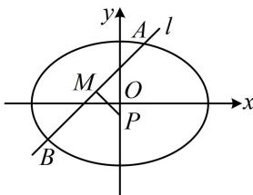

> [!faq]- 《第1节 解析几何大题条件翻译：长度与面积》例题解析
>
> > [!success]- **【答案】** 详见解析
>
> > [!note]- **【分析】**
> > 本题未单列分析。
>
> > [!note]- **【解析】**
> > (2) 若斜率不为 0 的直线 $l$ 与椭圆 $E$ 交于点 $A, B$ , 过点 $P\left(0, -\frac{1}{3}\right)$ 的直线垂直平分线段 $AB$ , 且交 $AB$ 于点 $M$ , $\left|AM\right| = 2\left|PM\right|$ , 求直线 $l$ 的方程.
> >
> > 解：
> > （1）由题意，椭圆的离心率 $e = \frac{\sqrt{a^2 - b^2}}{a} = \frac{\sqrt{2}}{2}$ ，化简得： $a = \sqrt{2} b$ ，
> >
> > 又因为椭圆过点 $T\left(\sqrt{3}, \frac{\sqrt{6}}{2}\right)$ ，所以 $\frac{3}{a^2} + \frac{3}{2b^2} = 1$ ，结合 $a = \sqrt{2} b$ 解得： $a = \sqrt{6}$ ， $b = \sqrt{3}$ ，
> >
> > 所以椭圆 $E$ 的方程为 $\frac{x^2}{6} +\frac{y^2}{3} = 1$
> >
> > (2) (翻译条件 $|AM|=2|PM|$ 需要计算 $|AM|$ 和 $|PM|$ ，其中 $|AM|=\frac{1}{2}|AB|$ ，而 $|AB|$ 可用弦长公式计算，故设出直线 AB 的方程和 A, B 的坐标)
> >
> > 因为直线 l 斜率不为 0，所以可设 $l: y = kx + m (k \neq 0)$ ，设 $A(x_{1}, y_{1})$ ， $B(x_{2}, y_{2})$ ，则 $\left|AB\right| = \sqrt{1 + k^{2}} \cdot \left|x_{1} - x_{2}\right|$ ①，（上式中的 $\left|x_{1} - x_{2}\right|$ 可由韦达定理推论计算，于是联立直线 l 和椭圆的方程）
> >
> > 联立 $\left\{ \begin{array}{l} y = kx + m \\ \frac{x^2}{6} + \frac{y^2}{3} = 1 \end{array} \right.$ 消去 $y$ 整理得： $(1 + 2k^2)x^2 + 4kmx + 2m^2 - 6 = 0$ 判别式 $\Delta = (4km)^2 - 4(1 + 2k^2)(2m^2 - 6) = 8(6k^2 - m^2 + 3)$ ，由韦达定理推论， $|x_1 - x_2| = \frac{\sqrt{8(6k^2 - m^2 + 3)}}{1 + 2k^2}$ ，代入①得 $|AB| = \sqrt{1 + k^2} \cdot \frac{\sqrt{8(6k^2 - m^2 + 3)}}{1 + 2k^2}$ ，（再算 $|PM|$ ，如图，注意到点 $P$ 的横坐标为0，故只需求出点 $M$ 的横坐标 $x_M$ ，就能用 $|PM| = \sqrt{1 + k_{PM}^2} \cdot |x_P - x_M|$ 求 $|PM|$ ，而 $x_M = \frac{x_1 + x_2}{2}$ ，可用韦达定理计算）由韦达定理， $x_1 + x_2 = -\frac{4km}{1 + 2k^2}$ ，因为 $PM$ 是 $AB$ 的中垂线，所以 $M$ 为 $AB$ 中点，故 $x_M = \frac{x_1 + x_2}{2} = -\frac{2km}{1 + 2k^2}$ ，又 $PM \perp l$ ，且直线 $l$ 的斜率为 $k$ ，所以直线 $PM$ 的斜率为 $-\frac{1}{k}$ ，故 $|PM| = \sqrt{1 + \left(-\frac{1}{k}\right)^2} \cdot \left|0 - \left(-\frac{2km}{1 + 2k^2}\right)\right| = \sqrt{1 + \frac{1}{k^2}} \cdot \left|\frac{2km}{1 + 2k^2}\right| = \frac{\sqrt{k^2 + 1}}{|k|} \cdot \left|\frac{2km}{1 + 2k^2}\right| = \frac{2|m|\sqrt{k^2 + 1}}{1 + 2k^2}$ ，由题意， $|AM| = 2|PM|$ ，所以 $|AB| = 4|PM|$ ，故 $\sqrt{1 + k^2} \cdot \frac{\sqrt{8(6k^2 - m^2 + 3)}}{1 + 2k^2} = 4 \cdot \frac{2|m|\sqrt{k^2 + 1}}{1 + 2k^2}$ ，
> >
> > 化简得： $3m^{2} = 2k^{2} + 1$ ②，（求 $k$ 和 $m$ 还差一个方程，怎样建立？可用 $PM \perp l$ 建立一个方程）因为点 $M$ 在直线 $l$ 上，所以 $y_{M} = kx_{M} + m = k \cdot \left(-\frac{2km}{1 + 2k^{2}}\right) + m = \frac{m}{1 + 2k^{2}}$ ，又因为 $PM \perp l$ ，所以 $k_{PM} \cdot k = -1$
> >
> > 故 $\frac{-\frac{1}{3} - \frac{m}{1 + 2k^2}}{0 - \left(-\frac{2km}{1 + 2k^2}\right)}\cdot k = -1$ ，化简得： $1 + 2k^{2} - 3m = 0$ ③，联立②③解得： $m = 1$ ， $k = \pm 1$ ，经检验，满足 $\Delta >0$ 所以直线 $l$ 的方程为 $y = x + 1$ 或 $y = -x + 1$
> >
> > 
>
> > [!tip]- **【反思】**
> > 可以发现这题比例 1 计算更复杂，但本质思路大同小异，所以想做好圆锥曲线大题，除了学会翻译条件的常见思路，还得锻炼出强大的计算能力.
