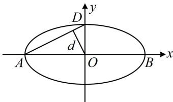
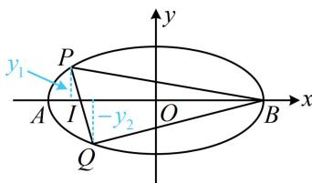

<!-- question-source:start -->
【例2】已知椭圆 $\frac{x^2}{a^2} +\frac{y^2}{b^2} = 1(a > b > 0)$ 的离心率为 $\frac{\sqrt{3}}{2}$ ，左、右顶点分别为 $A$ ， $B$ ，上顶点为 $D$ ，坐标原点 $O$ 到直线 $AD$ 的距离为 $\frac{2\sqrt{5}}{5}$ .

(1) 求椭圆的方程;

(2) 过点 $(- \sqrt{2}, 0)$ 的直线与椭圆交于 $P, Q$ 两点, 求 $\triangle BPQ$ 面积的最大值.

（1）由题意，椭圆的离心率 $e = \frac{\sqrt{a^2 - b^2}}{a} = \frac{\sqrt{3}}{2}$ ，化简得： $a = 2b$ ①，

设原点 O 到直线 AD 的距离为 d，如图，由 $S_{\triangle AOD} = \frac{1}{2}|AD| \cdot d = \frac{1}{2}|OA| \cdot |OD|$ 可得 $d = \frac{|OA| \cdot |OD|}{|AD|} = \frac{ab}{\sqrt{a^2 + b^2}}$ ，又由题意， $d = \frac{2\sqrt{5}}{5}$ ，所以 $\frac{ab}{\sqrt{a^2 + b^2}} = \frac{2\sqrt{5}}{5}$ ，结合①解得：a = 2, b = 1，故椭圆的方程为 $\frac{x^2}{4} + y^2 = 1$ 。

（2）解法1：（求 $S_{\triangle BPQ}$ 可用 $PQ$ 为底，而 $|PQ|$ 可联立直线 $PQ$ 与椭圆的方程，用弦长公式计算，故先设直线 $PQ$ 的方程. 直线 $PQ$ 过 $x$ 轴上定点，考虑设横截式方程，下面先看斜率为0的情况）

当直线 $PQ \perp y$ 轴时， $P, Q$ 中有一个与 $B$ 重合，构不成三角形；

当直线 $PQ$ 不与 $y$ 轴垂直时，可设其方程为 $x = my - \sqrt{2}$ ，代入 $\frac{x^2}{4} + y^2 = 1$ 整理得： $(m^2 + 4)y^2 - 2\sqrt{2}my - 2 = 0$ ，判别式 $\Delta = (-2\sqrt{2}m)^2 - 4(m^2 + 4) \cdot (-2) = 16(m^2 + 2) > 0$ ，设 $P(x_1, y_1)$ ， $Q(x_2, y_2)$ ，由弦长公式， $|PQ| = \sqrt{1 + m^2} \cdot |y_1 - y_2| = \sqrt{1 + m^2} \cdot \frac{\sqrt{16(m^2 + 2)}}{m^2 + 4} = \sqrt{1 + m^2} \cdot \frac{4\sqrt{m^2 + 2}}{m^2 + 4}$ ，直线 $PQ$ 的方程可化为 $x - my + \sqrt{2} = 0$ ，所以点 $B(2,0)$ 到直线 $PQ$ 的距离 $d' = \frac{|2 + \sqrt{2}|}{\sqrt{1^2 + (-m)^2}} = \frac{2 + \sqrt{2}}{\sqrt{1 + m^2}}$ ，故 $S_{\triangle BPQ} = \frac{1}{2}|PQ| \cdot d' = \frac{1}{2} \times \sqrt{1 + m^2} \cdot \frac{4\sqrt{m^2 + 2}}{m^2 + 4} \times \frac{2 + \sqrt{2}}{\sqrt{1 + m^2}} = \frac{(4 + 2\sqrt{2})\sqrt{m^2 + 2}}{m^2 + 4}$ ②，（ $\sqrt{m^2 + 2}$ 可看成关于 $m$ 的一次式，则式②为“ $\frac{\text{一次}}{\text{二次}}$ ”，可将“一次”换元成 $t$ ，再上下同除以 $t$ 分析）令 $t = \sqrt{m^2 + 2}$ ，则 $t \geq \sqrt{2}$ ，且 $m^2 = t^2 - 2$ ，代入②得 $S_{\triangle BPQ} = \frac{(4 + 2\sqrt{2})t}{t^2 + 2} = \frac{4 + 2\sqrt{2}}{t + \frac{2}{t}} \leq \frac{4 + 2\sqrt{2}}{2\sqrt{t \cdot \frac{2}{t}}} = \sqrt{2} + 1$ ，当且仅当 $t = \frac{2}{t}$ ，即 $t = \sqrt{2}$ 时取等号，此时 $m = 0$ ，满足题意，所以 $\triangle BPQ$ 面积的最大值为 $\sqrt{2} + 1$ 。

  
图1

  
图2
<!-- question-source:end -->

![[高中/总复习/教辅/一数常规版2026/第10章 解析几何/模块6 解析几何大题/第1节 解析几何大题条件翻译：长度与面积/类型02_面积的计算/例题/answers/Q00049509A1.md]]
