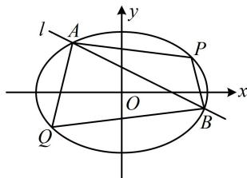

> [!faq]- 《第1节 解析几何大题条件翻译：长度与面积》例题解析
>
> > [!success]- **【答案】** 详见解析
>
> > [!note]- **【分析】**
> > 本题未单列分析。
>
> > [!note]- **【解析】**
> > (2) 设 $P(2,1)$ , $Q(-2,-1)$ , 若动直线 $l: y = -\frac{1}{2}x + m (1 \leq m < 2)$ 与椭圆 $C$ 交于 $A$ , $B$ 两点, 求四边形 $PAQB$ 面积的最大值. 解:
> > (1) 由题意, 离心率 $e = \frac{\sqrt{a^2 - b^2}}{a} = \frac{\sqrt{2}}{2}$ ①, 又椭圆过点 $D\left(\sqrt{3}, \frac{\sqrt{6}}{2}\right)$ , 所以 $\frac{3}{a^2} + \frac{3}{2b^2} = 1$ ②, 联立①②解得: $a = \sqrt{6}$ , $b = \sqrt{3}$ , 所以椭圆 $C$ 的标准方程为 $\frac{x^2}{6} + \frac{y^2}{3} = 1$ .
> >
> > (2) (如图, 四边形 $PAQB$ 形状不特殊, 也没有对角线互相垂直, 不方便直接算面积, 故考虑将其拆分成 $\triangle PAB$ 和 $\triangle QAB$ 分别计算, 以 $AB$ 为公共底, $P$ , $Q$ 到直线 $l$ 的距离为高, 下面先算 $|AB|$ )
> >
> > 将 $y = -\frac{1}{2} x + m$ 代入 $\frac{x^2}{6} +\frac{y^2}{3} = 1$ 消去 $y$ 整理得： $3x^{2} - 4mx + 4m^{2} - 12 = 0$
> >
> > 判别式 $\Delta = (-4m)^2 - 4 \times 3 \times (4m^2 - 12) = 16(9 - 2m^2)$ ，由题意， $1 \leq m < 2$ ，所以 $\Delta > 0$ ，
> >
> > 设 $A(x_{1},y_{1})$ ， $B(x_{2},y_{2})$ ，则由弦长公式， $\left|AB\right| = \sqrt{1 + \left(-\frac{1}{2}\right)^2}\cdot \left|x_1 - x_2\right| = \frac{\sqrt{5}}{2}\cdot \frac{\sqrt{16(9 - 2m^2)}}{3} = \frac{2\sqrt{5}}{3}\cdot \sqrt{9 - 2m^2}$
> >
> > 直线 $l$ 的方程可化为 $x + 2y - 2m = 0$ ，所以点 $P$ ， $Q$ 到 $l$ 的距离分别为 $d_{1} = \frac{|2 + 2\times 1 - 2m|}{\sqrt{1^{2} + 2^{2}}} = \frac{|4 - 2m|}{\sqrt{5}}$
> >
> > $d_{2} = \frac{|-2 + 2\times(-1) - 2m|}{\sqrt{1^{2} + 2^{2}}} = \frac{|4 + 2m|}{\sqrt{5}}$ ，结合 $1\leq m <   2$ 可得 $d_{1} = \frac{4 - 2m}{\sqrt{5}}$ ， $d_{2} = \frac{4 + 2m}{\sqrt{5}}$
> >
> > 所以四边形 $PAQB$ 的面积 $S = S_{\triangle PAB} + S_{\triangle QAB} = \frac{1}{2}\big|AB\big|\cdot d_1 + \frac{1}{2}\big|AB\big|\cdot d_2$
> >
> > $$
> > = \frac {1}{2} | A B | \cdot \left(d _ {1} + d _ {2}\right) = \frac {1}{2} \times \frac {2 \sqrt {5}}{3} \cdot \sqrt {9 - 2 m ^ {2}} \times \left(\frac {4 - 2 m}{\sqrt {5}} + \frac {4 + 2 m}{\sqrt {5}}\right) = \frac {8 \sqrt {9 - 2 m ^ {2}}}{3},
> > $$
> >
> > 
> >
> > 故当 $m = 1$ 时， $S$ 取得最大值 $\frac{8\sqrt{7}}{3}$ .
>
> > [!tip]- **【反思】**
> > 当四边形不特殊时，可考虑用它的一条对角线将四边形分割成两个同底的三角形来计算面积.
