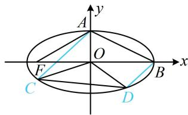

> [!faq]- 《第1节 解析几何大题条件翻译：长度与面积》例题解析
>
> > [!success]- **【答案】** 详见解析
>
> > [!note]- **【分析】**
> > 本题未单列分析。
>
> > [!note]- **【解析】**
> > 解：
> > 所以 $x_{C} = -\frac{8k}{1 + 4k^{2}}$ ， $y_{C} = kx_{C} + 1 = \frac{1 - 4k^{2}}{1 + 4k^{2}}$ ，故 $C\left(-\frac{8k}{1 + 4k^2},\frac{1 - 4k^2}{1 + 4k^2}\right)$ ③，
> >
> > 联立 $\left\{ \begin{array}{l} y = k(x - 2) \\ \frac{x^2}{4} + y^2 = 1 \end{array} \right.$ 消去 $y$ 整理得： $(1 + 4k^2)x^2 - 16k^2x + 16k^2 - 4 = 0$
> >
> > 判别式 $\Delta = (-16k^2)^2 - 4(1 + 4k^2)(16k^2 - 4) = 16 > 0$ ，由韦达定理， $x_{B}x_{D} = 2x_{D} = \frac{16k^{2} - 4}{1 + 4k^{2}}$
> >
> > 所以 $x_{D} = \frac{8k^{2} - 2}{1 + 4k^{2}}$ ， $y_{D} = k(x_{D} - 2) = -\frac{4k}{1 + 4k^{2}}$ ，故 $D\left(\frac{8k^2 - 2}{1 + 4k^2}, - \frac{4k}{1 + 4k^2}\right)$ ④，
> >
> > (有了 C, D 的坐标, 可按前述结论求 $S_{\triangle OCD}$ , 因为是解答题, 所以先推导该结论再使用)
> >
> > $$
> > S _ {\triangle O C D} = \frac {1}{2} | \overrightarrow {O C} | \cdot | \overrightarrow {O D} | \cdot \sin \angle C O D = \frac {1}{2} | \overrightarrow {O C} | \cdot | \overrightarrow {O D} | \cdot \sqrt {1 - \cos^ {2} \angle C O D} = \frac {1}{2} | \overrightarrow {O C} | \cdot | \overrightarrow {O D} | \cdot \sqrt {1 - \left(\frac {\overrightarrow {O C} \cdot \overrightarrow {O D}}{| \overrightarrow {O C} | \cdot | \overrightarrow {O D} |}\right) ^ {2}}
> > $$
> >
> > $$
> > = \frac {1}{2} \sqrt {\left| \overrightarrow {O C} \right| ^ {2} \cdot \left| \overrightarrow {O D} \right| ^ {2} - (\overrightarrow {O C} \cdot \overrightarrow {O D}) ^ {2}} = \frac {1}{2} \sqrt {(x _ {C} ^ {2} + y _ {C} ^ {2}) (x _ {D} ^ {2} + y _ {D} ^ {2}) - (x _ {C} x _ {D} + y _ {C} y _ {D}) ^ {2}}
> > $$
> >
> > $$
> > = \frac {1}{2} \sqrt {x _ {C} ^ {2} x _ {D} ^ {2} + x _ {C} ^ {2} y _ {D} ^ {2} + y _ {C} ^ {2} x _ {D} ^ {2} + y _ {C} ^ {2} y _ {D} ^ {2} - (x _ {C} ^ {2} x _ {D} ^ {2} + y _ {C} ^ {2} y _ {D} ^ {2} + 2 x _ {C} x _ {D} y _ {C} y _ {D})}
> > $$
> >
> > $$
> > = \frac {1}{2} \sqrt {x _ {C} ^ {2} y _ {D} ^ {2} + y _ {C} ^ {2} x _ {D} ^ {2} - 2 x _ {C} x _ {D} y _ {C} y _ {D}} = \frac {1}{2} \sqrt {\left(x _ {C} y _ {D} - x _ {D} y _ {C}\right) ^ {2}} = \frac {1}{2} \left| x _ {C} y _ {D} - x _ {D} y _ {C} \right|,
> > $$
> >
> > 将③④代入上式得 $S_{\triangle OCD} = \frac{1}{2}\left[-\frac{8k}{1 + 4k^2}\left(-\frac{4k}{1 + 4k^2}\right) - \frac{8k^2 - 2}{1 + 4k^2}\cdot \frac{1 - 4k^2}{1 + 4k^2}\right]$
> >
> > $= \frac{1}{2}\left|\frac{32k^2 - (8k^2 - 2)(1 - 4k^2)}{(1 + 4k^2)^2}\right| = \left|\frac{16k^2 + (4k^2 - 1)^2}{(1 + 4k^2)^2}\right| = \left|\frac{(4k^2 + 1)^2}{(1 + 4k^2)^2}\right| = 1,$
> >
> > 
> >
> > 所以 $\triangle OCD$ 的面积不可能大于1.
>
> > [!tip]- **【反思】**
> > 当三角形的一个顶点是原点时，若用其它方法求面积不方便，但三角形的另外两个顶点的坐标容易求得，则可按 $S = \frac{1}{2}\left|x_{1}y_{2} - x_{2}y_{1}\right|$ 计算三角形的面积，其中 $(x_{1}, y_{1})$ ， $(x_{2}, y_{2})$ 分别为另外两个顶点的坐标.
