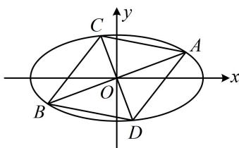

> [!faq]- 《第1节 解析几何大题条件翻译：长度与面积》例题解析
>
> > [!success]- **【答案】** 详见解析
>
> > [!note]- **【分析】**
> > 本题未单列分析。
>
> > [!note]- **【解析】**
> > （2）设经过原点 $O$ 的两条互相垂直的直线分别与椭圆 $E$ 相交于 $A, B$ 两点和 $C, D$ 两点，求四边形 $ACBD$ 的面积的最小值.
> >
> > 解：
> > （1）因为椭圆 $E$ 经过点 $\left(1, \frac{\sqrt{3}}{2}\right)$ ，所以 $\frac{1}{a^2} + \frac{3}{4b^2} = 1$ ①，
> >
> > 又因为椭圆 $E$ 的一个焦点在 $y = \sqrt{3} x - 3$ 上，而椭圆 $E$ 的焦点在 $x$ 轴上，
> >
> > 所以该直线与 $x$ 轴的交点即为椭圆的一个焦点，联立 $\left\{ \begin{array}{l} y = \sqrt{3} x - 3 \\ y = 0 \end{array} \right.$ 解得： $\left\{ \begin{array}{l} x = \sqrt{3} \\ y = 0 \end{array} \right.$ ，
> >
> > 所以 $(\sqrt{3},0)$ 是椭圆的一个焦点，故 $a^2 - b^2 = 3$ ，结合①可解得： $a = 2$ ， $b = 1$
> >
> > 故椭圆 E 的方程为 $\frac{x^{2}}{4} + y^{2} = 1$ .
> >
> > （2）解法1：（如图，四边形 $ACBD$ 对角线互相垂直，可按 $S = \frac{1}{2} |AB| \cdot |CD|$ 算面积，故只需求 $|AB|$ 和 $|CD|$ ）当两条直线分别与 $x$ 轴、 $y$ 轴垂直时， $S_{ACBD} = \frac{1}{2} \times 2a \times 2b = 2ab = 4$ ；
> >
> > 当两条直线都不与坐标轴垂直时，不妨设 $AB$ 的方程为 $y = kx (k \neq 0)$ ，则 $CD$ 的方程为 $y = -\frac{1}{k} x$ ，
> >
> > 将 $y = kx$ 代入 $\frac{x^2}{4} + y^2 = 1$ 消去 $y$ 整理得： $(1 + 4k^2)x^2 = 4$ ，解得： $x = \pm \frac{2}{\sqrt{1 + 4k^2}}$ ，它们即为 $A, B$ 的横坐标，
> >
> > 所以由弦长公式， $\left|AB\right|=\sqrt{1+k^{2}}\cdot\left|x_{A}-x_{B}\right|=\sqrt{1+k^{2}}\cdot\left|\frac{2}{\sqrt{1+4k^{2}}}-\left(-\frac{2}{\sqrt{1+4k^{2}}}\right)\right|=\frac{4\sqrt{1+k^{2}}}{\sqrt{1+4k^{2}}}$ ②，
> >
> > （要用类似的方法再求 $|CD|$ 吗？不用，直线 CD 与直线 AB 的差别只是把 k 换成了 $-\frac{1}{k}$ ，其它都一样，故直接按此代换即可得到 $|CD|$ ）在②中将 k 换成 $-\frac{1}{k}$ 可得 $|CD| = \frac{4\sqrt{1 + \left(-\frac{1}{k}\right)^2}}{\sqrt{1 + 4\left(-\frac{1}{k}\right)^2}} = \frac{4\sqrt{k^2 + 1}}{\sqrt{k^2 + 4}}$ ，
> >
> > 因为 $AB \perp CD$ ，所以 $S_{ACBD} = \frac{1}{2} |AB| \cdot |CD| = \frac{1}{2} \cdot \frac{4\sqrt{1 + k^2}}{\sqrt{1 + 4k^2}} \cdot \frac{4\sqrt{k^2 + 1}}{\sqrt{k^2 + 4}} = \frac{8(k^2 + 1)}{\sqrt{(1 + 4k^2)(k^2 + 4)}}$ ③，
> >
> > (怎样求上式的最小值？可尝试先把分子的 $k^2 + 1$ 也拿到根号里面，再做观察)
> >
> > $$
> > S _ {A C B D} = \frac {8}{\sqrt {\frac {(1 + 4 k ^ {2}) (k ^ {2} + 4)}{(k ^ {2} + 1) ^ {2}}}} = \frac {8}{\sqrt {\frac {4 k ^ {4} + 1 7 k ^ {2} + 4}{k ^ {4} + 2 k ^ {2} + 1}}} = \frac {8}{\sqrt {\frac {4 (k ^ {4} + 2 k ^ {2} + 1) + 9 k ^ {2}}{k ^ {4} + 2 k ^ {2} + 1}}} = \frac {8}{\sqrt {4 + \frac {9 k ^ {2}}{k ^ {4} + 2 k ^ {2} + 1}}} = \frac {8}{\sqrt {4 + \frac {9}{k ^ {2} + \frac {1}{k ^ {2}} + 2}}},
> > $$
> >
> > 因为 $k^2 + \frac{1}{k^2} \geq 2\sqrt{k^2 \cdot \frac{1}{k^2}} = 2$ ，取等条件是 $k^2 = \frac{1}{k^2}$ ，即 $k = \pm 1$ ，所以 $S_{ACBD} \geq \frac{8}{\sqrt{4 + \frac{9}{2 + 2}}} = \frac{16}{5}$ ；因为 $\frac{16}{5} < 4$ ，所以四边形 $ACBD$ 面积的最小值为 $\frac{16}{5}$ .
> >
> > 解法2: (按解法1得到式③后, 若注意到将分母的 $1 + 4k^{2}$ 和 $k^{2} + 4$ 相加, 恰好可与分子约分化为常数, 则可直接对分母用基本不等式, 求得 $S_{ABCD}$ 的最小值)
> >
> > 因为 $0 < \sqrt{(1 + 4k^2)(k^2 + 4)} \leq \frac{1 + 4k^2 + k^2 + 4}{2} = \frac{5}{2}(k^2 + 1)$ ，所以 $S_{ABCD} = \frac{8(k^2 + 1)}{\sqrt{(1 + 4k^2)(k^2 + 4)}} \geq \frac{8(k^2 + 1)}{\frac{5}{2}(k^2 + 1)} = \frac{16}{5}$ ，取等条件是 $1 + 4k^2 = k^2 + 4$ ，即 $k = \pm 1$ ，因为 $\frac{16}{5} < 4$ ，所以四边形 $ACBD$ 面积的最小值为 $\frac{16}{5}$ .
> >
> > 
>
> > [!tip]- **【反思】**
> > - **①**：当四边形 ACBD 对角线互相垂直时，可按 $S = \frac{1}{2} |AB| \cdot |CD|$ 求其面积；
> > - **②**：计算同类对象时，求出其中一个后，可通过观察另一个与它的区别，用替换的方法直接得到另一对象的结果（如本题求出 $|AB|$ ，再求 $|CD|$ 时就用到了替换方法），这种替换的思想在解析几何中很重要，恰当地运用它，可以避免一些不必要的计算.
