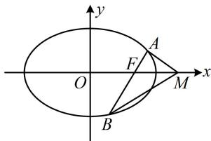

> [!faq]- 《第2节 解析几何大题条件翻译：角度》参考答案
>
> > [!success]- **【答案】** 详见解析
>
> > [!note]- **【分析】**
> > 本题未单列分析。
>
> > [!note]- **【解析】**
> > (2018·新课标Ⅰ卷·★★★☆)
> >
> > 设椭圆 $C: \frac{x^2}{2} + y^2 = 1$ 的右焦点为 $F$ ，过 $F$ 的直线 $l$ 与 $C$ 交于 $A$ ， $B$ 两点，点 $M$ 的坐标为 $(2,0)$ .
> >
> > （1）当 $l$ 与 $x$ 轴垂直时，求直线 $AM$ 的方程；
> >
> > （2）设 $O$ 为坐标原点，证明： $\angle OMA = \angle OMB$ ：
> >
> > 解：（1）（已有 $M$ 的坐标，只需联立直线 $l$ 与椭圆的方程，求出 $A$ 的坐标，就能写出 $AM$ 的方程）由题意， $F(1,0)$ ，当 $l \perp x$ 轴时， $l$ 的方程为 $x = 1$ ，由 $\left\{ \begin{array}{l} x = 1 \\ \frac{x^2}{2} + y^2 = 1 \end{array} \right.$ 得 $y = \pm \frac{\sqrt{2}}{2}$ ，所以点 $A$ 的坐标为 $\left(1, \pm \frac{\sqrt{2}}{2}\right)$ ，当点 $A$ 的坐标为 $\left(1, \frac{\sqrt{2}}{2}\right)$ 时， $k_{AM} = \frac{\frac{\sqrt{2}}{2} - 0}{1 - 2} = -\frac{\sqrt{2}}{2}$ ，所以 $AM$ 的方程为 $y = -\frac{\sqrt{2}}{2}(x - 2)$ ，即 $y = -\frac{\sqrt{2}}{2}x + \sqrt{2}$ ，当点 $A$ 的坐标为 $\left(1, -\frac{\sqrt{2}}{2}\right)$ 时， $k_{AM} = \frac{-\frac{\sqrt{2}}{2} - 0}{1 - 2} = \frac{\sqrt{2}}{2}$ ，所以 $AM$ 的方程为 $y = \frac{\sqrt{2}}{2}(x - 2)$ ，即 $y = \frac{\sqrt{2}}{2}x - \sqrt{2}$ ，综上所述，直线 $AM$ 的方程为 $y = -\frac{\sqrt{2}}{2}x + \sqrt{2}$ 或 $y = \frac{\sqrt{2}}{2}x - \sqrt{2}$ .
> >
> > (2) 解法 1: (如图, $\angle OMA = \angle OMB$ 意味着直线 $AM$ 和 $BM$ 的倾斜角互补, 即它们的斜率互为相反数, 故可按此证明结论. 计算斜率需要坐标, 于是先设坐标)
> >
> > 设 $A(x_{1}, y_{1})$ , $B(x_{2}, y_{2})$ , 则 $k_{AM} + k_{BM} = \frac{y_{1}}{x_{1} - 2} + \frac{y_{2}}{x_{2} - 2}$ $= \frac{y_{1}(x_{2} - 2) + y_{2}(x_{1} - 2)}{(x_{1} - 2)(x_{2} - 2)} = \frac{x_{1}y_{2} + x_{2}y_{1} - 2(y_{1} + y_{2})}{(x_{1} - 2)(x_{2} - 2)} \quad ①$ ,
> >
> > （看到 $x_{1}y_{2} + x_{2}y_{1}$ 和 $y_{1} + y_{2}$ ，想到设直线 $l$ 的方程，与椭圆联立，结合韦达定理计算它们，直线 $l$ 过 $x$ 轴上的定点，考虑设横截式方程，下面先考虑 $l \perp y$ 轴的情况）
> >
> > 当 $l \perp y$ 轴时， $A, B$ 为椭圆的两个长轴端点，
> >
> > 所以 $\angle OMA = \angle OMB = 0^{\circ}$
> >
> > 当 $l$ 不与 $y$ 轴垂直时，可设其方程为 $x = my + 1$
> >
> > 代入 $\frac{x^2}{2} + y^2 = 1$ 消去 $x$ 整理得： $(m^2 + 2)y^2 + 2my - 1 = 0$
> >
> > 判别式 $\Delta = 4m^2 - 4(m^2 + 2) \cdot (-1) = 8(m^2 + 1) > 0$
> >
> > 由韦达定理， $y_{1} + y_{2} = -\frac{2m}{m^{2} + 2},\quad y_{1}y_{2} = -\frac{1}{m^{2} + 2},$
> >
> > $$
> > x _ {1} y _ {2} + x _ {2} y _ {1} = (m y _ {1} + 1) y _ {2} + (m y _ {2} + 1) y _ {1} = 2 m y _ {1} y _ {2} + (y _ {1} + y _ {2})
> > $$
> >
> > $$
> > = 2 m \cdot \left(- \frac {1}{m ^ {2} + 2}\right) + \left(- \frac {2 m}{m ^ {2} + 2}\right) = - \frac {4 m}{m ^ {2} + 2},
> > $$
> >
> > 所以 $x_{1}y_{2} + x_{2}y_{1} - 2(y_{1} + y_{2}) = -\frac{4m}{m^{2} + 2} -2\left(-\frac{2m}{m^{2} + 2}\right) = 0$
> >
> > 代入①得 $k_{AM} + k_{BM} = 0$ ，所以 $\angle OMA = \angle OMB$
> >
> > 综上所述， $\angle OMA = \angle OMB$
> >
> > 
> >
> > 解法2：（按解法1得到 $k_{AM} + k_{BM} = \frac{y_1}{x_1 - 2} +\frac{y_2}{x_2 - 2}$ 后，由其结构特征想到可用齐次化思想来速算它．为了直接由韦达定理求出 $\frac{y_1}{x_1 - 2} +\frac{y_2}{x_2 - 2}$ ，在联立直线和椭圆方程时，应化成 $A\left(\frac{y}{x - 2}\right)^2 +B\cdot \frac{y}{x - 2} +C = 0$ 这种形式.由于目标结构是 $\frac{y}{x - 2}$ ，我们先把直线和椭圆方程中的 $x$ 凑成 $x - 2$ ）
> >
> > 当 $l \perp y$ 轴时， $A, B$ 为椭圆的两个长轴端点，
> >
> > 所以 $\angle OMA = \angle OMB = 0^{\circ}$
> >
> > 当 l 不与 y 轴垂直时，可设其方程为 $x = my + 1$ ，
> >
> > 即 $(x - 2) - my = -1$ ，椭圆方程可化为 $\frac{[(x - 2) + 2]^2}{2} + y^2 = 1$
> >
> > 即 $(x - 2)^{2} + 4(x - 2) + 2y^{2} + 2 = 0$ ②，
> >
> > （式②关于 $x - 2$ 和 $y$ 不齐次，应将一次项 $4(x - 2)$ 和常数项2也化为关于 $x - 2$ 和 $y$ 的二次式，可用 $(x - 2) - my = -1$ 来实现）结合 $(x - 2) - my = -1$ 可将式②化为
> >
> > $$
> > (x - 2) ^ {2} - 4 [ (x - 2) - m y ] (x - 2) + 2 y ^ {2} + 2 (x - 2 - m y) ^ {2} = 0
> > $$
> >
> > 整理得： $(2 + 2m^{2})y^{2} - (x - 2)^{2} = 0$
> >
> > 两端同除以 $(x - 2)^{2}$ 得 $(2 + 2m^{2})\left(\frac{y}{x - 2}\right)^{2} - 1 = 0$
> >
> > 因为 $M, N$ 的坐标满足上述方程，所以由韦达定理，
> >
> > $\frac{y_{1}}{x_{1}-2}+\frac{y_{2}}{x_{2}-2}=\frac{0}{2+2m^{2}}=0$ ，从而 $k_{AM}+k_{BM}=0$ ，
> >
> > 故 $\angle OMA = \angle OMB$
> >
> > 综上所述， $\angle OMA = \angle OMB$ 。
