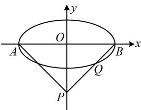
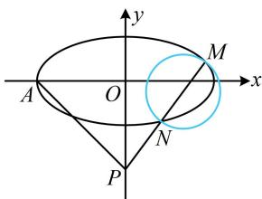

> [!faq]- 《第2节 解析几何大题条件翻译：角度》参考答案
>
> > [!success]- **【答案】** 详见解析
>
> > [!note]- **【分析】**
> > 本题未单列分析。
>
> > [!note]- **【解析】**
> > 解: (1) 如图 1, 由题意, $\triangle ABP$ 是等腰直角三角形,
> >
> > 且 $P(0, - 2)$ ，所以 $\left|OA\right| = \left|OB\right| = \left|OP\right| = 2$ ，故 $a = 2$
> >
> > （再求 $b$ ，条件 $\overrightarrow{PQ} = \frac{3}{2}\overrightarrow{QB}$ 怎样翻译？注意到 $P$ ， $B$ 坐标已知，故可由此求 $Q$ 的坐标，代入椭圆方程即可求 $b$ ）因为 $P(0, - 2)$ ， $B(2,0)$ ，所以 $\overrightarrow{PQ} = (x_Q,y_Q + 2)$ ， $\overrightarrow{QB} = (2 - x_Q, - y_Q)$ ，由题意， $\overrightarrow{PQ} = \frac{3}{2}\overrightarrow{QB}$
> >
> > 所以 $\left\{ \begin{array}{l} x_{Q} = \frac{3}{2} (2 - x_{Q}) \\ y_{Q} + 2 = \frac{3}{2} (-y_{Q}) \end{array} \right.$ ，解得： $\left\{ \begin{array}{l} x_{Q} = \frac{6}{5} \\ y_{Q} = -\frac{4}{5} \end{array} \right.$ ，故 $Q\left(\frac{6}{5}, -\frac{4}{5}\right)$ ，
> >
> > $$
> > \frac {x ^ {2}}{a ^ {2}} + \frac {y ^ {2}}{b ^ {2}} = 1
> > $$
> >
> > $$
> > \frac {3 6}{2 5 a ^ {2}} + \frac {1 6}{2 5 b ^ {2}} = 1
> > $$
> >
> > $$
> > \frac {x ^ {2}}{4} + y ^ {2} = 1
> > $$
> >
> > $$
> > a = 2
> > $$
> >
> > $$
> > b = 1
> > $$
> >
> > （2）（条件“原点 $O$ 位于以 $MN$ 为直径的圆外”可翻译为 $\overrightarrow{OM} \cdot \overrightarrow{ON} > 0$ ，故先求此数量积）设 $M(x_{1},y_{1})$ ， $N(x_{2},y_{2})$ ，则 $\overrightarrow{OM} = (x_{1},y_{1})$ ， $\overrightarrow{ON} = (x_{2},y_{2})$ ，所以 $\overrightarrow{OM} \cdot \overrightarrow{ON} = x_{1}x_{2} + y_{1}y_{2}$ ①，（看到 $x_{1}x_{2}$ 和 $y_{1}y_{2}$ ，想到设直线 $l$ 的方程，与椭圆联立，结合韦达定理计算它们）由题意，直线 $l$ 的斜率存在，设其方程为 $y = kx - 2$ ，代入 $\frac{x^2}{4} + y^2 = 1$ 消去 $y$ 整理得： $(1 + 4k^2)x^2 - 16kx + 12 = 0$ ，判别式 $\Delta = (-16k)^2 - 4(1 + 4k^2) \cdot 12 > 0$ ，所以 $k^2 > \frac{3}{4}$ ②，由韦达定理， $x_1 + x_2 = \frac{16k}{1 + 4k^2}$ ， $x_1x_2 = \frac{12}{1 + 4k^2}$ ，所以 $y_1y_2 = (kx_1 - 2)(kx_2 - 2) = k^2x_1x_2 - 2k(x_1 + x_2) + 4 = \frac{12k^2}{1 + 4k^2} - \frac{32k^2}{1 + 4k^2} + 4 = \frac{4 - 4k^2}{1 + 4k^2}$ ，代入①得 $\overrightarrow{OM} \cdot \overrightarrow{ON} = \frac{12}{1 + 4k^2} + \frac{4 - 4k^2}{1 + 4k^2} = \frac{16 - 4k^2}{1 + 4k^2}$ ，因为原点 $O$ 在以 $MN$ 为直径的圆外，所以 $\overrightarrow{OM} \cdot \overrightarrow{ON} > 0$ ，从而 $\frac{16 - 4k^2}{1 + 4k^2} > 0$ ，故 $k^2 < 4$ ，结合②得 $\frac{3}{4} < k^2 < 4$ 所以 $-2 < k < -\frac{\sqrt{3}}{2}$ 或 $\frac{\sqrt{3}}{2} < k < 2$ 故直线 $l$ 斜率的取值范围是 $\left(-2, -\frac{\sqrt{3}}{2}\right) \cup \left(\frac{\sqrt{3}}{2}, 2\right)$ .
> >
> >   
> > 图1
> >
> >   
> > 图2
