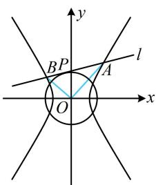

> [!faq]- 《第2节 解析几何大题条件翻译：角度》参考答案
>
> > [!success]- **【答案】** 详见解析
>
> > [!note]- **【分析】**
> > 本题未单列分析。
>
> > [!note]- **【解析】**
> > 由题意， $\left\{ \begin{array}{l} \frac{c}{a} = \sqrt{3}\\  \frac{2}{a^2} -\frac{2}{b^2} = 1 \end{array} \right.$ ，解得： $a = 1$ ， $b = \sqrt{2}$ ， $c = \sqrt{3}$
> >
> > 所以双曲线 $C$ 的方程为 $x^{2} - \frac{y^{2}}{2} = 1$ .
> >
> > (2) (稍微准确一点地画出图形如图, 由图可以猜想 $\angle AOB$ 为定值 $90^{\circ}$ , 故尝试证 $\overrightarrow{OA} \cdot \overrightarrow{OB} = 0$ . 求此数量积需要 $A, B$ 的坐标,于是先设坐标)
> >
> > 设 $A(x_{1},y_{1})$ ， $B(x_{2},y_{2})$ ，则 $\overrightarrow{OA} = (x_1,y_1)$ ， $\overrightarrow{OB} = (x_2,y_2)$
> >
> > 所以 $\overrightarrow{OA}\cdot\overrightarrow{OB}=x_{1}x_{2}+y_{1}y_{2}$ ①,
> >
> > (由此想到设直线 l 的方程, 与双曲线联立, 结合韦达定理计算式①. 不妨设斜截式, 先考虑斜率不存在的情形)
> >
> > 当直线 $l \perp x$ 轴时，易得其方程为 $x = \sqrt{2}$ 或 $x = -\sqrt{2}$ ，
> >
> > 分别代入 $x^{2} - \frac{y^{2}}{2} = 1$ 可解得： $y = \pm \sqrt{2}$
> >
> > 所以 $\left\{ \begin{array}{l}x_{1} = \sqrt{2}\\ y_{1} = \sqrt{2} \end{array} \right.$ ， $\left\{ \begin{array}{l}x_2 = \sqrt{2}\\ y_2 = -\sqrt{2} \end{array} \right.$ 或 $\left\{ \begin{array}{l}x_{1} = -\sqrt{2}\\ y_{1} = \sqrt{2} \end{array} \right.$ ， $\left\{ \begin{array}{l}x_{2} = -\sqrt{2}\\ y_{2} = -\sqrt{2} \end{array} \right.$
> >
> > 代入①均有 $\overrightarrow{OA} \cdot \overrightarrow{OB} = x_{1}x_{2} + y_{1}y_{2} = 0$ ，所以 $\angle AOB = 90^{\circ}$ ;
> >
> > 当直线 $l$ 斜率存在时，可设其方程为 $y = kx + m$
> >
> > 将 $y = kx + m$ 代入 $2x^{2} - y^{2} = 2$ 消去 $y$ 整理得：
> >
> > $$
> > (2 - k ^ {2}) x ^ {2} - 2 k m x - m ^ {2} - 2 = 0
> > $$
> >
> > 因为 $l$ 与 $C$ 交于不同的两点，所以 $2 - k^2 \neq 0$ 且判别式 $\Delta =$
> >
> > $(-2km)^{2} - 4(2 - k^{2})(-m^{2} - 2) = 8(m^{2} + 2 - k^{2}) > 0$ ②,
> >
> > 由韦达定理， $x_{1} + x_{2} = \frac{2km}{2 - k^{2}}$ ， $x_{1}x_{2} = -\frac{m^{2} + 2}{2 - k^{2}}$
> >
> > 所以 $y_{1}y_{2} = (kx_{1} + m)(kx_{2} + m)$
> >
> > $$
> > = k ^ {2} x _ {1} x _ {2} + k m \left(x _ {1} + x _ {2}\right) + m ^ {2} = \frac {2 m ^ {2} - 2 k ^ {2}}{2 - k ^ {2}},
> > $$
> >
> > 故 $\overrightarrow{OA} \cdot \overrightarrow{OB} = x_{1}x_{2} + y_{1}y_{2}$
> >
> > $$
> > = - \frac {m ^ {2} + 2}{2 - k ^ {2}} + \frac {2 m ^ {2} - 2 k ^ {2}}{2 - k ^ {2}} = \frac {m ^ {2} - 2 k ^ {2} - 2}{2 - k ^ {2}} \quad ③,
> > $$
> >
> > （上式中有 $m$ 和 $k$ 两个变量，要进一步计算，需寻找 $m$ 和 $k$ 的关系，还剩直线 $l$ 与圆 $O$ 相切没有翻译，故翻译它）由 $l$ 与圆 $O$ 相切得 $\frac{|m|}{\sqrt{k^2 + 1}} = \sqrt{2}$ ，所以 $m^2 = 2(k^2 + 1)$ ④，
> >
> > 将④代入②知满足 $\Delta > 0$ ，将④代入③可得
> >
> > $\overrightarrow{OA}\cdot\overrightarrow{OB}=\frac{2(k^{2}+1)-2k^{2}-2}{2-k^{2}}=0$ ，所以 $\angle AOB=90^{\circ}$
> >
> > 综上所述， $\angle AOB$ 为定值 $90^{\circ}$ 。
> >
> > 
