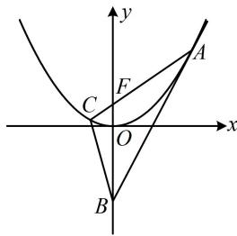

> [!faq]- 《第2节 解析几何大题条件翻译：角度》参考答案
>
> > [!success]- **【答案】** 详见解析
>
> > [!note]- **【分析】**
> > 本题未单列分析。
>
> > [!note]- **【解析】**
> > 解：（1）（开口向上的抛物线可看成二次函数的图象，故可
> >
> > 由 $x^{2}=4y$ 可得 $y=\frac{x^{2}}{4}$ ，所以 $y'=\frac{x}{2}$ ，
> >
> > 故抛物线在点 $A(x_0,y_0)$ 处的切线斜率为 $\frac{x_0}{2}$
> >
> > 切线方程为 $y - y_0 = \frac{x_0}{2} (x - x_0)$
> >
> > 结合 $y_{0}=\frac{x_{0}^{2}}{4}$ 化简得 $y=\frac{x_{0}}{2}x-\frac{x_{0}^{2}}{4}$ .
> >
> > （2）（涉及 $\angle ACB$ 为钝角，可按 $\overrightarrow{CA} \cdot \overrightarrow{CB} < 0$ 来翻译，计算此数量积需要 $B, C$ 的坐标，故先求坐标）在 $y = \frac{x_0}{2} x - \frac{x_0^2}{4}$ 中令 $x = 0$ 得 $y = -\frac{x_0^2}{4}$ ，所以 $B\left(0, -\frac{x_0^2}{4}\right)$ ，
> >
> > (再求 C 的坐标, 可写出 AF 的方程, 与抛物线联立求解)
> >
> > 抛物线 $x^{2} = 4y$ 的焦点为 $F(0,1)$ ，所以 $k_{AF} = \frac{y_0 - 1}{x_0}$
> >
> > 故 $AF$ 的方程为 $y = \frac{y_0 - 1}{x_0} x + 1$
> >
> > 代入 $x^{2} = 4y$ 化简得： $x^{2} - \frac{4(y_{0} - 1)}{x_{0}} x - 4 = 0$
> >
> > 由韦达定理， $x_0x_C = -4$ ，所以 $x_{C} = -\frac{4}{x_{0}}$
> >
> > 从而 $y_{C} = \frac{x_{C}^{2}}{4} = \frac{4}{x_{0}^{2}}$ ，故 $C\left(-\frac{4}{x_0},\frac{4}{x_0^2}\right)$
> >
> > 故 $\overrightarrow{CA} = \left(x_0 + \frac{4}{x_0}, y_0 - \frac{4}{x_0^2}\right)$ ， $\overrightarrow{CB} = \left(\frac{4}{x_0}, -\frac{x_0^2}{4} - \frac{4}{x_0^2}\right)$ ，
> >
> > 因为 $\angle ACB$ 是钝角，所以 $\overrightarrow{CA} \cdot \overrightarrow{CB} = \left(x_0 + \frac{4}{x_0}\right) \frac{4}{x_0} +$
> >
> > $$
> > \left(y _ {0} - \frac {4}{x _ {0} ^ {2}}\right) \left(- \frac {x _ {0} ^ {2}}{4} - \frac {4}{x _ {0} ^ {2}}\right) = 4 + \frac {1 6}{x _ {0} ^ {2}} - \left(y _ {0} - \frac {4}{x _ {0} ^ {2}}\right) \left(\frac {x _ {0} ^ {2}}{4} + \frac {4}{x _ {0} ^ {2}}\right) <   0 \quad ①
> > $$
> >
> > （我们的目标是求 $y_{0}$ 的范围，故考虑消去上式中的 $x_{0}$ ，可用 $x_{0}^{2} = 4y_{0}$ 来实现）将 $x_{0}^{2} = 4y_{0}$ 代入①得
> >
> > $$
> > \overrightarrow {C A} \cdot \overrightarrow {C B} = 4 + \frac {4}{y _ {0}} - \left(y _ {0} - \frac {1}{y _ {0}}\right) \left(y _ {0} + \frac {1}{y _ {0}}\right) <   0
> > $$
> >
> > 两端乘以 $y_0^2$ 可得 $4y_0^2 + 4y_0 - (y_0^2 - 1)(y_0^2 + 1) < 0$ ②，
> >
> > 因为 $4y_{0}^{2} + 4y_{0} - (y_{0}^{2} - 1)(y_{0}^{2} + 1) = 4y_{0}(y_{0} + 1) -$
> >
> > $$
> > (y _ {0} + 1) (y _ {0} - 1) (y _ {0} ^ {2} + 1) = (y _ {0} + 1) [ 4 y _ {0} - (y _ {0} - 1) (y _ {0} ^ {2} + 1) ]
> > $$
> >
> > $$
> > = (y _ {0} + 1) (- y _ {0} ^ {3} + y _ {0} ^ {2} + 3 y _ {0} + 1)
> > $$
> >
> > 所以代入②得 $(y_0 + 1)(-y_0^3 + y_0^2 + 3y_0 + 1) < 0$ ③，
> >
> > 又因为 $y_0 > 0$ ，所以 $y_0 + 1 > 0$
> >
> > 故式③可化为 $y_{0}^{3}-y_{0}^{2}-3y_{0}-1>0$ ④，
> >
> > （怎样解此不等式？次数较高，考虑通过猜根来寻找分解因式的方向。观察发现 $y_0 = -1$ 是方程 $y_0^3 - y_0^2 - 3y_0 - 1 = 0$ 的根，所以该方程必可化为 $(y_0 + 1)(\cdots) = 0$ 的形式，故按此凑形式，分解因式）
> >
> > $$
> > y _ {0} ^ {3} - y _ {0} ^ {2} - 3 y _ {0} - 1 = y _ {0} ^ {3} + y _ {0} ^ {2} - (2 y _ {0} ^ {2} + 3 y _ {0} + 1)
> > $$
> >
> > $= y_0^2 (y_0 + 1) - (2y_0 + 1)(y_0 + 1) = (y_0 + 1)(y_0^2 -2y_0 - 1)$
> >
> > 代入④得 $(y_0 + 1)(y_0^2 - 2y_0 - 1) > 0$
> >
> > 结合 $y_0 + 1 > 0$ 可得 $y_0^2 - 2y_0 - 1 > 0$ ，所以 $(y_0 - 1)^2 > 2$
> >
> > 故 $y_0 > 1 + \sqrt{2}$ 或 $y_0 < 1 - \sqrt{2}$ ，又 $y_0 > 0$ ，所以 $y_0 > 1 + \sqrt{2}$ ，
> >
> > 
> >
> > 故 $y_{0}$ 的取值范围是 $(1 + \sqrt{2}, + \infty)$
> >
> > 一数·必刷100讲
