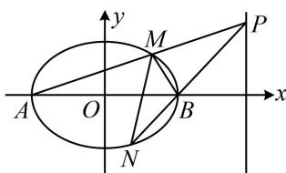

<!-- question-source:start -->
【例3】设 $A, B$ 分别为椭圆 $\frac{x^2}{a^2} + \frac{y^2}{b^2} = 1 (a > b > 0)$ 的左、右顶点，椭圆长半轴的长等于焦距，且过点 $\left(\sqrt{2}, \frac{\sqrt{6}}{2}\right)$ .

(1) 求椭圆的方程;

（2）设 $P$ 为直线 $x = 4$ 上不同于点 $(4,0)$ 的任意一点，若直线 $AP$ ， $BP$ 分别与椭圆相交于异于 $A$ ， $B$ 的点 $M$ ， $N$ ，证明：点 $B$ 在以 $MN$ 为直径的圆内.

（1）设椭圆的焦距为 $2c$ ，则 $\left\{ \begin{array}{l}a = 2c\\ \frac{2}{a^2} +\frac{3}{2b^2} = 1, \end{array} \right.$ 解得： $a = 2$ ， $b = \sqrt{3}$ ， $c = 1$ ，故椭圆的方程为 $\frac{x^2}{4} +\frac{y^2}{3} = 1$

(2) 解法 1: (怎样翻译点 $B$ 在以 $MN$ 为直径的圆内? 结合图形可知此结论意味着 $\angle MBN$ 为钝角, 故可翻译为 $\overrightarrow{BM} \cdot \overrightarrow{BN} < 0$ , 计算此数量积需要 $M, N$ 的坐标, 观察图形发现可设 $P$ 的坐标, 并用它写出 $PA, PB$ 的方程, 与椭圆联立求 $M, N$ 的坐标)

由
（1）可得 $A(-2,0)$ ， $B(2,0)$ ，设 $P(4,t)(t \neq 0)$ ，则 $k_{PA} = \frac{t}{6}$ ，所以直线 $PA$ 的方程为 $x = \frac{6}{t} y - 2$ ，

代入椭圆方程消去 $x$ 整理得： $(t^2 + 27)y^2 - 18ty = 0$ ，解得： $y = 0$ 或 $\frac{18t}{t^2 + 27}$

所以 $y_{M} = \frac{18t}{t^{2} + 27}$ ， $x_{M} = \frac{6}{t} y_{M} - 2 = \frac{54 - 2t^{2}}{t^{2} + 27}$ ，故 $M\left(\frac{54 - 2t^2}{27 + t^2},\frac{18t}{27 + t^2}\right)$

又 $k_{PB} = \frac{t}{2}$ ，所以直线 $PB$ 的方程为 $x = \frac{2}{t} y + 2$

代入椭圆方程消去 $x$ 整理得： $(t^2 +3)y^2 +6ty = 0$ ，解得： $y = 0$ 或 $-\frac{6t}{t^2 + 3}$

所以 $y_{N} = -\frac{6t}{t^{2} + 3}, x_{N} = \frac{2}{t} y_{N} + 2 = \frac{2t^{2} - 6}{t^{2} + 3}$ 故 $N\left(\frac{2t^2 - 6}{3 + t^2}, -\frac{6t}{3 + t^2}\right)$

所以 $\overrightarrow{BM} = \left(-\frac{4t^2}{27 + t^2},\frac{18t}{27 + t^2}\right)$ ， $\overrightarrow{BN} = \left(-\frac{12}{3 + t^2}, - \frac{6t}{3 + t^2}\right)$ ，故 $\overrightarrow{BM}\cdot \overrightarrow{BN} = -\frac{60t^2}{(27 + t^2)(3 + t^2)} < 0$ 所以∠MBN为钝角，故点B在以MN为直径的圆内.

（1）可得 $A(-2,0)$ ， $B(2,0)$ ，设 $M(x_0,y_0)$ ，因为点 $M$ 在椭圆上，所以 $\frac{x_0^2}{4} +\frac{y_0^2}{3} = 1$ ①，又点 $M$ 异于顶点 $A,B$ ，所以 $-2 <   x_{0} <   2$ ，（接下来可以写出 $AM$ 的方程，与 $x = 4$ 联立求 $P$ 的坐标，但直接根据 $A,M,P$ 三点共线，由 $k_{AM} = k_{AP}$ 建立方程求 $P$ 的坐标更便捷）由 $P,A,M$ 三点共线知 $\frac{y_p}{4 - (-2)} = \frac{y_0}{x_0 - (-2)}$ ，解得： $y_{P} = \frac{6y_{0}}{x_{0} + 2}$ ，所以 $P\left(4,\frac{6y_0}{x_0 + 2}\right)$ 所以 $\overrightarrow{BM} = (x_0 - 2,y_0)$ ， $\overrightarrow{BP} = \left(2,\frac{6y_0}{x_0 + 2}\right)$ ，故 $\overrightarrow{BM}\cdot \overrightarrow{BP} = 2x_0 - 4 + \frac{6y_0^2}{x_0 + 2} = \frac{2}{x_0 + 2}(x_0^2 -4 + 3y_0^2)$ ②，（涉及两个变量，可利用椭圆方程来消元）由①得 $y_0^2 = 3\left(1 - \frac{x_0^2}{4}\right)$ ，代入式②化简得 $\overrightarrow{BM}\cdot \overrightarrow{BP} = \frac{5}{2} (2 - x_0)$ 因为 $2 - x_0 > 0$ ，所以 $\overrightarrow{BM}\cdot \overrightarrow{BP} >0$ ，从而∠MBP为锐角，故∠MBN为钝角，所以点 $B$ 在以MN为直径的圆内.

【反思】直角、锐角、钝角这类条件可能会以点在圆上、点在圆外、点在圆内这样隐含地给出，一般而言，可总结如下．设 M, N 是不重合的两点，则：

① $\overrightarrow{BM} \cdot \overrightarrow{BN} = 0 \Leftrightarrow \angle MBN = 90^{\circ}$ 或 B 与 M, N 中的一个重合 $\Leftrightarrow$ 点 B 在以 MN 为直径的圆上;

② $\overrightarrow{BM} \cdot \overrightarrow{BN} > 0 \Leftrightarrow \angle MBN$ 为锐角或 $0^{\circ} \Leftrightarrow$ 点 B 在以 MN 为直径的圆外；

③ $\overrightarrow{BM} \cdot \overrightarrow{BN} < 0 \Leftrightarrow \angle MBN$ 为钝角或平角 $\Leftrightarrow$ 点 B 在以 MN 为直径的圆内.
<!-- question-source:end -->

![[高中/总复习/教辅/一数常规版2026/第10章 解析几何/模块6 解析几何大题/第2节 解析几何大题条件翻译：角度/类型01_直角_锐角_钝角/例题/answers/Q00049521A1.md]]
