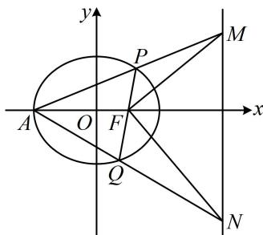

> [!faq]- 《第2节 解析几何大题条件翻译：角度》例题解析
>
> > [!success]- **【答案】** 详见解析
>
> > [!note]- **【分析】**
> > 本题未单列分析。
>
> > [!note]- **【解析】**
> > （2）设点 $A$ 是椭圆 $C$ 的左顶点，直线 $AP, AQ$ 分别与直线 $x = 4$ 相交于点 $M, N$ ，求证：以 $MN$ 为直径的圆恒过点 $F$ .
> >
> > 解：
> > （1）由题意，椭圆 $C$ 的焦距 $2c = 2$ ，所以 $c = 1$
> >
> > 又长半轴长 $a = 2$ ，所以 $b = \sqrt{a^2 - c^2} = \sqrt{3}$ ，故椭圆 $C$ 的方程为 $\frac{x^2}{4} +\frac{y^2}{3} = 1$
> >
> > (2) (以 $MN$ 为直径的圆恒过点 $F$ 意味着 $FM \perp FN$ , 故可翻译成 $\overrightarrow{FM} \cdot \overrightarrow{FN} = 0$ , 而求此数量积需要 $M, N$ 的坐标, 故考虑设出 $P, Q$ 的坐标, 写出直线 $AP, AQ$ 的方程, 与 $x = 4$ 联立求 $M, N$ 的坐标)
> >
> > 设 $P(x_{1},y_{1})$ ， $Q(x_{2},y_{2})$ ，由
> > （1）可得 $A(-2,0)$ ，所以 $k_{AP} = \frac{y_1}{x_1 + 2}$ ，故直线 $AP$ 的方程为 $y = \frac{y_1}{x_1 + 2}(x + 2)$
> >
> > 令 $x = 4$ 得 $y = \frac{6y_1}{x_1 + 2}$ ，所以 $M\left(4,\frac{6y_1}{x_1 + 2}\right)$ ，同理可得， $N\left(4,\frac{6y_2}{x_2 + 2}\right)$
> >
> > 又因为 $F(1,0)$ ，所以 $\overrightarrow{FM} = \left(3,\frac{6y_1}{x_1 + 2}\right),\quad \overrightarrow{FN} = \left(3,\frac{6y_2}{x_2 + 2}\right),$
> >
> > 故 $\overrightarrow{FM} \cdot \overrightarrow{FN} = 9 + \frac{36y_1y_2}{x_1x_2 + 2(x_1 + x_2) + 4}$ ①,
> >
> > 
> >
> > （看到 $x_{1}x_{2}$ ， $x_{1} + x_{2}$ ， $y_{1}y_{2}$ ，想到设直线 $l$ 的方程，与椭圆方程联立，结合韦达定理计算它们. 直线 $l$ 过 $x$ 轴上的定点 $F$ ，考虑设横截式方程）
> >
> > 由题意，直线 l 不与 y 轴垂直，故可设其方程为 $x = my + 1$ ，
> >
> > 代入 $\frac{x^2}{4} +\frac{y^2}{3} = 1$ 消去 $x$ 整理得： $(3m^{2} + 4)y^{2} + 6my - 9 = 0$ ， $\Delta = 36m^2 -4(3m^2 +4)\cdot (-9) = 144(m^2 +1) > 0$
> >
> > 由韦达定理， $y_{1} + y_{2} = -\frac{6m}{3m^{2} + 4},\quad y_{1}y_{2} = -\frac{9}{3m^{2} + 4},$ 所以 $x_{1} + x_{2} = m(y_{1} + y_{2}) + 2 = \frac{8}{3m^{2} + 4},$
> >
> > $$
> > x _ {1} x _ {2} = \left(m y _ {1} + 1\right) \left(m y _ {2} + 1\right) = m ^ {2} y _ {1} y _ {2} + m \left(y _ {1} + y _ {2}\right) + 1 = \frac {4 - 1 2 m ^ {2}}{3 m ^ {2} + 4},
> > $$
> >
> > 代入①得 $\overrightarrow{FM} \cdot \overrightarrow{FN} = 9 + \frac{36 \cdot \left(-\frac{9}{3m^2 + 4}\right)}{\frac{4 - 12m^2}{3m^2 + 4} + \frac{16}{3m^2 + 4} + 4} = 0$ ，所以 $FM \perp FN$ ，故以 $MN$ 为直径的圆恒过点 $F$ .
>
> > [!tip]- **【反思】**
> > 在解析几何中， $FM \perp FN$ 的翻译方法有： $\overrightarrow{FM} \cdot \overrightarrow{FN} = 0$ ， $k_{FM} \cdot k_{FN} = -1$ ， $\left|FT\right| = \frac{1}{2}\left|MN\right|$ （其中 $T$ 为 $MN$ 中点）， $\left|FM\right|^2 + \left|FN\right|^2 = \left|MN\right|^2$ 等，但最常用的是前两种。本题采用的是第一种，其实用第二种，计算量也大致相当，因为 $k_{FM} \cdot k_{FN} = \frac{2y_1}{x_1 + 2} \cdot \frac{2y_2}{x_2 + 2} = \frac{4y_1y_2}{x_1x_2 + 2(x_1 + x_2) + 4}$ ，所以要证明其结果是-1，也是结合韦达定理计算。
