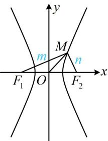
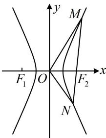

> [!faq]- 《第2节 解析几何大题条件翻译：角度》例题解析
>
> > [!success]- **【答案】** 详见解析
>
> > [!note]- **【分析】**
> > 本题未单列分析。
>
> > [!note]- **【解析】**
> > (2) 已知 $M, N$ 都在 $C$ 的右支上, 设 $l$ 的斜率为 $m$ .
> >
> > (i) 求实数 $m$ 的取值范围; (ii) 是否存在实数 $m$ , 使得 $\angle MON$ 为锐角? 若存在, 请求出 $m$ 的取值范围; 若不存在, 请说明理由.
> >
> > 解：
> > （1）（如图1，不难看出 $\triangle MF_{1}F_{2}$ 为 Rt $\triangle$ ，所以由面积为3可以得出 $|MF_{1}|$ 与 $|MF_{2}|$ 的一个方程，想到结合双曲线定义求解）设 $|MF_{1}| = m$ ， $|MF_{2}| = n$ ，双曲线 $C$ 的半焦距为 $c$ ，则 $|F_{1}F_{2}| = 2c$ ，
> >
> > 当 $|OM| = |OF_2|$ 时， $|OM| = \frac{1}{2}|F_1F_2|$ ，所以 $MF_1 \perp MF_2$ ，故 $m^2 + n^2 = 4c^2$ ①，
> >
> > 且由题意， $S_{\triangle MF_1F_2} = \frac{1}{2} mn = 3$ ，所以 $mn = 6$ ②，又由双曲线定义， $\vert m - n\vert = 2a$ ③，
> >
> > 由①可得 $4c^{2} = m^{2} + n^{2} = (m - n)^{2} + 2mn$ ，结合②③得 $4c^{2} = 4a^{2} + 12$ ，所以 $b^{2} = c^{2} - a^{2} = 3$ ，故 $b = \sqrt{3}$ 又双曲线 $C$ 的离心率 $e = \frac{c}{a} = \frac{\sqrt{a^2 + b^2}}{a} = 2$ ，所以 $a = 1$ ，故双曲线 $C$ 的方程为 $x^{2} - \frac{y^{2}}{3} = 1$ ：
> >
> > （2）（i）由
> > （1）可得 $c = \sqrt{a^2 + b^2} = 2$ ，所以 $F_{2}(2,0)$ ，又直线 $l$ 的斜率为 $m$ ，所以其方程为 $y = m(x - 2)$ 设 $M(x_{1},y_{1})$ ， $N(x_{2},y_{2})$ ，将 $y = m(x - 2)$ 代入 $x^{2} - \frac{y^{2}}{3} = 1$ 消去 $y$ 整理得： $(3 - m^2)x^2 + 4m^2x - 4m^2 - 3 = 0$ ④，因为 $M$ ， $N$ 都在 $C$ 的右支上，所以 $\left\{ \begin{array}{l} 3 - m^2 \neq 0 \\ \Delta = (4m^2)^2 - 4(3 - m^2)(-4m^2 - 3) = 36(m^2 + 1) > 0 \end{array} \right.$ ，解得： $m \neq \pm \sqrt{3}$ ，
> >
> > (上述结果只能保证直线 $l$ 与双曲线 $C$ 有 2 个交点, 不一定都在右支上, 还要补充什么? 交点都在右支上意味着交点横坐标都是正的, 所以方程④得有两个正根, 可结合韦达定理来处理)
> >
> > 由韦达定理， $\left\{ \begin{array}{l}x_{1} + x_{2} = \frac{4m^{2}}{m^{2} - 3} >0\\ x_{1}x_{2} = \frac{4m^{2} + 3}{m^{2} - 3} >0 \end{array} \right.$ ，解得： $m <   - \sqrt{3}$ 或 $m > \sqrt{3}$ ，故 $m$ 的取值范围是 $(-\infty , - \sqrt{3})\bigcup (\sqrt{3}, + \infty)$
> >
> > （ii）（涉及 $\angle MON$ 为锐角，可翻译为 $\overrightarrow{OM} \cdot \overrightarrow{ON} > 0$ ，下面先求该数量积，看看 $\overrightarrow{OM} \cdot \overrightarrow{ON} > 0$ 是否可能成立） $\overrightarrow{OM} = (x_{1}, y_{1})$ ， $\overrightarrow{ON} = (x_{2}, y_{2})$ ，所以 $\overrightarrow{OM} \cdot \overrightarrow{ON} = x_{1}x_{2} + y_{1}y_{2} = \frac{4m^{2} + 3}{m^{2} - 3} + y_{1}y_{2}$ ⑤，
> >
> > (还差 $y_{1}y_{2}$ , 可利用直线 $l$ 的方程将它化为 $x_{1}$ , $x_{2}$ 来计算)
> >
> > $$
> > y _ {1} y _ {2} = m \left(x _ {1} - 2\right) m \left(x _ {2} - 2\right) = m ^ {2} \left[ x _ {1} x _ {2} - 2 \left(x _ {1} + x _ {2}\right) + 4 \right] = m ^ {2} \left(\frac {4 m ^ {2} + 3}{m ^ {2} - 3} - 2 \cdot \frac {4 m ^ {2}}{m ^ {2} - 3} + 4\right) = - \frac {9 m ^ {2}}{m ^ {2} - 3},
> > $$
> >
> > 代入⑤得 $\overrightarrow{OM} \cdot \overrightarrow{ON} = \frac{4m^2 + 3}{m^2 - 3} - \frac{9m^2}{m^2 - 3} = \frac{3 - 5m^2}{m^2 - 3}$ ，由（i）可得 $m^2 > 3$ ，所以 $\frac{3 - 5m^2}{m^2 - 3} < 0$ ，故 $\overrightarrow{OM} \cdot \overrightarrow{ON} < 0$ ，所以 $\angle MON$ 始终为钝角，故不存在实数 $m$ ，使得 $\angle MON$ 为锐角.
> >
> >   
> > 图1
> >
> >   
> > 图2
>
> > [!tip]- **【反思】**
> > 解析几何中 $\angle MON$ 为锐角一般按 $\overrightarrow{OM} \cdot \overrightarrow{ON} > 0$ 来翻译. 但需注意, 若有必要, 还应检验 $\overrightarrow{OM}$ 与 $\overrightarrow{ON}$ 是否可能同向, 此时虽也满足 $\overrightarrow{OM} \cdot \overrightarrow{ON} > 0$ , 但 $\angle MON = 0^{\circ}$ , 应排除这种情况.
