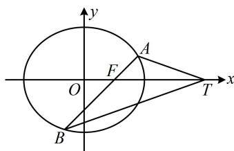

<!-- question-source:start -->
【例 5】已知椭圆 $C: \frac{x^{2}}{a^{2}} + \frac{y^{2}}{b^{2}} = 1 (a > b > 0)$ 的焦距为 2，且经过点 $P\left(1, \frac{3}{2}\right)$ .

(1) 求椭圆 C 的方程;

(2) 经过椭圆 $C$ 的右焦点 $F$ 且斜率为 $k (k \neq 0)$ 的动直线 $l$ 与椭圆 $C$ 交于 $A, B$ 两点, 试问 $x$ 轴上是否存在异于点 $F$ 的定点 $T$ 使 $\left|AF\right| \cdot \left|BT\right| = \left|BF\right| \cdot \left|AT\right|$ 恒成立? 若存在, 求出点 $T$ 坐标; 若不存在,说明理由.

(1) (可以将 $P$ 的坐标代入椭圆方程, 再结合 $a^2 - b^2 = c^2 = 1$ 来求解, 但直接用椭圆定义求 $a$ 更简单)由椭圆的焦距为 2 知它的两个焦点分别为 $(-1,0)$ , $(1,0)$ , 因为 $P$ 在椭圆上, 所以 $P$ 到两个焦点的距离之和 $\sqrt{(-1-1)^2 + \left(0 - \frac{3}{2}\right)^2} + \sqrt{(1-1)^2 + \left(0 - \frac{3}{2}\right)^2} = 4 = 2a$ , 从而 $a = 2$ , 故 $b^2 = a^2 - 1 = 3$ , 所以椭圆 $C$ 的方程为 $\frac{x^2}{4} + \frac{y^2}{3} = 1$ .

(2) (怎样翻译 $|AF| \cdot |BT| = |BF| \cdot |AT|$ ? 若直接算这些长度, 则较麻烦, 可将其化成 $\frac{|AF|}{|BF|} = \frac{|AT|}{|BT|}$ , 故想到角平分线性质定理. 如图, $TF$ 应为 $\angle ATB$ 的平分线, 故 $AT$ , $BT$ 关于 $x$ 轴对称, 又可翻译成 $k_{AT} + k_{BT} = 0$ , 到此“复杂”的条件就转化为简单的模型了! 下面我们先推导这一转化过程) 因为 $|AF| \cdot |BT| = |BF| \cdot |AT|$ , 所以 $\frac{|AF|}{|BF|} = \frac{|AT|}{|BT|}$ ①,

又 $\frac{|AF|}{|BF|} = \frac{S_{\triangle ATF}}{S_{\triangle BTF}} = \frac{\frac{1}{2}|AT|\cdot|TF|\cdot\sin\angle ATF}{\frac{1}{2}|BT|\cdot|TF|\cdot\sin\angle BTF} = \frac{|AT|\cdot\sin\angle ATF}{|BT|\cdot\sin\angle BTF}$ ，代入①得 $\frac{|AT|}{|BT|} = \frac{|AT|\cdot\sin\angle ATF}{|BT|\cdot\sin\angle BTF}$

所以 $\sin \angle ATF = \sin \angle BTF$ ，由 $T$ 与 $F$ 不重合知 $\angle ATF$ 与 $\angle BTF$ 不可能互补，所以 $\angle ATF = \angle BTF$ 所以 $|AF|\cdot |BT| = |BF|\cdot |AT|$ 等价于直线 $TA$ ， $TB$ 的斜率之和 $k_{TA} + k_{TB} = 0$

（涉及斜率，考虑设点的坐标）由
（1）可得 $F(1,0)$ ，设 $A(x_{1},y_{1})$ ， $B(x_{2},y_{2})$ ， $T(t,0)(t\neq 1)$

则 $k_{TA} + k_{TB} = \frac{y_1}{x_1 - t} +\frac{y_2}{x_2 - t} = \frac{y_1(x_2 - t) + y_2(x_1 - t)}{(x_1 - t)(x_2 - t)}$ ，所以 $k_{TA} + k_{TB} = 0\Leftrightarrow y_1(x_2 - t) + y_2(x_1 - t) = 0$ ②，

(变量较多, 有 $x$ 有 $y$ , 考虑设直线的方程, 并用于消元, $A B$ 过 $x$ 轴上定点 $F$ , 设横截式)

由题意，直线 $AB$ 不与坐标轴垂直，故可设其方程为 $x = my + 1 (m \neq 0)$ ，则 $\left\{ \begin{array}{l} x_{1} = my_{1} + 1 \\ x_{2} = my_{2} + 1 \end{array} \right.$ ，

代入②得 $y_{1}(my_{2} + 1 - t) + y_{2}(my_{1} + 1 - t) = 2my_{1}y_{2} + (1 - t)(y_{1} + y_{2}) = 0$ ③，

(式③中有 $y_{1} y_{2}$ 和 $y_{1} + y_{2}$ , 故联立直线 $A B$ 与椭圆方程, 结合韦达定理来算)

联立 $\left\{ \begin{array}{l} x = my + 1 \\ \frac{x^2}{4} + \frac{y^2}{3} = 1 \end{array} \right.$ 消去 $x$ 整理得： $(3m^2 + 4)y^2 + 6my - 9 = 0$

判别式 $\Delta = 36m^2 - 4(3m^2 + 4) \times (-9) = 144(m^2 + 1) > 0$

由韦达定理， $y_{1} + y_{2} = -\frac{6m}{3m^{2} + 4}$ ， $y_{1}y_{2} = -\frac{9}{3m^{2} + 4}$

代入③得 $2m \cdot \left(-\frac{9}{3m^2 + 4}\right) + (1 - t) \cdot \left(-\frac{6m}{3m^2 + 4}\right) = 0$ ，化简得： $m(t - 4) = 0$ ，

结合 $m \neq 0$ 可得 $t = 4$ ，所以 $x$ 轴上存在满足题意的定点 $T(4,0)$ 。

【反思】有时倾斜角互补不会直白地给出，需要将已知条件进行分析整合才能发现。本题就是如此，表面上看给的是长度关系 $\left|AF\right|\cdot\left|BT\right|=\left|BF\right|\cdot\left|AT\right|$ ，但化为比值关系后我们发现x轴是 $\angle ATB$ 的平分线，于是可按倾斜角互补模型处理。
<!-- question-source:end -->

![[高中/总复习/教辅/一数常规版2026/第10章 解析几何/模块6 解析几何大题/第2节 解析几何大题条件翻译：角度/类型02_倾斜角互补/例题/answers/Q00049523A1.md]]
