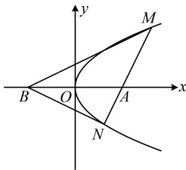

> [!faq]- 《第2节 解析几何大题条件翻译：角度》例题解析
>
> > [!success]- **【答案】** 详见解析
>
> > [!note]- **【分析】**
> > 本题未单列分析。
>
> > [!note]- **【解析】**
> > （1）当 $l$ 与 $x$ 轴垂直时，求直线 $BM$ 的方程；
> > （2）
> > 证明： $\angle ABM = \angle ABN$
> >
> > 解：
> > （1）当 $l$ 与 $x$ 轴垂直时，其方程为 $x = 2$ ，由 $\left\{ \begin{array}{l} x = 2 \\ y^2 = 2x \end{array} \right.$ 解得： $y = \pm 2$ ，故 $M$ 的坐标为(2,2)或(2,-2)，若 $M$ 的坐标为(2,2)，则 $BM$ 的方程为 $x - 2y + 2 = 0$ ，若 $M$ 的坐标为(2,-2)，则 $BM$ 的方程为 $x + 2y + 2 = 0$ 综上所述， $BM$ 的方程为 $x - 2y + 2 = 0$ 或 $x + 2y + 2 = 0$ ：
> >
> > (2) 解法 1: (怎样翻译 $\angle A B M = \angle A B N$ ? 如图, $\angle A B M = \angle A B N$ 意味着 $B M$ , $B N$ 倾斜角互补, 即它们的斜率互为相反数, 故可按 $k _ { B M } + k _ { B N } = 0$ 来翻译, 计算这两个斜率需要 $M$ , $N$ 的坐标, 故先设坐标)
> >
> > 设 $M(x_{1},y_{1})$ ， $N(x_{2},y_{2})$ ，则 $k_{BM} + k_{BN} = \frac{y_1}{x_1 + 2} +\frac{y_2}{x_2 + 2} = \frac{y_1(x_2 + 2) + y_2(x_1 + 2)}{(x_1 + 2)(x_2 + 2)} = \frac{x_1y_2 + x_2y_1 + 2(y_1 + y_2)}{(x_1 + 2)(x_2 + 2)}$ ①，
> >
> > (由上式的结构特征想到设直线 $l$ 的方程, 与抛物线联立, 结合韦达定理来进行计算)
> >
> > $$
> > x = m y + 2
> > $$
> >
> > $$
> > y ^ {2} = 2 x
> > $$
> >
> > $$
> > y ^ {2} - 2 m y - 4 = 0
> > $$
> >
> > $$
> > \Delta > 0
> > $$
> >
> > $$
> > y _ {1} + y _ {2} = 2 m, \quad y _ {1} y _ {2} = - 4
> > $$
> >
> > 所以 $x_{1}y_{2} + x_{2}y_{1} = \frac{y_{1}^{2}}{2}\cdot y_{2} + \frac{y_{2}^{2}}{2}\cdot y_{1} = \frac{y_{1}y_{2}(y_{1} + y_{2})}{2} = \frac{-4\times 2m}{2} = -4m$
> >
> > 从而 $x_{1}y_{2} + x_{2}y_{1} + 2(y_{1} + y_{2}) = -4m + 2 \times 2m = 0$ ，代入①得 $k_{BM} + k_{BN} = 0$ ，故 $\angle ABM = \angle ABN$
> >
> > 解法2: (按解法1得到 $k_{BM} + k_{BN} = \frac{y_1}{x_1 + 2} + \frac{y_2}{x_2 + 2}$ 后, 算 $\frac{y_1}{x_1 + 2} + \frac{y_2}{x_2 + 2}$ 的过程能否简化? 能, 我们可以利用齐次化的思想, 联立直线和抛物线时, 刻意化成 $A\left(\frac{y}{x + 2}\right)^2 + B \cdot \frac{y}{x + 2} + C = 0$ 这种形式, 则可直接由韦达定理求 $\frac{y_2}{x_2 + 2} + \frac{y_1}{x_1 + 2}$ . 下面按此操作, 我们的目标结构是 $\frac{y}{x + 2}$ , 所以先把直线和抛物线方程中的 $x$ 凑成 $x + 2$ ) 由 $x = my + 2$ 可得 $x + 2 - my = 4$ ②, 抛物线的方程可化为 $y^2 + 4 = 2(x + 2)$ ③,
> >
> > 合式②来化）结合②可将③化为 $y^{2} + \frac{1}{4}(x + 2 - my)^{2} = \frac{x + 2 - my}{2}(x + 2)$ ，整理得： $(4 + m^{2})y^{2} - (x + 2)^{2} = 0$ ，两端同除以 $(x + 2)^{2}$ 得 $(4 + m^{2})\left(\frac{y}{x + 2}\right)^{2} - 1 = 0$ ，因为 $M, N$ 的坐标满足上述方程，所以由韦达定理， $\frac{y_1}{x_1 + 2} + \frac{y_2}{x_2 + 2} = -\frac{0}{4 + m^2} = 0$ ，从而 $k_{BM} + k_{BN} = 0$ ，故 $\angle ABM = \angle ABN$ 。
> >
> > 
>
> > [!tip]- **【反思】**
> > - **①**：当我们通过分析图形的几何特征发现两条直线倾斜角互补时，常翻译为它们的斜率之和为0.
> > - **②**：计算 $\frac{y_1 - b}{x_1 - a} +\frac{y_2 - b}{x_2 - a}$ 或 $\frac{y_1 - b}{x_1 - a}\cdot \frac{y_2 - b}{x_2 - a}$ 这类结构，可考虑齐次化思想，其核心是在联立直线和椭圆（双曲线、抛物线）的方程时，将其化为关于 $x - a$ 和 $y - b$ 的二次齐次式 $A(y - b)^2 +B(x - a)(y - b) + C(x - a)^2 = 0$ ，再同除以 $(x - a)^2$ 化为 $A\left(\frac{y - b}{x - a}\right)^2 +B\cdot \frac{y - b}{x - a} +C = 0$ ，这样可直接由韦达定理求得 $\frac{y_1 - b}{x_1 - a} +\frac{y_2 - b}{x_2 - a} = -\frac{B}{A}$ 和 $\frac{y_1 - b}{x_1 - a}\cdot \frac{y_2 - b}{x_2 - a} = \frac{C}{A}.$
