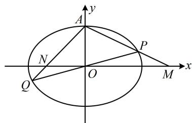

> [!faq]- 《第3节 解析几何大题条件翻译：定值与定点》参考答案
>
> > [!success]- **【答案】** 详见解析
>
> > [!note]- **【分析】**
> > 本题未单列分析。
>
> > [!note]- **【解析】**
> > 解: (1) 椭圆 $C$ 的右焦点为 $(1,0)$ , 所以半焦距 $c = 1$ ,
> >
> > 又椭圆经过点 $A(0,1)$ ，所以 $b = 1$ ，从而 $a^2 = b^2 + c^2 = 2$
> >
> > 故椭圆 $C$ 的方程为 $\frac{x^2}{2} + y^2 = 1$ .
> >
> > （2）（如图，条件涉及 $|OM|\cdot |ON| = 2$ ，故需计算 $|OM|$ 和 $|ON|$ ，算它们需要 $M,N$ 的坐标，而 $M,N$ 的坐标可通过分别联立 $AP,AQ$ 和 $x$ 轴方程求得，故考虑设 $P,Q$ 的坐标，用于写出 $AP,AQ$ 的方程）
> >
> > 设 $P(x_{1},y_{1})$ ， $Q(x_{2},y_{2})$ ，则 $AP$ 的方程为 $y = \frac{y_1 - 1}{x_1} x + 1$
> >
> > 令 $y = 0$ 解得： $x = \frac{x_1}{1 - y_1}$ ，所以 $M\left(\frac{x_1}{1 - y_1},0\right)$
> >
> > 同理可得点 N 的坐标为 $\left(\frac{x_{2}}{1-y_{2}},0\right)$ ,
> >
> > 所以 $\left|OM\right|\cdot\left|ON\right|=\left|\frac{x_{1}x_{2}}{(1-y_{1})(1-y_{2})}\right|=\left|\frac{x_{1}x_{2}}{1-(y_{1}+y_{2})+y_{1}y_{2}}\right|=2$ ，
> >
> > 故 $\left|x_{1}x_{2}\right|=2\left|1-\left(y_{1}+y_{2}\right)+y_{1}y_{2}\right|$ ①,
> >
> > （涉及 $x_{1}x_{2}$ ， $y_{1} + y_{2}$ ， $y_{1}y_{2}$ ，于是联立直线 $l$ 与椭圆方程，结合韦达定理计算它们）
> >
> > 联立 $\left\{ \begin{array}{l} y = kx + t \\ \frac{x^2}{2} + y^2 = 1 \end{array} \right.$ 消去 $y$ 整理得：
> >
> > $(1 + 2k^{2})x^{2} + 4ktx + 2t^{2} - 2 = 0$ ②,
> >
> > 由韦达定理， $x_{1} + x_{2} = -\frac{4kt}{1 + 2k^{2}}$ ， $x_{1}x_{2} = \frac{2t^{2} - 2}{1 + 2k^{2}}$
> >
> > 故 $y_{1} + y_{2} = k(x_{1} + x_{2}) + 2t = \frac{2t}{1 + 2k^{2}}$
> >
> > $y_{1}y_{2} = (kx_{1} + t)(kx_{2} + t) = k^{2}x_{1}x_{2} + kt(x_{1} + x_{2}) + t^{2} = \frac{t^{2} - 2k^{2}}{1 + 2k^{2}}$
> >
> > 代入①得 $\left|\frac{2t^2 - 2}{1 + 2k^2}\right| = 2\left|1 - \frac{2t}{1 + 2k^2} +\frac{t^2 - 2k^2}{1 + 2k^2}\right|$
> >
> > 从而 $\left|2t^2 - 2\right| = 2\left|1 - 2t + t^2\right|$ ，故 $\left|(t + 1)(t - 1)\right| = \left|(t - 1)^2\right|$ ，
> >
> > 结合 $t \neq \pm 1$ 可解得： $t = 0$ ，经检验，满足方程②的判别式
> >
> > $\Delta > 0$ ，所以直线 $l$ 的方程为 $y = kx$ ，该直线过定点 $O$ .
> >
> > 
