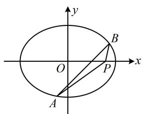

> [!faq]- 《第3节 解析几何大题条件翻译：定值与定点》参考答案
>
> > [!success]- **【答案】** 详见解析
>
> > [!note]- **【分析】**
> > 本题未单列分析。
>
> > [!note]- **【解析】**
> > 解：（1）因为椭圆 C 的短轴长 $2b = 2\sqrt{3}$ ，所以 $b = \sqrt{3}$ ，又因为椭圆的离心率 $e = \frac{\sqrt{a^{2} - b^{2}}}{a} = \frac{1}{2}$ ，所以 a = 2，故椭圆 C 的方程为 $\frac{x^{2}}{4} + \frac{y^{2}}{3} = 1$ .
> >
> > （2）（计算 $\overrightarrow{PA} \cdot \overrightarrow{PB}$ 需要 $P, A, B$ 的坐标，故先设坐标）设 $P(t,0)$ ， $A(x_1,y_1)$ ， $B(x_2,y_2)$ ，则 $\overrightarrow{PA} = (x_1 - t,y_1)$ ， $\overrightarrow{PB} = (x_2 - t,y_2)$ ，所以 $\overrightarrow{PA} \cdot \overrightarrow{PB} = (x_1 - t)(x_2 - t) + y_1y_2 = x_1x_2 - t(x_1 + x_2) + t^2 + y_1y_2$ ①，
> >
> > （看到 $x_{1}x_{2}$ ， $x_{1} + x_{2}$ ， $y_{1}y_{2}$ ，想到联立直线 $l$ 与椭圆的方程，结合韦达定理计算它们，故先设直线. 直线 $l$ 过 $x$ 轴上的定点，这种情况一般考虑设横截式方程）
> >
> > 当直线 $l$ 与 $x$ 轴不重合时，设 $l$ 的方程为 $x = my + 1$
> >
> > 由 $\left\{ \begin{array}{l} x = my + 1 \\ \frac{x^2}{4} + \frac{y^2}{3} = 1 \end{array} \right.$ 消去 $x$ 整理得： $(3m^2 + 4)y^2 + 6my - 9 = 0$
> >
> > 易知 $\Delta > 0$ ，所以 $y_{1} + y_{2} = -\frac{6m}{3m^{2} + 4}$ ， $y_{1}y_{2} = -\frac{9}{3m^{2} + 4}$ ，
> >
> > 故 $x_{1} + x_{2} = my_{1} + 1 + my_{2} + 1 = m(y_{1} + y_{2}) + 2 = \frac{8}{3m^{2} + 4}$
> >
> > $$
> > x _ {1} x _ {2} = (m y _ {1} + 1) (m y _ {2} + 1) = m ^ {2} y _ {1} y _ {2} + m (y _ {1} + y _ {2}) + 1
> > $$
> >
> > $= \frac{4 - 12m^2}{3m^2 + 4}$ ，代入①得 $\overrightarrow{PA} \cdot \overrightarrow{PB} =$
> >
> > $$
> > \frac {4 - 1 2 m ^ {2}}{3 m ^ {2} + 4} - t \cdot \frac {8}{3 m ^ {2} + 4} + t ^ {2} - \frac {9}{3 m ^ {2} + 4} = \frac {- 1 2 m ^ {2} - 8 t - 5}{3 m ^ {2} + 4} + t ^ {2},
> > $$
> >
> > （怎样能使上式的值不随 $m$ 的变化而改变？像这种分式型式子要为定值，只需分子分母对应系数成比例） $\overrightarrow{PA} \cdot \overrightarrow{PB}$ 为定值等价于 $\frac{-12}{3} = \frac{-8t - 5}{4}$ ，解得： $t = \frac{11}{8}$ ，
> >
> > 此时 $\overrightarrow{PA} \cdot \overrightarrow{PB} = -\frac{135}{64}$ ;
> >
> > 当直线 l 与 x 轴重合且 $t=\frac{11}{8}$ 时，A，B 都是长轴端点，
> >
> > 不妨设 $A(-2,0)$ ， $B(2,0)$ ，则 $\overrightarrow{PA} = \left(-\frac{27}{8}, 0\right)$ ， $\overrightarrow{PB} = \left(\frac{5}{8}, 0\right)$ ，
> >
> > $$
> > \overrightarrow {P A} \cdot \overrightarrow {P B} = - \frac {2 7}{8} \times \frac {5}{8} = - \frac {1 3 5}{6 4};
> > $$
> >
> > 综上所述，存在点 $P\left(\frac{11}{8},0\right)$ ，使得 $\overrightarrow{PA}\cdot \overrightarrow{PB}$ 为定值 $-\frac{135}{64}$
> >
> > 
