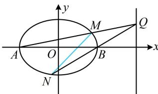

> [!faq]- 《第3节 解析几何大题条件翻译：定值与定点》参考答案
>
> > [!success]- **【答案】** 详见解析
>
> > [!note]- **【分析】**
> > 本题未单列分析。
>
> > [!note]- **【解析】**
> > 解：（1）（所给的斜率之积容易用坐标计算，故直接设 $P$ 的解：(1)（例2）在解析式中定义为用坐标分析，故函数P的坐标，翻译斜率之积建立关于所设坐标的方程）
> > 设 $P(x,y)$ ，则 $k_{PA} \cdot k_{PB} = \frac{y}{x+2} \cdot \frac{y}{x-2} = -\frac{1}{2}$ 化简得： $\frac{x^{2}}{4}+\frac{y^{2}}{2}=1$ 因为 PA, PB 斜率要存在，所以 P 不与 A, B 重合，
> > 从而 $x \neq \pm 2$ ，故点 P 的轨迹 E 的方程为 $\frac{x^{2}}{4} + \frac{y^{2}}{2} = 1 (x \neq \pm 2)$ .
> >
> > （2）解法1：（注意到 $M, N$ 分别是 $QA, QB$ 与轨迹 $E$ 的交点，图形可看成随 $Q$ 的运动而运动，只要设 $Q$ 的坐标，就能写出 $QA, QB$ 的方程，与 $E$ 的方程联立，求得 $M, N$ 的坐标，故可考虑先求 $M, N$ 的坐标，再找定点）设 $Q(4,t)(t \neq 0)$ ，则直线 $QA$ 的方程为 $y = \frac{t}{6}(x + 2)$ ，代入 $\frac{x^2}{4} + \frac{y^2}{2} = 1$ 消去 $y$ 整理得： $(t^2 + 18)x^2 + 4t^2x + 4t^2 - 72 = 0$ ，判别式 $\Delta_1 = (4t^2)^2 - 4(t^2 + 18)(4t^2 - 72) = 72^2 > 0$ ，由韦达定理， $x_A x_M = -2x_M = \frac{4t^2 - 72}{t^2 + 18}$ ，所以 $x_M = \frac{36 - 2t^2}{t^2 + 18}$ ， $y_M = \frac{t}{6}(x_M + 2) = \frac{12t}{t^2 + 18}$ ，故 $M\left(\frac{36 - 2t^2}{t^2 + 18}, \frac{12t}{t^2 + 18}\right)$ ，直线 $QB$ 的方程为 $y = \frac{t}{2}(x - 2)$ ，代入 $\frac{x^2}{4} + \frac{y^2}{2} = 1$ 消去 $y$ 整理得： $(t^2 + 2)x^2 - 4t^2x + 4t^2 - 8 = 0$ ，判别式 $\Delta_2 = (-4t^2)^2 - 4(t^2 + 2)(4t^2 - 8) = 64 > 0$ ，由韦达定理， $x_B x_N = 2x_N = \frac{4t^2 - 8}{t^2 + 2}$ ，所以 $x_N = \frac{2t^2 - 4}{t^2 + 2}$ ， $y_N = \frac{t}{2}(x_N - 2) = -\frac{4t}{t^2 + 2}$ ，故 $N\left(\frac{2t^2 - 4}{t^2 + 2}, -\frac{4t}{t^2 + 2}\right)$ ，
> >
> > （上述 $M, N$ 的坐标较复杂，先求直线 $MN$ 的方程再找定点较难，怎么办呢？此时可考虑用特值探路，只需取两个特定的 $t$ 求出两条直线 $MN$ ，则定点只能是这两条直线的交点。为了便于计算，第一条我们假设 $t = 0$ ，不难得出此时 $MN$ 即为 $x$ 轴；第二条我们让 $M$ 在 $y$ 轴上，故取 $t = 3\sqrt{2}$ ，进一步可求得直线 $MN$ 的方程为 $y = -\sqrt{2} x + \sqrt{2}$ ，它与 $x$ 轴的交点为 $P(1,0)$ ，于是直线 $MN$ 过的定点只能为 $P$ 。既然我们心中已有答案，作答时可直接给出 $P$ 的坐标，再用向量法证明 $P, M, N$ 三点共线即可）记 $P(1,0)$ ，则 $\overrightarrow{PM} = \left(\frac{18 - 3t^2}{t^2 + 18}, \frac{12t}{t^2 + 18}\right)$ ，
> >
> > $\overrightarrow{PN} = \left(\frac{t^2 - 6}{t^2 + 2}, -\frac{4t}{t^2 + 2}\right)$ ，所以 $\overrightarrow{PM} = -\frac{3(t^2 + 2)}{t^2 + 18}\overrightarrow{PN}$ ，
> >
> > 从而 P, M, N 三点共线，故直线 MN 过定点 $P(1,0)$ .
> >
> > 解法2：（求直线 $MN$ 过的定点，也可考虑设直线 $MN$ 的方程，再寻找参数满足的条件。这里的已知怎样翻译呢？受题干斜率之积的启发，我们来分析有关直线的斜率，看能否找出端倪）
> >
> > 设 $Q(4,t)(t \neq 0)$ ，由题意可知 $k_{MA} \cdot k_{MB} = -\frac{1}{2}$ ①，
> >
> > 又 $k_{MA} = k_{QA} = \frac{t - 0}{4 - (-2)} = \frac{t}{6},\quad k_{NB} = k_{QB} = \frac{t - 0}{4 - 2} = \frac{t}{2},$
> >
> > 所以 $k_{MA}=\frac{1}{3}k_{NB}$ ，
> >
> > 代入①得 $\frac{1}{3} k_{NB}\cdot k_{MB} = -\frac{1}{2}$ ，故 $k_{NB}\cdot k_{MB} = -\frac{3}{2}$ ②，
> >
> > (要求 $k_{NB}$ 和 $k_{MB}$ ，需要 M，N 的坐标，故设它们的坐标)
> >
> > 设 $M(x_{1},y_{1})$ ， $N(x_{2},y_{2})$ ，则式②即为 $\frac{y_2}{x_2 - 2}\cdot \frac{y_1}{x_1 - 2} = -\frac{3}{2}$
> >
> > 所以 $2y_{1}y_{2} = -3(x_{1} - 2)(x_{2} - 2) = -3[x_{1}x_{2} - 2(x_{1} + x_{2}) + 4]$ ③，
> >
> > （看到式③，想到联立直线 $MN$ 和椭圆的方程，结合韦达定理来算）
> >
> > 因为 $t \neq 0$ ，所以 $MN$ 不与 $y$ 轴垂直，可设直线 $MN$ 的方程
> >
> > 为 $x = my + n$ ，代入 $\frac{x^2}{4} +\frac{y^2}{2} = 1$ 消去 $x$ 整理得：
> >
> > $$
> > (m ^ {2} + 2) y ^ {2} + 2 m n y + n ^ {2} - 4 = 0
> > $$
> >
> > 判别式 $\Delta = (2mn)^2 - 4(m^2 + 2)(n^2 - 4) = 8(2m^2 - n^2 + 4)$ ④，
> >
> > 由韦达定理， $y_{1} + y_{2} = -\frac{2mn}{m^{2} + 2}$ ， $y_{1}y_{2} = \frac{n^{2} - 4}{m^{2} + 2}$ ，
> >
> > 所以 $x_{1} + x_{2} = my_{1} + n + my_{2} + n = m(y_{1} + y_{2}) + 2n = \frac{4n}{m^{2} + 2}$
> >
> > $$
> > x _ {1} x _ {2} = \left(m y _ {1} + n\right) \left(m y _ {2} + n\right) = m ^ {2} y _ {1} y _ {2} + m n \left(y _ {1} + y _ {2}\right) + n ^ {2}
> > $$
> >
> > $$
> > = \frac {2 n ^ {2} - 4 m ^ {2}}{m ^ {2} + 2}
> > $$
> >
> > 代入③得 $2 \cdot \frac{n^2 - 4}{m^2 + 2} = -3\left(\frac{2n^2 - 4m^2}{m^2 + 2} - 2 \cdot \frac{4n}{m^2 + 2} + 4\right)$ ,
> >
> > 化简得： $(n - 2)(n - 1) = 0$ ，所以 $n = 1$ 或2，
> >
> > 若 $n = 2$ ，则 $MN$ 的方程为 $x = my + 2$ ，所以直线 $MN$ 过点 $B$ ，不合题意，故 $n = 1$ ，代入④得 $\Delta = 8(2m^2 +3) > 0$ 所以 $MN$ 的方程为 $x = my + 1$ ，故直线 $MN$ 过定点(1,0).
> >
> > 
