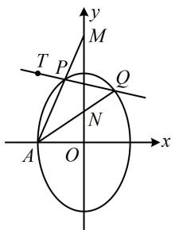

> [!faq]- 《第3节 解析几何大题条件翻译：定值与定点》参考答案
>
> > [!success]- **【答案】** 详见解析
>
> > [!note]- **【分析】**
> > 本题未单列分析。
>
> > [!note]- **【解析】**
> > 解：（1）因为点 $A(-2,0)$ 在椭圆 $C$ 上，所以 $b = 2$
> >
> > 又 $C$ 的离心率 $e = \frac{c}{a} = \frac{\sqrt{a^2 - b^2}}{a} = \frac{\sqrt{5}}{3}$ ，所以 $a = 3$ ，
> >
> > 故椭圆 C 的方程为 $\frac{y^{2}}{9} + \frac{x^{2}}{4} = 1$ .
> >
> > (2) 解法 1: (由于 $M, N$ 都在 $y$ 轴上, 所以要证线段 $MN$ 中点为定点, 只需证 $MN$ 中点的纵坐标为定值, 而计算 $MN$ 中点的纵坐标需要 $M, N$ 的纵坐标, 故可考虑设 $P, Q$ 的坐标, 写出 $AP, AQ$ 的方程, 用于求 $M, N$ 的纵坐标)
> >
> > 设 $P(x_{1},y_{1})$ ， $Q(x_{2},y_{2})$ ，则 $AP$ 的方程为 $y = \frac{y_1}{x_1 + 2} (x + 2)$
> >
> > 令 $x = 0$ 得 $y = \frac{2y_1}{x_1 + 2}$ ，故 $y_{M} = \frac{2y_{1}}{x_{1} + 2}$ ，同理 $y_{N} = \frac{2y_{2}}{x_{2} + 2}$
> >
> > 所以 $MN$ 中点的纵坐标为 $\frac{y_M + y_N}{2} = \frac{y_1}{x_1 + 2} +\frac{y_2}{x_2 + 2}$
> >
> > （上式变量较多，但注意到它关于 $x_{1}$ 和 $x_{2}$ ， $y_{1}$ 和 $y_{2}$ 的结构是对称的，故可以想象，若利用直线 $PQ$ 的方程将其消元，化简后结构也应是对称的，可联立直线 $PQ$ 和椭圆的方程处理，于是又设直线 $PQ$ 的方程）
> >
> > 如图，由题意，直线 $PQ$ 不与坐标轴垂直，可设其方程为
> >
> > $y - 3 = k(x + 2)(k \neq 0)$ ，则 $x_{1} + 2 = \frac{y_{1} - 3}{k}$ ， $x_{2} + 2 = \frac{y_{2} - 3}{k}$ ，
> >
> > 所以 $\frac{y_M + y_N}{2} = \frac{y_1}{x_1 + 2} +\frac{y_2}{x_2 + 2} = \frac{y_1}{\frac{y_1 - 3}{k}} +\frac{y_2}{\frac{y_2 - 3}{k}}$
> >
> > $$
> > = k \left(\frac {y _ {1}}{y _ {1} - 3} + \frac {y _ {2}}{y _ {2} - 3}\right) = k \left(\frac {y _ {1} - 3 + 3}{y _ {1} - 3} + \frac {y _ {2} - 3 + 3}{y _ {2} - 3}\right)
> > $$
> >
> > $$
> > = k \left(2 + \frac {3}{y _ {1} - 3} + \frac {3}{y _ {2} - 3}\right) = k \left[ 2 + 3 \cdot \frac {(y _ {1} - 3) + (y _ {2} - 3)}{(y _ {1} - 3) (y _ {2} - 3)} \right] \tag {①}
> > $$
> >
> > （由于这里需要的是 $(y_{1} - 3) + (y_{2} - 3)$ 和 $(y_{1} - 3)(y_{2} - 3)$ ，所以联立方程时，可考虑整理成 $A(y - 3)^{2} + B(y - 3) + C = 0$ 这种结构，以便于直接求出上述两式）
> >
> > 将 $\frac{y^2}{9} +\frac{x^2}{4} = 1$ 变形成 $4[(y - 3) + 3]^2 +9[(x + 2) - 2]^2 = 36$ ②，
> >
> > 由 $y - 3 = k(x + 2)$ 可得 $x + 2 = \frac{1}{k} (y - 3)$
> >
> > 代入②得 $4(y - 3)^2 + 24(y - 3) + 36 + 9\left[\frac{1}{k} (y - 3) - 2\right]^2 = 36$
> >
> > 整理得： $\left(4 + \frac{9}{k^2}\right)(y - 3)^2 +\left(24 - \frac{36}{k}\right)(y - 3) + 36 = 0$
> >
> > 所以 $(y_{1} - 3) + (y_{2} - 3) = -\frac{24 - \frac{36}{k}}{4 + \frac{9}{k^{2}}} = \frac{36k - 24k^{2}}{4k^{2} + 9}$
> >
> > $$
> > (y _ {1} - 3) (y _ {2} - 3) = \frac {3 6}{4 + \frac {9}{k ^ {2}}} = \frac {3 6 k ^ {2}}{4 k ^ {2} + 9},
> > $$
> >
> > 代入①得 $\frac{y_M + y_N}{2} = k\left(2 + 3\cdot \frac{\frac{36k - 24k^2}{4k^2 + 9}}{\frac{36k^2}{4k^2 + 9}}\right)$
> >
> > $$
> > = k \left(2 + 3 \cdot \frac {3 6 - 2 4 k}{3 6 k}\right) = k \left(2 + \frac {3}{k} - 2\right) = 3,
> > $$
> >
> > 故线段 $MN$ 的中点为定点 $(0,3)$
> >
> > 解法2：（既然要用 $M, N$ 的坐标，那能否直接设这个坐标，再翻译已知条件进行计算呢？可以的，以 $M$ 为例，只要设出 $M$ 的坐标，就能写出 $AM$ 的方程，与椭圆联立，求出 $P$ 的坐标，故按此尝试）
> >
> > 设 $M(0,m)$ ， $N(0,n)$ ， $m\neq n$ ，则直线 $AM$ 的斜率 $k_{AM} =$
> >
> > $\frac{m-0}{0-(-2)}=\frac{m}{2}$ ，其方程为 $y=\frac{m}{2}(x+2)$ ，
> >
> > 代入 $\frac{y^2}{9} +\frac{x^2}{4} = 1$ 消去 $y$ 整理得：
> >
> > $$
> > (m ^ {2} + 9) x ^ {2} + 4 m ^ {2} x + 4 m ^ {2} - 3 6 = 0,
> > $$
> >
> > 因为点 $A$ 的横坐标为-2，所以由韦达定理，
> >
> > $x_{A}x_{P} = -2x_{P} = \frac{4m^{2} - 36}{m^{2} + 9}$ ，故 $x_{P} = \frac{18 - 2m^{2}}{m^{2} + 9}$
> >
> > $y_{P} = \frac{m}{2} (x_{P} + 2) = \frac{18m}{m^{2} + 9}$ ，所以 $P\left(\frac{18 - 2m^2}{m^2 + 9},\frac{18m}{m^2 + 9}\right),$
> >
> > 同理， $Q\left(\frac{18-2n^{2}}{n^{2}+9},\frac{18n}{n^{2}+9}\right)$ ，（怎样寻找 m，n 满足的关系？观察发现还有 P，Q 是过 $(-2,3)$ 的直线与椭圆的交点没有翻译，怎样翻译呢？注意到点 $(-2,3)$ 与 P，Q 共线，故可用斜率来翻译）记 T $(-2,3)$ ，由题意，T，P，Q 三点共线，
> >
> > 所以 $k_{TP} = k_{TQ}$ ，故 $\frac{\frac{18m}{m^2 + 9} - 3}{\frac{18 - 2m^2}{m^2 + 9} + 2} = \frac{\frac{18n}{n^2 + 9} - 3}{\frac{18 - 2n^2}{n^2 + 9} + 2},$
> >
> > 整理得： $(m - 3)^{2} = (n - 3)^{2}$
> >
> > 因为 $m \neq n$ ，所以 $m - 3 \neq n - 3$ ，从而 $m - 3 = 3 - n$
> >
> > 故 $m + n = 6$ ，所以 $\frac{m + n}{2} = 3$ ，故 $MN$ 的中点为定点(0,3).
> >
> > 
> >
> > 一数·必刷100讲
