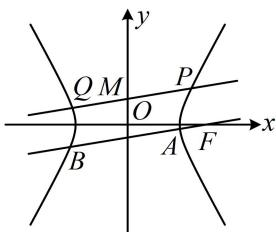

> [!faq]- 《第3节 解析几何大题条件翻译：定值与定点》例题解析
>
> > [!success]- **【答案】** 详见解析
>
> > [!note]- **【分析】**
> > 本题未单列分析。
>
> > [!note]- **【解析】**
> > 证明: $\frac{|MP| \cdot |MQ|}{|AB|}$ 是定值.
> >
> > 解：
> > （1）将 $\left(3, \frac{5}{2}\right)$ 和 $(4, \sqrt{15})$ 代入双曲线方程可得 $\left\{ \begin{array}{l} \frac{9}{a^2} - \frac{25}{4b^2} = 1 \\ \frac{16}{a^2} - \frac{15}{b^2} = 1 \end{array} \right.$ ，解得： $\left\{ \begin{array}{l} a = 2 \\ b = \sqrt{5} \end{array} \right.$ ，所以双曲线的方程为 $\frac{x^2}{4} - \frac{y^2}{5} = 1$ .
> >
> > （2）（|MP|，|MQ|，|AB|都可由弦长公式 $\sqrt{1 + k^2} \cdot |x_1 - x_2|$ 来算，故先设斜率和有关点的坐标）如图，过 $M$ 的直线要与双曲线交于 $P$ ， $Q$ 两点，其斜率必定存在，设为 $k$ ，设 $P(x_1, y_1)$ ， $Q(x_2, y_2)$ ， $A(x_3, y_3)$ ， $B(x_4, y_4)$ ，由弦长公式， $|MP| = \sqrt{1 + k^2} \cdot |0 - x_1| = \sqrt{1 + k^2} \cdot |x_1|$ ， $|MQ| = \sqrt{1 + k^2} \cdot |0 - x_2| = \sqrt{1 + k^2} \cdot |x_2|$ ，由题意， $AB // PQ$ ，所以直线 $AB$ 的斜率也为 $k$ ，故 $|AB| = \sqrt{1 + k^2} \cdot |x_3 - x_4|$ ，所以 $\frac{|MP| \cdot |MQ|}{|AB|} = \frac{\sqrt{1 + k^2} \cdot |x_1| \cdot \sqrt{1 + k^2} \cdot |x_2|}{\sqrt{1 + k^2} \cdot |x_3 - x_4|} = \frac{\sqrt{1 + k^2} \cdot |x_1x_2|}{|x_3 - x_4|}$ ①，
> >
> > （有 $x_{1}x_{2}$ ， $\left|x_3 - x_4\right|$ ，故想到联立直线 $PQ$ ， $AB$ 与双曲线的方程，结合韦达定理及其推论来计算它们）
> >
> > 直线 $PQ$ 的方程为 $y = kx + 1$ ，代入 $\frac{x^2}{4} -\frac{y^2}{5} = 1$ 整理得： $(5 - 4k^{2})x^{2} - 8kx - 24 = 0$
> >
> > 因为直线 PQ 与双曲线有 2 个交点，所以 $\left\{\begin{aligned}5-4k^{2}\neq0\\ \Delta=64k^{2}-4(5-4k^{2})\cdot(-24)>0\end{aligned}\right.$ ，解得： $-\frac{\sqrt{6}}{2}<k<\frac{\sqrt{6}}{2}$ 且 $k\neq\pm\frac{\sqrt{5}}{2}$ ，由韦达定理， $x_{1}x_{2}=-\frac{24}{5-4k^{2}}$ ②，双曲线的半焦距 $c = \sqrt{a^2 + b^2} = 3$ ，故其右焦点为 $F(3,0)$
> >
> > 
> >
> > 所以直线 $AB$ 的方程为 $y = k(x - 3)$ ，代入 $\frac{x^2}{4} -\frac{y^2}{5} = 1$ 整理得： $(5 - 4k^2)x^2 +24k^2x - 36k^2 -20 = 0$ ，因为直线 $AB$ 与双曲线有2个交点，所以 $\left\{ \begin{array}{l}5 - 4k^2\neq 0\\ \Delta ' = (24k^2)^2 -4(5 - 4k^2)(-36k^2 -20) = 400(k^2 +1) > 0 \end{array} \right.$ 故 $k\neq \pm \frac{\sqrt{5}}{2}$ ，由韦达定理推论， $|x_3 - x_4| = \frac{\sqrt{\Delta'}}{|5 - 4k^2|} = \frac{20\sqrt{k^2 + 1}}{|5 - 4k^2|}$ ③，将②③代入①可得 $\frac{|MP|\cdot|MQ|}{|AB|} = \frac{\sqrt{1 + k^2}\cdot|x_1x_2|}{|x_3 - x_4|} = \frac{\sqrt{1 + k^2}\cdot\left[-\frac{24}{5 - 4k^2}\right]}{20\sqrt{k^2 + 1}} = \frac{6}{5}$ ，所以 $\frac{|MP|\cdot|MQ|}{|AB|}$ 为定值 $\frac{6}{5}$ .
>
> > [!tip]- **【反思】**
> > 在条件清晰的情况下，直接设变量，正面计算目标量，化简得出目标量为定值即可解决问题.
