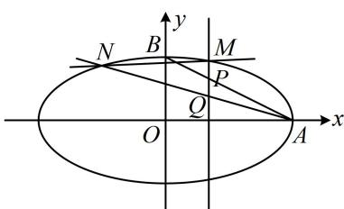

> [!faq]- 《第3节 解析几何大题条件翻译：定值与定点》例题解析
>
> > [!success]- **【答案】** 详见解析
>
> > [!note]- **【分析】**
> > 本题未单列分析。
>
> > [!note]- **【解析】**
> > 证明：直线 $MN$ 过定点.
> >
> > 解：
> > （1）由题意，椭圆 $E$ 的长轴长 $2a = 4$ ，所以 $a = 2$
> >
> > 
> >
> > 又由椭圆 E 的三个顶点构成的三角形的面积为 2,
> >
> > 所以 $\frac{1}{2} \times 2a \times b = 2$ 或 $\frac{1}{2} \times 2b \times a = 2$ ，化简都得到 $ab = 2$ ，所以 $b = 1$ ，故椭圆 $E$ 的方程为 $\frac{x^2}{4} + y^2 = 1$ .
> >
> > (2) 解法 1: (题干点的产生过程较复杂, 我们是直接设直线 $MN$ 的方程, 还是设 $M, N$ 的坐标呢? 既然要证直线 $MN$ 过定点, 后续运算肯定需要 $M, N$ 的坐标, 可以想象, 正面求 $M, N$ 的坐标比较麻烦, 于是考虑先设 $M, N$ 的坐标, 逐步翻译已知条件, 找到两个坐标间的联系)
> >
> > 设 $M(x_{1},y_{1})$ ， $N(x_{2},y_{2})$ ，则直线 $PQ$ 的方程为 $x = x_{1}$ ，由
> > （1）知 $A(2,0)$ ， $B(0,1)$
> >
> > 所以直线 $AB$ 的截距式方程为 $\frac{x}{2} +\frac{y}{1} = 1$ ，与 $x = x_{1}$ 联立解得： $y = 1 - \frac{x_1}{2}$ ，所以 $P\left(x_{1},1 - \frac{x_{1}}{2}\right)$
> >
> > 又 $P$ 为线段 $QM$ 的中点，所以 $x_{Q} = x_{1}$ ，且 $\frac{y_Q + y_1}{2} = 1 - \frac{x_1}{2}$ ，所以 $y_{Q} = 2 - x_{1} - y_{1}$ ，故 $Q(x_{1},2 - x_{1} - y_{1})$
> >
> > (接下来要用直线 $AQ$ 与椭圆联立求 $N$ 的坐标, 从而建立所设坐标的方程吗? 这样做显然太麻烦, 根据 $A$ , $Q$ , $N$ 三点共线, 翻译为直线 $AQ$ , $AN$ 斜率相等更简单, 且观察图形可发现这里斜率一定存在)
> >
> > 因为 $N$ 是直线 $AQ$ 与椭圆的交点，所以 $A, Q, N$ 三点共线，从而 $k_{AQ} = k_{AN}$ ，故 $\frac{2 - x_1 - y_1}{x_1 - 2} = \frac{y_2}{x_2 - 2}$ ，
> >
> > 所以 $-1 - \frac{y_1}{x_1 - 2} = \frac{y_2}{x_2 - 2}$ 故 $\frac{y_1}{x_1 - 2} +\frac{y_2}{x_2 - 2} = -1$ ①，
> >
> > (可以想象, 式①关于 $x_{1}$ 和 $x_{2}$ , $y_{1}$ 和 $y_{2}$ 是对称的, 故若设直线 $MN$ 的方程, 并用它消去 $y_{1}$ , $y_{2}$ , 得到的结果关于 $x_{1}$ , $x_{2}$ 必定也是对称的, 于是可联立直线 $MN$ 与椭圆的方程, 用韦达定理处理)
> >
> > 由图可知 $MN$ 斜率存在，可设其方程为 $y = kx + m$ ，则 $\left\{ \begin{array}{l} y_{1} = kx_{1} + m \\ y_{2} = kx_{2} + m \end{array} \right.$ ，代入①得 $\frac{kx_1 + m}{x_1 - 2} + \frac{kx_2 + m}{x_2 - 2} = -1$
> >
> > 所以 $\frac{(kx_1 + m)(x_2 - 2) + (kx_2 + m)(x_1 - 2)}{(x_1 - 2)(x_2 - 2)} = -1$ ，故 $\frac{2kx_1x_2 + (m - 2k)(x_1 + x_2) - 4m}{x_1x_2 - 2(x_1 + x_2) + 4} = -1$ ②，
> >
> > 联立 $\left\{ \begin{array}{l} y = kx + m \\ \frac{x^2}{4} + y^2 = 1 \end{array} \right.$ 消去 $y$ 整理得： $(1 + 4k^2)x^2 + 8kmx + 4m^2 - 4 = 0$
> >
> > 由韦达定理， $x_{1} + x_{2} = -\frac{8km}{1 + 4k^{2}}$ ， $x_{1}x_{2} = \frac{4m^{2} - 4}{1 + 4k^{2}}$ ，代入②得 $\frac{2k\cdot\frac{4m^2 - 4}{1 + 4k^2} + (m - 2k)\cdot\left(-\frac{8km}{1 + 4k^2}\right) - 4m}{\frac{4m^2 - 4}{1 + 4k^2} - 2\left(-\frac{8km}{1 + 4k^2}\right) + 4} = -1$
> >
> > 所以 $\frac{2k(4m^2 - 4) - 8km(m - 2k) - 4m(1 + 4k^2)}{4m^2 - 4 + 16km + 4 + 16k^2} = -1$ ，化简得： $\frac{1}{m + 2k} = 1$ ，所以 $m = 1 - 2k$
> >
> > 所以直线 $MN$ 的方程为 $y = kx + 1 - 2k$ ，即 $y = k(x - 2) + 1$ ，故直线 $MN$ 过定点(2,1).
> >
> > 解法2: (按解法1得到式①后, 看到 $\frac{y_1}{x_1 - 2} + \frac{y_2}{x_2 - 2}$ 这种结构, 想到可利用齐次化思想来算它, 只要联立直线和椭圆时, 刻意化成 $A\left(\frac{y}{x - 2}\right)^2 + B \cdot \frac{y}{x - 2} + C = 0$ 这种形式, 就能直接由韦达定理求 $\frac{y_1}{x_1 - 2} + \frac{y_2}{x_2 - 2}$ , 下面我们按此操作. 注意到我们的目标结构是 $\frac{y}{x - 2}$ , 所以把直线和椭圆方程中的 $x$ 凑成 $x - 2$ )
> >
> > 直线 $y = kx + m$ 可变形成 $y = k(x - 2) + 2k + m$ ，即 $y - k(x - 2) = 2k + m$ ③，
> >
> > 椭圆 $\frac{x^2}{4} + y^2 = 1$ 可变形成 $\frac{[(x - 2) + 2]^2}{4} + y^2 = 1$ ，进一步可化为 $(x - 2)^2 + 4(x - 2) + 4y^2 = 0$ ④，
> >
> > (此式关于 $x - 2$ 和 $y$ 不齐次, 我们需要把一次项 $4(x - 2)$ 也化为二次的, 怎么化? 可用式③化)
> >
> > 在式④两端乘以 $2k + m$ 可得 $(2k + m)(x - 2)^{2} + 4(2k + m)(x - 2) + 4(2k + m)y^{2} = 0$ ⑤，
> >
> > (观察发现将式⑤一次项前面的 $2k + m$ 换成 $y - k(x - 2)$ , 就能将式⑤化为关于 $x - 2$ 和 $y$ 的二次齐次式)
> >
> > 结合式③可将式⑤化为 $(2k + m)(x - 2)^{2} + 4[y - k(x - 2)](x - 2) + 4(2k + m)y^{2} = 0$
> >
> > 整理得： $4(2k + m)y^{2} + 4(x - 2)y + (m - 2k)(x - 2)^{2} = 0$
> >
> > 两端同除以 $(x - 2)^{2}$ 可得 $4(2k + m)\left(\frac{y}{x - 2}\right)^{2} + 4\cdot \frac{y}{x - 2} +m - 2k = 0$
> >
> > 因为 $M, N$ 的坐标满足上述方程，所以由韦达定理， $\frac{y_1}{x_1 - 2} + \frac{y_2}{x_2 - 2} = -\frac{1}{2k + m}$ ，
> >
> > 代入式①得 $-\frac{1}{2k + m} = -1$ ，所以 $m = 1 - 2k$ ，从而直线 $MN$ 的方程为 $y = kx + 1 - 2k$ ，即 $y = k(x - 2) + 1$ ，故直线 $MN$ 过定点(2,1).
>
> > [!tip]- **【反思】**
> > 当容易设直线的方程处理时，可考虑设直线的方程，翻译已知条件寻找所设直线方程中参数的关系，从而找到直线所过的定点.
