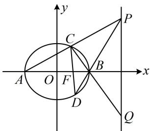

> [!faq]- 《第3节 解析几何大题条件翻译：定值与定点》例题解析
>
> > [!success]- **【答案】** 详见解析
>
> > [!note]- **【分析】**
> > 本题未单列分析。
>
> > [!note]- **【解析】**
> > （2）设直线 $BP$ 与 $E$ 的另一个交点为 $D$ ，求证：直线 $CD$ 经过 $F$ .
> >
> > 解：
> > （1）（观察发现 $P, Q$ 的横坐标均为4，所以可将它们看成直线 $AC, BC$ 与直线 $x = 4$ 的交点，故可考虑设 $C$ 的坐标，写出直线 $AC, BC$ 的方程，与 $x = 4$ 联立求 $P, Q$ 的纵坐标）由题意， $A(-2,0), B(2,0)$ ，设 $C(x_0, y_0)(x_0 \neq \pm 2)$ ，则 $AC$ 的方程为 $y = \frac{y_0}{x_0 + 2}(x + 2)$ ，令 $x = 4$ 得 $y_P = \frac{6y_0}{x_0 + 2}$ ，直线 $BC$ 的方程为 $y = \frac{y_0}{x_0 - 2}(x - 2)$ ，令 $x = 4$ 得 $y_Q = \frac{2y_0}{x_0 - 2}$ ，所以 $y_P y_Q = \frac{12y_0^2}{x_0^2 - 4}$ ①，（此式有2个变量，可用椭圆方程消元）因为点 $C$ 在椭圆 $E$ 上，所以 $\frac{x_0^2}{4} + \frac{y_0^2}{3} = 1$ ，故 $y_0^2 = 3\left(1 - \frac{x_0^2}{4}\right) = \frac{3}{4}(4 - x_0^2)$ ，代入①得 $y_P y_Q = -9$ 。
> >
> > (2) (若用求得的 $P$ 写直线 $PB$ 的方程, 则会有 $x_0$ , $y_0$ 两个变量, 与椭圆联立求点 $D$ 比较难算. 注意到图形可看成 $PA$ , $PB$ 分别与椭圆交于 $C$ , $D$ 两点, 故可考虑设 $P$ 的坐标, 只需设 1 个参数, 用它来写 $PA$ , $PB$ 的方程, 与椭圆联立求 $C$ , $D$ 两点)
> >
> > 设 $P(4,t)$ ，则直线 $PA$ 的方程为 $y = \frac{t}{6} (x + 2)$ ，代入 $\frac{x^2}{4} +\frac{y^2}{3} = 1$ 化简得： $(t^2 +27)x^2 +4t^2 x + 4t^2 -108 = 0$
> >
> > 判别式 $\Delta_{1} = (4t^{2})^{2} - 4(t^{2} + 27)(4t^{2} - 108) = 108^{2} > 0$ ，由韦达定理， $x_{A}x_{C} = -2x_{C} = \frac{4t^{2} - 108}{t^{2} + 27}$ ，所以 $x_{C} = \frac{54 - 2t^{2}}{t^{2} + 27}$ $y_{C} = \frac{t}{6}(x_{C} + 2) = \frac{18t}{t^{2} + 27}$ ，故 $C\left(\frac{54 - 2t^2}{t^2 + 27},\frac{18t}{t^2 + 27}\right)$
> >
> > 直线 $PB$ 的方程为 $y = \frac{t}{2} (x - 2)$ ，代入 $\frac{x^2}{4} +\frac{y^2}{3} = 1$ 化简得： $(t^2 +3)x^2 -4t^2 x + 4t^2 -12 = 0$
> >
> > 判别式 $\Delta_2 = (-4t^2)^2 - 4(t^2 + 3)(4t^2 - 12) = 144 > 0$ ，由韦达定理， $x_B x_D = 2x_D = \frac{4t^2 - 12}{t^2 + 3}$ ，所以 $x_D = \frac{2t^2 - 6}{t^2 + 3}$ ，
> >
> > $y_{D} = \frac{t}{2} (x_{D} - 2) = -\frac{6t}{t^{2} + 3}$ 故 $D\left(\frac{2t^2 - 6}{t^2 + 3}, -\frac{6t}{t^2 + 3}\right)$
> >
> > (要证直线 CD 过点 F，只需证 $\overrightarrow{FC}$ 与 $\overrightarrow{FD}$ 共线，故先求这两个向量的坐
> >
> > 
> >
> > 标，再观察它们的倍数关系）
> >
> > 由题意， $F(1,0)$ ，所以 $\overrightarrow{FC} = \left(\frac{27 - 3t^2}{t^2 + 27},\frac{18t}{t^2 + 27}\right),\quad \overrightarrow{FD} = \left(\frac{t^2 - 9}{t^2 + 3}, - \frac{6t}{t^2 + 3}\right),$
> >
> > 从而 $\overrightarrow{FD} = -\frac{t^2 + 27}{3(t^2 + 3)}\overrightarrow{FC}$ ，故 $F, C, D$ 三点共线，即直线 $CD$ 过点 $F$ .
>
> > [!tip]- **【反思】**
> > 像本题这样不方便设直线 $CD$ 的方程处理时, 可考虑先求出 $C, D$ 两点的坐标, 用特值探路找到直线 $CD$ 过的定点 $F$ , 再用向量法证明 $F, C, D$ 三点共线, 就能得到直线 $CD$ 过定点 $F$ .
