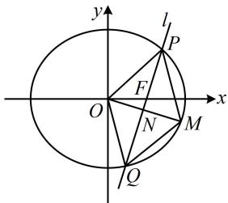

> [!faq]- 《第4节 解析几何综合大题》参考答案
>
> > [!success]- **【答案】** 详见解析
>
> > [!note]- **【分析】**
> > 本题未单列分析。
>
> > [!note]- **【解析】**
> > 解：（1）因为椭圆 $C$ 经过 $(0, \sqrt{3})$ ，所以 $b = \sqrt{3}$ ，
> >
> > 又因为椭圆的离心率 $e = \frac{\sqrt{a^2 - b^2}}{a} = \frac{1}{2}$ ，所以 $a = 2$
> >
> > 故椭圆 C 的方程为 $\frac{x^{2}}{4} + \frac{y^{2}}{3} = 1$ .
> >
> > （2）（如图，涉及平行四边形，考虑按对角线互相平分翻译，需要 $PQ$ 中点的坐标，我们先设直线 $l$ 的方程，与椭圆联立，结合韦达定理求 $PQ$ 中点坐标）
> >
> > 由（1）可得椭圆的半焦距 $c = \sqrt{a^2 - b^2} = 1$ ，所以 $F(1,0)$
> >
> > 若直线 $l$ 与 $y$ 轴垂直，则 $O, P, Q$ 共线，无法构成平行四边形 $OPMQ$ ，所以 $l$ 不与 $y$ 轴垂直，
> >
> > 又因为 l 不与 x 轴垂直，所以可设 $l: x = my + 1 (m \neq 0)$ ，
> >
> > 代入 $\frac{x^2}{4} +\frac{y^2}{3} = 1$ 整理得： $(3m^{2} + 4)y^{2} + 6my - 9 = 0$
> >
> > 判别式 $\Delta = (6m)^2 - 4(3m^2 + 4) \cdot (-9) = 144(m^2 + 1) > 0$
> >
> > 由韦达定理， $y_{1} + y_{2} = -\frac{6m}{3m^{2} + 4}$
> >
> > 所以 $x_{1} + x_{2} = my_{1} + 1 + my_{2} + 1 = m(y_{1} + y_{2}) + 2$
> >
> > $$
> > = m \cdot \left(- \frac {6 m}{3 m ^ {2} + 4}\right) + 2 = \frac {8}{3 m ^ {2} + 4},
> > $$
> >
> > 故 $PQ$ 中点为 $N\left(\frac{4}{3m^2 + 4}, - \frac{3m}{3m^2 + 4}\right)$
> >
> > （怎样建立方程求 $m$ ？可由 $N$ 也是 $OM$ 中点，求出 $M$ 的坐标，代入椭圆方程，即可建立关于 $m$ 的方程）若四边形 $OPMQ$ 为平行四边形，则 $N$ 是 $OM$ 中点，
> >
> > 所以 $M\left(\frac{8}{3m^{2}+4},-\frac{6m}{3m^{2}+4}\right)$ ,
> >
> > 代入椭圆方程得： $\frac{\left(\frac{8}{3m^2 + 4}\right)^2}{4} +\frac{\left(-\frac{6m}{3m^2 + 4}\right)^2}{3} = 1$
> >
> > 解得： $m = 0$ ，与 $m\neq 0$ 矛盾，所以椭圆 $C$ 上不存在点 $M$ ，使四边形OPMQ为平行四边形.
> >
> > 
