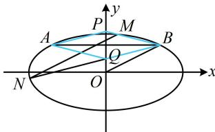

> [!faq]- 《第4节 解析几何综合大题》参考答案
>
> > [!success]- **【答案】** 详见解析
>
> > [!note]- **【分析】**
> > 本题未单列分析。
>
> > [!note]- **【解析】**
> > 解：（1）由题意， $\left\{\begin{aligned}\frac{(-2)^{2}}{a^{2}}+\frac{1^{2}}{b^{2}}=1\\\frac{\sqrt{a^{2}-b^{2}}}{a}=\frac{\sqrt{3}}{2}\end{aligned}\right.$ ，解得： $\left\{\begin{aligned}a=2\sqrt{2}\\ b=\sqrt{2}\end{aligned}\right.$ 所以椭圆 C 的方程为 $\frac{x^{2}}{8} + \frac{y^{2}}{2} = 1$ .
> >
> > (2) 解法 1: (证菱形即证对角线垂直平分, 这里垂直显然成立, 故只需证平分, 即 $AB$ 中点也是 $PQ$ 中点, $AB$ 中点显然是 $(0,1)$ , 结合图形不难发现只需证 $PQ$ 中点纵坐标为 1. 求 $PQ$ 中点纵坐标需要 $P$ , $Q$ 的坐标, 可分别用 $BM$ , $BN$ 的方程与 $y$ 轴联立来求它们)
> >
> > 由题意, $B(2,1)$ , 设 $M(x_1,y_1)$ , $N(x_2,y_2)$ ,
> >
> > 当 $BM \perp x$ 轴时, $BM$ 与 $y$ 轴没有交点, 不合题意;
> >
> > 当 $BM$ 不与 $x$ 轴垂直时, $k_{BM} = \frac{y_1 - 1}{x_1 - 2}$ ,
> >
> > 所以直线 $BM$ 的方程为 $y - 1 = \frac{y_1 - 1}{x_1 - 2}(x - 2)$ ,
> >
> > 令 $x = 0$ 得 $y = 1 - \frac{2(y_1 - 1)}{x_1 - 2}$ , 所以 $y_P = 1 - \frac{2(y_1 - 1)}{x_1 - 2}$ ,
> >
> > 同理可得, $y_Q = 1 - \frac{2(y_2 - 1)}{x_2 - 2}$ ,
> >
> > 所以 $y_P + y_Q = 2 - 2\left(\frac{y_1 - 1}{x_1 - 2} + \frac{y_2 - 1}{x_2 - 2}\right)$ ①,
> >
> > (怎样计算上式?有 $x$ 有 $y$ , 变量较多, 考虑消元, 可设直线 $MN$ 的方程, 利用该方程来消元)
> >
> > 设直线 $l$ 的方程为 $y = \frac{1}{2} x + m (m \neq 0)$ , 则 $\begin{cases} y_1 = \frac{1}{2} x_1 + m \\ y_2 = \frac{1}{2} x_2 + m \end{cases}$ ,
> >
> > 代入①得 $y_P + y_Q = 2 - 2\left(\frac{\frac{1}{2} x_1 + m - 1}{x_1 - 2} + \frac{\frac{1}{2} x_2 + m - 1}{x_2 - 2}\right)$ $= 2 - \left(\frac{x_1 + 2m - 2}{x_1 - 2} + \frac{x_2 + 2m - 2}{x_2 - 2}\right) = 2 - \left(1 + \frac{2m}{x_1 - 2} + 1 + \frac{2m}{x_2 - 2}\right)$ $= -2m\left(\frac{1}{x_1 - 2} + \frac{1}{x_2 - 2}\right) = -2m \cdot \frac{x_2 - 2 + x_1 - 2}{(x_1 - 2)(x_2 - 2)}$ $= -2m \cdot \frac{x_1 + x_2 - 4}{x_1 x_2 - 2(x_1 + x_2) + 4}$ ②, (看到 $x_1 + x_2$ 和 $x_1 x_2$ , 想到联立直线 $l$ 与椭圆方程, 用韦达定理计算它们)
> >
> > 联立 $\begin{cases} y = \frac{1}{2} x + m \\ \frac{x^2}{8} + \frac{y^2}{2} = 1 \end{cases}$ 可得 $x^2 + 2mx + 2m^2 - 4 = 0$ , $\Delta = (2m)^2 - 4(2m^2 - 4) = 16 - 4m^2 > 0$ , 所以 $-2 < m < 2$ ,
> >
> > 结合 $m \neq 0$ 可得 $-2 < m < 0$ 或 $0 < m < 2$ ,
> >
> > 由韦达定理, $x_1 + x_2 = -2m$ , $x_1 x_2 = 2m^2 - 4$ ,
> >
> > 代入②得 $y_{P} + y_{Q} = -2m \cdot \frac{-2m - 4}{2m^{2} - 4 - 2(-2m) + 4} = \frac{2m(2m + 4)}{2m^{2} + 4m} = 2$ ，
> >
> > 所以 $\frac{y_P + y_Q}{2} = 1$ ，故 $PQ$ 中点为(0,1)，
> >
> > 所以 $PQ$ 中点与 $AB$ 中点重合，
> >
> > 又因为 $AB \perp PQ$ ，所以四边形 APBQ 为菱形.
> >
> > 
> >
> > 解法2：（按解法1得到式①后，由其结构联想到可用齐次化方法快速求出它：在联立直线 $l$ 与椭圆方程时，刻意将其化为 $A\left(\frac{y - 1}{x - 2}\right)^2 +B\cdot \frac{y - 1}{x - 2} +C = 0$ 这种形式，则可用韦达定理直接求出 $\frac{y_1 - 1}{x_1 - 2} +\frac{y_2 - 1}{x_2 - 2}$ ，下面我们先将直线 $l$ 和椭圆方程凑出 $y - 1$ 和 $x - 2$ 这两个结构）  
> > 直线 $l$ 的方程 $y = \frac{1}{2} x + m$ 可化为 $y - 1 = \frac{1}{2} (x - 2) + m$ 即 $2(y - 1) - (x - 2) = 2m$ ③，  
> > 椭圆的方程 $\frac{x^2}{8} +\frac{y^2}{2} = 1$ 可化为 $\frac{(x - 2 + 2)^2}{8} +\frac{(y - 1 + 1)^2}{2} = 1$ 即 $(x - 2)^{2} + 4(y - 1)^{2} + 4(x - 2) + 8(y - 1) = 0$ ④，  
> > （上式关于 $x - 2$ 和 $y - 1$ 不齐次，可利用方程③来把一次项4(x-2)和8(y-1)化为二次式，实现齐次化）  
> > 在式④两端乘以 $m$ 可得 $m(x - 2)^2 +4m(y - 1)^2 +4m(x - 2) + 8m(y - 1) = 0$ 结合式③得 $m(x - 2)^2 +4m(y - 1)^2 +2[2(y - 1) - (x - 2)](x - 2) + 4[2(y - 1) - (x - 2)](y - 1) = 0$ 整理得： $(4m + 8)(y - 1)^{2} + (m - 2)(x - 2)^{2} = 0$ 两端同除以 $(x - 2)^{2}$ 得 $(4m + 8)\left(\frac{y - 1}{x - 2}\right)^{2} + m - 2 = 0$ 因为 $M,N$ 的坐标满足上述方程，所以由韦达定理， $\frac{y_1 - 1}{x_1 - 2} +\frac{y_2 - 1}{x_2 - 2} = -\frac{0}{4m + 8} = 0$ ，代入①得 $y_{P} + y_{Q} = 2$ 接下来同解法1.
