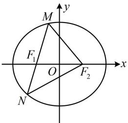
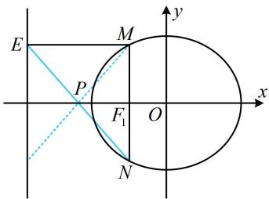

> [!faq]- 《第4节 解析几何综合大题》参考答案
>
> > [!success]- **【答案】** 详见解析
>
> > [!note]- **【分析】**
> > 本题未单列分析。
>
> > [!note]- **【解析】**
> > 由题意， $\triangle MNF_{2}$ 的周长为 8，所以 $4a = 8$ ，故 $a = 2$ ，
> >
> > 又椭圆的离心率 $e = \frac{\sqrt{a^2 - b^2}}{a} = \frac{1}{2}$ ，所以 $b = \sqrt{3}$ ，
> >
> > 故椭圆的标准方程为 $\frac{x^2}{4} +\frac{y^2}{3} = 1$
> >
> >   
> > 图1
> >
> >   
> > 图2
> >
> > （2）（ $E$ 在直线 $x = -4$ 上， $N$ 在椭圆上，显然不方便直接设直线 $EN$ 的方程来找定点，故考虑用坐标来找，先设坐标）设 $M(x_{1},y_{1})$ ， $N(x_{2},y_{2})$ ，由题意可得， $E(-4,y_1)$ ，
> >
> > （怎样由上述 $E$ ， $N$ 的坐标找直线 $EN$ 过的定点？可以想象，若直接写出 $EN$ 的方程，漫无目的地寻找，则方程较复杂，不容易找到定点，可考虑先取特值探路，明确方向）
> >
> > 如图2，当 $MN \perp x$ 轴时， $EN$ 如图（蓝色实线），若交换 $M$ 和 $N$ 的位置，则 $EN$ 会沿 $x$ 轴对称（变成图2蓝色虚线），
> >
> > 上述两种 $EN$ 的交点在 $x$ 轴上，所以若直线 $EN$ 过定点 $P$ ，则 $P$ 只能在 $x$ 轴上，
> >
> > (有了 P 在 x 轴上，方向就明确了，可以用 E, N 的坐标写出直线 EN 的方程，与 x 轴联立求交点)
> >
> > 直线 $EN$ 的方程为 $y - y_{1} = \frac{y_{2} - y_{1}}{x_{2} + 4} (x + 4)$
> >
> > 令 $y = 0$ 得 $x = \frac{y_1(x_2 + 4)}{y_1 - y_2} - 4$ ①，（既有 $x$ ，又有 $y$ ，考虑消元，可设直线 $MN$ 的方程，并用它来消元）
> >
> > 由题意，MN 过 $F_{1}(-1,0)$ 且不与 x 轴重合，所以可设其方程为 x=my-1，则 $x_{2}=my_{2}-1$ ，
> >
> > 代入①得 $x = \frac{y_1(my_2 - 1 + 4)}{y_1 - y_2} - 4 = \frac{my_1y_2 + 3y_1}{y_1 - y_2} - 4$ ②，
> >
> > (看到式中的 $y_{1}y_{2}$ ，想到联立直线 MN 和椭圆的方程，写出韦达定理)
> >
> > 联立 $\left\{ \begin{array}{l} x = my - 1 \\ \frac{x^2}{4} + \frac{y^2}{3} = 1 \end{array} \right.$ 可得 $(3m^2 + 4)y^2 - 6my - 9 = 0$
> >
> > 判别式 $\Delta = (-6m)^2 - 4(3m^2 + 4) \cdot (-9) = 144(m^2 + 1) > 0$
> >
> > 由韦达定理， $y_{1} + y_{2} = \frac{6m}{3m^{2} + 4},\quad y_{1}y_{2} = -\frac{9}{3m^{2} + 4},$
> >
> > （我们发现式②分子有个单独的 $y_{1}$ ，没有与之系数对称的 $y_{2}$ ，不能直接用韦达定理计算，怎么办呢？既然不能直接将韦达定理代入消去 $y_{1}$ 和 $y_{2}$ ，那就考虑消 $m$ ）
> >
> > $$
> > m y _ {1} y _ {2} = - \frac {9 m}{3 m ^ {2} + 4} = - \frac {3}{2} (y _ {1} + y _ {2}),
> > $$
> >
> > 代入②得 $x = \frac{-\frac{3}{2}(y_1 + y_2) + 3y_1}{y_1 - y_2} - 4 = \frac{\frac{3}{2}y_1 - \frac{3}{2}y_2}{y_1 - y_2} - 4 = -\frac{5}{2}$
> >
> > 所以直线 EN 过定点 $P\left(-\frac{5}{2},0\right)$ .
>
> > [!tip]- **【反思】**
> > 分析变动的图形时, 若方向不明, 可考虑先取特值探路, 找到解决问题的方向.
