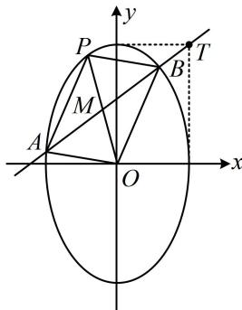

<!-- question-source:start -->
【例1】已知椭圆 $C: 9x^{2} + y^{2} = m^{2} (m > 0)$ ，直线 $l$ 不过原点 $O$ 且不平行于坐标轴， $l$ 与 $C$ 有两个交点 $A, B$ ，线段 $AB$ 的中点为 $M$ .

（1）证明：直线 $OM$ 的斜率与 $l$ 的斜率的乘积为定值；

（2）若 $l$ 过点 $\left(\frac{m}{3}, m\right)$ ，延长线段 $OM$ 与 $C$ 交于点 $P$ ，四边形 $OAPB$ 能否为平行四边形？若能，求此时 $l$ 的斜率；若不能，说明理由.

（1）（要证的结论是中点弦斜率积结论，可以用点差法证，但考虑到第
（2）问可能也要联立直线 $l$ 与椭圆方程，所以这里我们直接联立，用韦达定理求出中点 $M$ 的坐标，再证结论）由题意，可设直线 $l$ 的方程为 $y = kx + b (k \neq 0, b \neq 0)$ ，设 $A(x_{1}, y_{1})$ ， $B(x_{2}, y_{2})$ ，

联立 $\left\{ \begin{array}{l} y = kx + b \\ 9x^{2} + y^{2} = m^{2} \end{array} \right.$ 消去 $y$ 整理得： $(9 + k^{2})x^{2} + 2kbx + b^{2} - m^{2} = 0$ 所以 $x_{1} + x_{2} = -\frac{2kb}{9 + k^{2}}$ ， $x_{1}x_{2} = \frac{b^{2} - m^{2}}{9 + k^{2}}$ ，从而 $y_{1} + y_{2} = k(x_{1} + x_{2}) + 2b = \frac{18b}{9 + k^{2}}$ ，故 $M\left(-\frac{kb}{9 + k^2},\frac{9b}{9 + k^2}\right)$ 所以直线 $OM$ 的斜率为 $k_{OM} = -\frac{9}{k}$ ，故 $k_{OM}\cdot k = -9$ 为定值.

(2) 解法1: (涉及OAPB为平行四边形, 可按对角线互相平分翻译. 这里已有M为AB中点, 所以OAPB为平行四边形等价于M也是OP中点, 故可由O, M的坐标求P的坐标, 代入椭圆方程)

记 $T\left(\frac{m}{3}, m\right)$ ，椭圆C的方程可化为 $\frac{y^{2}}{m^{2}} + \frac{x^{2}}{\frac{m^{2}}{9}} = 1$ ，所以T的位置如图所示，因为l过点T且不过原点，并与椭圆C有2个交点，所以其斜率k > 0且 $k \neq 3$ ，将 $\left(\frac{m}{3}, m\right)$ 代入 $y = kx + b$ 得 $b = \frac{(3 - k)m}{3}$ ①,

由
（1）知 $M\left(-\frac{kb}{9 + k^{2}}, \frac{9b}{9 + k^{2}}\right)$ ，若四边形OAPB为平行四边形，则M为OP中点，所以 $P\left(-\frac{2kb}{9 + k^{2}}, \frac{18b}{9 + k^{2}}\right)$ ，代入椭圆方程得 $9 \cdot \left(-\frac{2kb}{9 + k^{2}}\right)^{2} + \left(\frac{18b}{9 + k^{2}}\right)^{2} = m^{2}$ ②,

将式①代入式②消去b可得 $9 \cdot \frac{4k^{2}}{(9 + k^{2})^{2}} \cdot \frac{(3 - k)^{2} m^{2}}{9} + \frac{18^{2}}{(9 + k^{2})^{2}} \cdot \frac{(3 - k)^{2} m^{2}}{9} = m^{2}$ ,

所以 $\frac{4k^{2}(3 - k)^{2}}{(9 + k^{2})^{2}} + \frac{36(3 - k)^{2}}{(9 + k^{2})^{2}} = 1$ ，从而 $\frac{4(3 - k)^{2}(k^{2} + 9)}{(9 + k^{2})^{2}} = 1$ ，故 $4(3 - k)^{2} = 9 + k^{2}$ ，解得： $k = 4 \pm \sqrt{7}$ , 都满足k > 0且 $k \neq 3$ 。所以四边形OAPB能为平行四边形。此时直线l的斜率为 $4 + \sqrt{7}$

都满足 $k > 0$ 且 $k \neq 3$ ，所以四边形 OAPB 能为平行四边形，此时直线 $l$ 的斜率为 $4 \pm \sqrt{7}$ .

（1）问的结论，容易写出 $OM$ 的方程，与椭圆联立可求出 $P$ 的坐标，再翻译 $M$ 为 $OP$ 中点，可能更简单）因为 $l$ 过点 $\left(\frac{m}{3}, m\right)$ 且不过原点，并与椭圆 $C$ 有2个交点，所以其斜率 $k > 0$ 且 $k \neq 3$ ，由 （1）知 $k_{OM} = -\frac{9}{k}$ ，所以 $OM$ 的方程为 $y = -\frac{9}{k} x$ ，代入 $9x^{2} + y^{2} = m^{2}$ 可解得： $x^{2} = \frac{m^{2}k^{2}}{9k^{2} + 81}$ ，所以 $x_{P} = \pm \frac{km}{3\sqrt{k^{2} + 9}}$ ，将点 $\left(\frac{m}{3}, m\right)$ 代入直线 $l$ 的方程 $y = kx + b$ 得 $b = \frac{(3 - k)m}{3}$ ，由 （1）知 $x_{M} = -\frac{kb}{9 + k^{2}} = -\frac{k(3 - k)m}{3(9 + k^{2})}$ ，四边形 $OAPB$ 为平行四边形等价于 $M$ 也为 $OP$ 中点，即 $x_{P} = 2x_{M}$ ，也即 $\pm \frac{km}{3\sqrt{k^{2} + 9}} = 2 \cdot \left[-\frac{k(3 - k)m}{3(9 + k^{2})}\right]$ ，解得： $k = 4 \pm \sqrt{7}$ ，满足 $k > 0$ 且 $k \neq 3$

所以四边形 OAPB 能为平行四边形，此时直线 l 的斜率为 $4 \pm \sqrt{7}$ .

【反思】解析几何大题中，遇到平行四边形，常按对角线互相平分来翻译。具体操作时，建立方程的方法是多样的。例如本题解法1根据 $M$ 为 $OP$ 中点求 $P$ 的坐标，代入椭圆建立方程，解法2则用直线 $OM$ 与椭圆联立求出 $P$ 的坐标，根据 $M$ 为 $OP$ 中点建立方程。虽然都是按对角线互相平分翻译，但计算量略有差别。
<!-- question-source:end -->

![[高中/总复习/教辅/一数常规版2026/第10章 解析几何/模块6 解析几何大题/第4节 解析几何综合大题/类型01_特殊四边形/例题/answers/Q00049536A1.md]]
