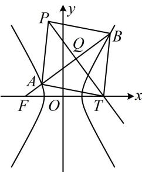

<!-- question-source:start -->
【变式】已知双曲线 $C: \frac{x^2}{a^2} - \frac{y^2}{b^2} = 1 (a > 0, b > 0)$ 的一条渐近线的斜率为 $\sqrt{3}$ ，且过点(2,3).

(1) 求双曲线 C 的方程;

(2) 过 $C$ 的左焦点 $F$ 且不与坐标轴垂直的直线 $l$ 与 $C$ 交于 $A, B$ 两点, 点 $T$ 在 $x$ 轴上, 点 $P$ 在 $C$ 上, 四边形 $TAPB$ 能否为菱形? 若能, 求出此时直线 $l$ 的方程和点 $T$ 的坐标; 否则, 说明理由.

（1）由题意， $\left\{ \begin{array}{l} \frac{b}{a} = \sqrt{3}\\  \frac{4}{a^2} -\frac{9}{b^2} = 1 \end{array} \right.$ ，解得： $\left\{ \begin{array}{l} a = 1\\ b = \sqrt{3} \end{array} \right.$ ，所以双曲线 $C$ 的方程为 $x^{2} - \frac{y^{2}}{3} = 1$

（2）由
（1）可得双曲线的半焦距 $c = \sqrt{a^2 + b^2} = 2$ ，所以 $F(-2,0)$

(怎样翻译 $TAPB$ 为菱形? 如图, $TAPB$ 为菱形意味着 $AB$ 与 $PT$ 垂直平分, 要翻译此几何关系, 需要 $AB$ , $PT$ 中点 $Q$ 的坐标, 故考虑设直线 $l$ 的方程, 与双曲线方程联立, 结合韦达定理求 $Q$ 的坐标)

$$
x = m y - 2 (m \neq 0)
$$

$$
A (x _ {1}, y _ {1}), \quad B (x _ {2}, y _ {2})
$$

联立 $\left\{ \begin{array}{l} x = my - 2 \\ 3x^{2} - y^{2} = 3 \end{array} \right.$ 消去 $x$ 整理得： $(3m^{2} - 1)y^{2} - 12my + 9 = 0$ ，因为直线 $l$ 与双曲线 $C$ 有 2 个交点，所以 $\left\{ \begin{array}{l} 3m^{2} - 1 \neq 0 \\ \Delta = (-12m)^{2} - 4(3m^{2} - 1) \cdot 9 = 36(m^{2} + 1) > 0 \end{array} \right.$ ，解得： $m \neq \pm \frac{\sqrt{3}}{3}$ ，

由韦达定理， $y_{1} + y_{2} = \frac{12m}{3m^{2} - 1}$ ，所以 $x_{1} + x_{2} = m(y_{1} + y_{2}) - 4 = \frac{4}{3m^{2} - 1}$ ，故 $AB$ 中点为 $Q\left(\frac{2}{3m^2 - 1}, \frac{6m}{3m^2 - 1}\right)$ ，

(接下来怎样建立方程求 $m$ ? 注意到 $PT$ 是 $AB$ 的中垂线, 其方程容易写出, 将该方程与 $x$ 轴联立可求 $T$ 的坐标, 结合 $Q$ 为 $PT$ 中点又能求 $P$ 的坐标, 代入双曲线即可建立方程)

线段 $AB$ 的中垂线为 $y - \frac{6m}{3m^2 - 1} = -m\left(x - \frac{2}{3m^2 - 1}\right)$ ，即 $y = -mx + \frac{8m}{3m^2 - 1}$ ①，若四边形 $TAPB$ 为菱形，则点 $T$ 必为线段 $AB$ 的中垂线与 $x$ 轴的交点，在①中令 $y = 0$ 可得 $x = \frac{8}{3m^2 - 1}$ ，所以 $T\left(\frac{8}{3m^2 - 1}, 0\right)$ ，又 $Q$ 为 $PT$ 的中点，所以 $P\left(-\frac{4}{3m^2 - 1}, \frac{12m}{3m^2 - 1}\right)$ ，代入双曲线 $C$ 的方程得 $\frac{16}{(3m^2 - 1)^2} - \frac{1}{3} \cdot \frac{144m^2}{(3m^2 - 1)^2} = 1$ ，所以 $\frac{16(1 - 3m^2)}{(3m^2 - 1)^2} = 1$

化简得： $m^{2} = -5$ ，无解，所以四边形 TAPB 不可能为菱形.

【反思】解析几何大题中，菱形常抓住对角线互相垂直平分这一特征来翻译.
<!-- question-source:end -->

![[高中/总复习/教辅/一数常规版2026/第10章 解析几何/模块6 解析几何大题/第4节 解析几何综合大题/类型01_特殊四边形/例题/answers/Q00049537A1.md]]
