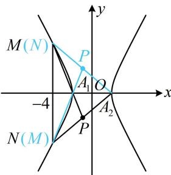

<!-- question-source:start -->
【变式】(2023·新课标Ⅱ卷) 双曲线 $C$ 的中心为坐标原点, 左焦点为 $(-2\sqrt{5}, 0)$ , 离心率为 $\sqrt{5}$ .

(1) 求 C 的方程;

（2）记 $C$ 的左、右顶点分别为 $A_{1}$ ， $A_{2}$ ，过点 $(-4,0)$ 的直线与 $C$ 的左支交于 $M$ ， $N$ 两点， $M$ 在第二象限，直线 $MA_{1}$ 与 $NA_{2}$ 交于点 $P$ ，证明：点 $P$ 在定直线上.

（1）设双曲线 $C$ 的方程为 $\frac{x^2}{a^2} -\frac{y^2}{b^2} = 1(a > 0,b > 0)$ ，则由题意， $a^2 +b^2 = (2\sqrt{5})^2 = 20$

离心率 $e = \frac{c}{a} = \frac{2\sqrt{5}}{a} = \sqrt{5}$ ，所以 $a = 2$ ， $b = 4$ ，故 $C$ 的方程为 $\frac{x^2}{4} - \frac{y^2}{16} = 1$ .

(2) (点 $P$ 在哪条定直线上? 我们先用特殊情况寻找计算的思路. 尽管题干规定了 $M$ 在第二象限, 但直观感觉可知即使 $M$ , $N$ 交换位置, 也不影响结论. 如图, 考虑 $MN \perp x$ 轴的情形, 由图形的对称性不难发现交换 $M$ , $N$ 后得到的点 $P$ 与原来的 $P$ 关于 $x$ 轴对称, 故可猜测 $P$ 在某条与 $x$ 轴垂直的定直线上, 这意味着 $x_{p}$ 为定值, 故只需求 $x_{p}$ . 由于 $P$ 是 $MA_{1}$ 与 $NA_{2}$ 的交点, 而 $A_{1}$ , $A_{2}$ 坐标已知, 所以可考虑设 $M$ , $N$ 的坐标, 写出 $MA_{1}$ 和 $NA_{2}$ 的方程, 并联立求 $x_{p}$ ) 设 $M(x_{1}, y_{1})$ , $N(x_{2}, y_{2})$ , 由
(1) 知 $A_{1}(-2,0)$ , $A_{2}(2,0)$ ,

所以直线 $MA_{1}$ 的方程为 $y = \frac{y_1}{x_1 + 2} (x + 2)$ ，直线 $NA_{2}$ 的方程为 $y = \frac{y_2}{x_2 - 2} (x - 2)$ ，

联立 $\left\{ \begin{array}{l} y = \frac{y_1}{x_1 + 2} (x + 2) \\ y = \frac{y_2}{x_2 - 2} (x - 2) \end{array} \right.$ 消去 $y$ 得： $\frac{y_1}{x_1 + 2} (x + 2) = \frac{y_2}{x_2 - 2} (x - 2)$ ，所以 $\frac{x + 2}{x - 2} = \frac{(x_1 + 2)y_2}{(x_2 - 2)y_1}$ ①，

（只要求出式①的右侧，就能得到 $P$ 的横坐标，怎样计算？既有 $x$ 又有 $y$ ，不好处理，可考虑设直线 $MN$ 的方程，并用于消元）如图，直线 $MN$ 不与 $y$ 轴垂直，可设其方程为 $x = my - 4$ ，则 $\left\{ \begin{array}{l} x_{1} = my_{1} - 4 \\ x_{2} = my_{2} - 4 \end{array} \right.$ ，

代入式①可得 $\frac{x + 2}{x - 2} = \frac{(my_1 - 2)y_2}{(my_2 - 6)y_1} = \frac{my_1y_2 - 2y_2}{my_1y_2 - 6y_1}$ ②，

（上式中有 $y_{1}y_{2}$ ，想到联立直线MN和双曲线的方程，结合韦达定理处理）联立 $\left\{ \begin{array}{l}x = my - 4\\ \frac{x^2}{4} -\frac{y^2}{16} = 1 \end{array} \right.$ 消去 $x$ 整理得： $(4m^{2} - 1)y^{2} - 32my + 48 = 0$ ，由韦达定理， $y_{1} + y_{2} = \frac{32m}{4m^{2} - 1}$ ③， $y_{1}y_{2} = \frac{48}{4m^{2} - 1}$ ④，

因为直线 $MN$ 与双曲线左支有2个交点，所以 $\left\{ \begin{array}{l}4m^{2} - 1\neq 0\\ \Delta = (-32m)^{2} - 4(4m^{2} - 1)\cdot 48 > 0,\\ y_{1}y_{2} = \frac{48}{4m^{2} - 1} < 0 \end{array} \right.$ 解得： $-\frac{1}{2} < m < \frac{1}{2},$

(可以想象, 式②中有 $-2y_{2}$ 和 $-6y_{1}$ , 这两部分由于无法凑成系数对称的结构, 故不能用韦达定理计算, 而若将 $y_{1}y_{2} = \frac{48}{4m^{2} - 1}$ 代入式②, 则仍有 $y_{1}, y_{2}, m$ 三个变量, 怎么办呢? 消元的方向肯定没错, 既然无法用韦达定理消 $y_{1}, y_{2}$ , 那我们转换思路, 改为消 $m$ 试试)

由③④可得 $my_{1}y_{2} = \frac{48m}{4m^{2} - 1} = \frac{3}{2}\cdot \frac{32m}{4m^{2} - 1} = \frac{3}{2} (y_{1} + y_{2})$ ，代入②得 $\frac{x + 2}{x - 2} = \frac{\frac{3}{2}(y_1 + y_2) - 2y_2}{\frac{3}{2}(y_1 + y_2) - 6y_1} = \frac{\frac{3}{2}y_1 - \frac{1}{2}y_2}{-\frac{9}{2}y_1 + \frac{3}{2}y_2}$ $= \frac{\frac{3}{2}y_1 - \frac{1}{2}y_2}{-3\left(\frac{3}{2}y_1 - \frac{1}{2}y_2\right)} = -\frac{1}{3}$ ，解得： $x = -1$ ，所以直线 $MA_{1}$ 与 $NA_{2}$ 的交点 $P$ 在定直线 $x = -1$ 上.

【反思】遇到像 $\frac{my_1y_2 - 2y_2}{my_1y_2 - 6y_1}$ 这种含有 $-2y_{2}$ 和 $-6y_{1}$ 的系数不对称结构，用韦达定理消 $y_{1}$ ， $y_{2}$ 往往行不通，可转为消 $m$ ，具体操作方法是找到 $my_1y_2$ 与 $y_{1} + y_{2}$ 的关系，再替换掉式中的 $my_1y_2$ ，往往就能约分，求得结果.
<!-- question-source:end -->

![[高中/总复习/教辅/一数常规版2026/第10章 解析几何/模块6 解析几何大题/第4节 解析几何综合大题/类型02_非对称韦达定理/例题/answers/Q00049539A1.md]]
