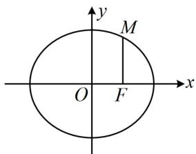
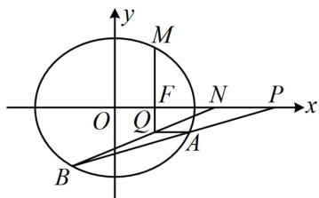
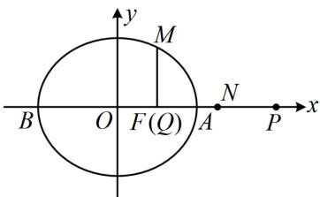

> [!faq]- 《第4节 解析几何综合大题》例题解析
>
> > [!success]- **【答案】** 详见解析
>
> > [!note]- **【分析】**
> > 本题未单列分析。
>
> > [!note]- **【解析】**
> > 解：
> > 解得： $m < -2$ 或 $m > 2$ ，由韦达定理， $y_{1} + y_{2} = -\frac{24m}{3m^{2} + 4}$ ， $y_{1}y_{2} = \frac{36}{3m^{2} + 4}$
> >
> > 所以 $2m \cdot \frac{36}{3m^2 + 4} + 3\left(-\frac{24m}{3m^2 + 4}\right) = 0$ ，从而式③成立，故 $AQ \perp y$ 轴；综上所述， $AQ \perp y$ 轴.
> >
> >   
> > 图1
> >
> >   
> > 图2
> >
> >   
> > 图3
>
> > [!tip]- **【反思】**
> > 当式子中既有 $x$ ，又有 $y$ 时，若遇到系数不对称的情况，可考虑利用直线的方程消元，将变量统一成 $x$ 或 $y$ ，也许系数就对称了，此时可再结合韦达定理计算.
