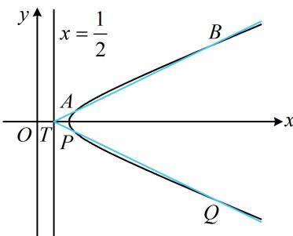

<!-- question-source:start -->
【例 3】(2021·新高考 I 卷) 在平面直角坐标系 $xOy$ 中, 已知点 $F_{1}(-\sqrt{17}, 0)$ , $F_{2}(\sqrt{17}, 0)$ , 点 $M$ 满足 $\left|MF_{1}\right| - \left|MF_{2}\right| = 2$ , 记 $M$ 的轨迹为 $C$ .

(1) 求 C 的方程;

（2）设点 $T$ 在直线 $x = \frac{1}{2}$ 上，过 $T$ 的两条直线分别交 $C$ 于 $A$ ， $B$ 两点和 $P$ ， $Q$ 两点，且 $\left|TA\right|\cdot \left|TB\right| = \left|TP\right|\cdot \left|TQ\right|$ ，求直线 $AB$ 的斜率与直线 $PQ$ 的斜率之和.

（1）由题意， $\left|MF_{1}\right|-\left|MF_{2}\right|=2$ ，由双曲线定义，点M的轨迹是以 $F_{1}$ ， $F_{2}$ 为焦点的双曲线的右支，设其实半轴长为a，则 $\left|MF_{1}\right|-\left|MF_{2}\right|=2a=2$ ，所以a=1，由 $F_{1}$ ， $F_{2}$ 的坐标可知双曲线C的半焦距 $c=\sqrt{17}$ ，所以虚半轴长 $b=\sqrt{c^{2}-a^{2}}=4$ ，故C的方程为 $x^{2}-\frac{y^{2}}{16}=1(x\geq1)$ 。
（2）（目标是求AB，PQ的斜率和，故设出斜率；条件中的 $|TA|$ ， $|TB|$ 等长度可用公式 $\sqrt{1+k^{2}}\cdot|x_{1}-x_{2}|$ 算，故再设出坐标）
设 $T\left(\frac{1}{2},m\right)$ ，设直线AB，PQ的斜率分别为 $k_{1}$ ， $k_{2}(k_{1}\neq k_{2})$ ，设 $A(x_{1},y_{1})$ ， $B(x_{2},y_{2})$ ， $x_{1}\geq1$ ， $x_{2}\geq1$ ，
由弦长公式， $\left|TA\right|=\sqrt{1+k_{1}^{2}}\left|x_{1}-\frac{1}{2}\right|=\sqrt{1+k_{1}^{2}}\left(x_{1}-\frac{1}{2}\right)$ ， $\left|TB\right|=\sqrt{1+k_{1}^{2}}\left|x_{2}-\frac{1}{2}\right|=\sqrt{1+k_{1}^{2}}\left(x_{2}-\frac{1}{2}\right)$ 所以 $\left|TA\right|\cdot\left|TB\right|=(1+k_{1}^{2})\left(x_{1}-\frac{1}{2}\right)\left(x_{2}-\frac{1}{2}\right)$ ①，（式①中 $k_{1}$ 为计算的目标，所以需化简 $\left(x_{1}-\frac{1}{2}\right)\left(x_{2}-\frac{1}{2}\right)$ ，故写出AB的方程，并与双曲线联立，将其变为含 $k_{1}$ 和m的代数式）
直线AB的方程为 $y-m=k_{1}\left(x-\frac{1}{2}\right)$ ，即 $y=k_{1}x+m-\frac{k_{1}}{2}$ 代入 $x^{2}-\frac{y^{2}}{16}=1$ 消去y整理得： $(16-k_{1}^{2})x^{2}-2k_{1}\left(m-\frac{k_{1}}{2}\right)x-\left(m-\frac{k_{1}}{2}\right)^{2}-16=0$ ②，
（若写出韦达定理，再按 $\left(x_{1}-\frac{1}{2}\right)\left(x_{2}-\frac{1}{2}\right)=x_{1}x_{2}-\frac{x_{1}+x_{2}}{2}+\frac{1}{4}$ 来算则较麻烦，可用“点乘双根法（见反思）”直接算目标式 $\left(x_{1}-\frac{1}{2}\right)\left(x_{2}-\frac{1}{2}\right)$ ，先把方程②化为双根式）
由 $x_{1}$ ， $x_{2}$ 是方程②的两根知该方程可化为 $(16-k_{1}^{2})x^{2}-2k_{1}\left(m-\frac{k_{1}}{2}\right)x-\left(m-\frac{k_{1}}{2}\right)^{2}-16=(16-k_{1}^{2})(x-x_{1})(x-x_{2})$ ，两端同时取 $x=\frac{1}{2}$ 得 $\frac{16-k_{1}^{2}}{4}-k_{1}\left(m-\frac{k_{1}}{2}\right)-\left(m-\frac{k_{1}}{2}\right)^{2}-16=(16-k_{1}^{2})\left(\frac{1}{2}-x_{1}\right)\left(\frac{1}{2}-x_{2}\right)$ ，
所以 $\left(x_{1}-\frac{1}{2}\right)\left(x_{2}-\frac{1}{2}\right)=\frac{\frac{16-k_{1}^{2}}{4}-k_{1}\left(m-\frac{k_{1}}{2}\right)-\left(m-\frac{k_{1}}{2}\right)^{2}-16}{16-k_{1}^{2}}=\frac{m^{2}+12}{k_{1}^{2}-16}$ ，代入①得 $|TA|\cdot|TB|=(1+k_{1}^{2})\cdot\frac{m^{2}+12}{k_{1}^{2}-16}$ ，
（再算 $|TP|\cdot|TQ|$ ，需要重复上述过程吗？不用，它与上面的差别只是 $k_{1}$ 变成了 $k_{2}$ ，故直接在上述结果中将 $k_{1}$ 换成 $k_{2}$ 即可）同理， $|TP|\cdot|TQ|=(1+k_{2}^{2})\cdot\frac{m^{2}+12}{k_{2}^{2}-16}$ 因为 $|TA|\cdot|TB|=|TP|\cdot|TQ|$ ，所以 $(1+k_{1}^{2})\cdot\frac{m^{2}+12}{k_{1}^{2}-16}=(1+k_{2}^{2})\cdot\frac{m^{2}+12}{k_{2}^{2}-16}$ 从而 $\frac{1+k_{1}^{2}}{k_{1}^{2}-16}=\frac{1+k_{2}^{2}}{k_{2}^{2}-16}$ ，故 $\frac{(k_{1}^{2}-16)+17}{k_{1}^{2}-16}=\frac{(k_{2}^{2}-16)+17}{k_{2}^{2}-16}$ 所以 $1+\frac{17}{k_{1}^{2}-16}=1+\frac{17}{k_{2}^{2}-16}$ ，故 $\frac{17}{k_{1}^{2}-16}=\frac{17}{k_{2}^{2}-16}$ ，化简得： $k_{1}^{2}=k_{2}^{2}$ 结合 $k_{1}\neq k_{2}$ 知 $k_{1}=-k_{2}$ ，所以 $k_{1}+k_{2}=0$

【反思】若将直线与圆锥曲线方程联立，得到关于 $x$ 的一元二次方程 $ax^2 + bx + c = 0 (a \neq 0)$ ，设该方程的两根为 $x_1$ ， $x_2$ ，现在要算 $(x_1 - t)(x_2 - t)$ ，将其展开为 $x_1 x_2 - t(x_1 + x_2) + t^2$ ，结合韦达定理来算可行，但有时这样做计算量较大，更简单的方法是根据 $x_1$ ， $x_2$ 是该方程的两根，将该方程左侧的 $ax^2 + bx + c$ 化为两根式，得到 $ax^2 + bx + c = a(x - x_1)(x - x_2)$ ，观察发现在上式两端同时令 $x = t$ ，即可得到 $at^2 + bt + c = a(t - x_1)(t - x_2)$ ，从而 $(x_1 - t)(x_2 - t) = \frac{at^2 + bt + c}{a}$ ，这样就快速求出了目标量 $(x_1 - t)(x_2 - t)$ ，此法叫做“点乘双根法”。
<!-- question-source:end -->

![[高中/总复习/教辅/一数常规版2026/第10章 解析几何/模块6 解析几何大题/第4节 解析几何综合大题/类型03_点乘双根法的应用/例题/answers/Q00049540A1.md]]
