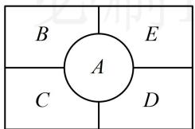

<!-- question-source:start -->
## 16. (2023·广东珠海模拟·★★★)

五一期间，某公园准备用不同的花卉装扮一个有五个区域的矩形花坛（如图），要求同一个区域用同一种花卉，相邻区域不能使用同种花卉，现有5种花卉可供选择，则不同的装扮方法共有\_\_\_\_种。（用数字作答）

<!-- question-source:end -->

![[Q00049578A1]]
